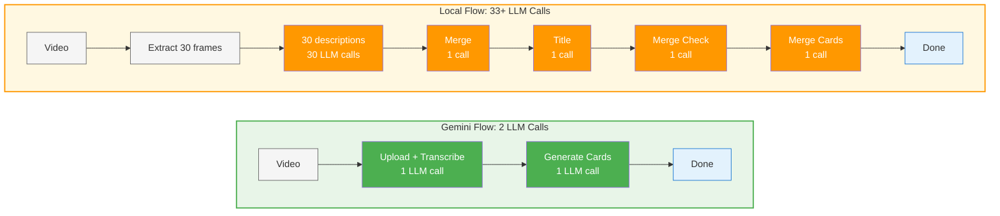

<div align="center">
  
</div>

<div align="center">
  <em>A timeline of your day, automatically.</em><br>
  Turns your screen activity into a clean timeline with AI summaries and distraction highlights.
</div>

<div align="center">
  <!-- Badges -->
  
  
  
  
  
</div>

<div align="center">
  
</div>

<div align="center">
  <a href="https://github.com/JerryZLiu/Dayflow/releases/latest">
    
  </a>
</div>

<p align="center">
  <a href="#quickstart">Quickstart</a> •
  <a href="#why-i-built-dayflow">Why I built Dayflow</a> •
  <a href="#features">Features</a> •
  <a href="#how-it-works">How it works</a> •
  <a href="#installation">Installation</a> •
  <a href="#data--privacy">Data & Privacy</a> •
  <a href="#automation">Automation</a> •
  <a href="#debug--developer-tools">Debug & Developer Tools</a> •
  <a href="#auto-updates">Auto‑updates</a> •
  <a href="#contributing">Contributing</a>
</p>

---

## What is Dayflow?

Dayflow is a **native Windows app** (WPF/.NET 8) that records your screen at **1 FPS**, analyzes it **every 15 minutes** with AI, and generates a **timeline** of your activities with summaries.
It's lightweight and uses minimal system resources.

> _Privacy‑minded by design_: You choose your AI provider. Use **Gemini** (bring your own API key) or **local models** (Ollama / LM Studio). See **Data & Privacy** for details.


## Why I built Dayflow

I built Dayflow after realizing that my calendar wasn't the source of truth for how I actually spent my time. My screen was. I wanted a calm, trustworthy timeline that let me see my workday without turning into yet another dashboard I had to maintain.

Dayflow stands for ownership and privacy by default. You control the data, you choose the AI provider, and you can keep everything local if that's what makes you comfortable. It's MIT licensed and fully open source because anything that watches your screen all day should be completely transparent about what it does with that information. The app should feel like a quiet assistant: respectful of your attention, honest about what it captures, and easy to shut off.


---

## Features

- **Automatic timeline** of your day with concise summaries.
- **1 FPS recording** - minimal CPU/storage impact.
- **15-minute analysis intervals** for timely updates.
- **Watch timelapses of your day**.
- **Auto storage cleanup** - removes old recordings after 3 days.
- **Distraction highlights** to see what pulled you off‑task.
- **Native UX** built with **WPF** and modern Windows design.
- **Auto‑updates** with **Squirrel** (daily check + background download).

### Coming soon

- **Infinitely customizable dashboard** — ask any question about your workday, pipe the answers into tiles you arrange yourself, and track trends over time.

  <div align="center">
    
  </div>

- **Daily journal** — review the highlights Dayflow captured, reflect with guided prompts, and drop screenshots or notes alongside your generated timeline.

  <div align="center">
    
  </div>

## How it works

1) **Capture** — Records screen at 1 FPS using Windows Graphics Capture API.
2) **Analyze** — Every 15 minutes, sends recent footage to AI.
3) **Generate** — AI creates timeline cards with activity summaries.
4) **Display** — Shows your day as a visual timeline.
5) **Cleanup** — Auto-deletes recordings older than 3 days.

### AI Processing Pipeline

The efficiency of your timeline generation depends on your chosen AI provider:



**Gemini** leverages native video understanding for direct analysis, while **Local models** reconstruct understanding from individual frame descriptions - resulting in dramatically different processing complexity.


---

## Quickstart

**Download (end users)**
1. Grab the latest `DayflowSetup.exe` from **GitHub Releases**.
2. Run the installer and follow the prompts.
3. Grant **Screen Recording** permission when the Graphics Capture picker appears.

<div align="center">
  <a href="https://github.com/JerryZLiu/Dayflow/releases/latest">
    
  </a>
</div>

**Build from source (developers)**
1. Install **Visual Studio 2022** or **.NET 8 SDK**.
2. Clone the repo and open `Dayflow.sln` in Visual Studio.
3. Build and run, or use PowerShell: `.\build.ps1`
4. Set your `GEMINI_API_KEY` in user secrets or environment variables (if using Gemini).

---

## Installation

### Requirements
- **Windows 10** (version 1803+) or **Windows 11**
- **.NET 8 Runtime** (included in installer)
- A **Gemini API key** (if using Gemini): https://ai.google.dev/gemini-api/docs/api-key

### From Releases
1. Download `DayflowSetup.exe` from GitHub Releases.
2. Run the installer and follow the setup wizard.
3. Launch Dayflow from the Start Menu or Desktop shortcut.

<div align="center">
  <a href="https://github.com/JerryZLiu/Dayflow/releases/latest">
    
  </a>
</div>

### From source
```powershell
git clone https://github.com/JerryZLiu/Dayflow.git
cd Dayflow
dotnet build Dayflow.sln
# Or use the build script:
.\build.ps1
```

### Package Managers

Support for Windows package managers (winget, Chocolatey) coming soon!

---

## Data & Privacy

This section explains **what Dayflow stores locally**, **what leaves your machine**, and **how provider choices affect privacy**.

### Data locations (on Windows)

The `Dayflow` folder is located at:
- `%LOCALAPPDATA%\Dayflow\` (typically `C:\Users\YourName\AppData\Local\Dayflow\`)

Contents:
- **Recordings (video chunks):** `recordings\` subfolder (or choose "Open Recordings..." from the system tray menu)
- **Timelapses:** `timelapses\` subfolder
- **Local database:** `chunks.db` (SQLite)
- **Recording details:** 1 FPS capture, analyzed every 15 minutes, 3-day retention
- **Purge / reset tip:** Quit Dayflow from the system tray. Delete the entire `Dayflow` folder to remove recordings and analysis data. Relaunch to start fresh.

### Processing modes & providers
- **Gemini (cloud, BYO key)** — Dayflow sends batch payloads to **Google's Gemini API** for analysis.
- **Local models (Ollama / LM Studio)** — Processing stays **on‑device**; Dayflow talks to a **local server** you run.

### TL;DR: Gemini data handling (my reading of Google's ToS)
- **Short answer: There is a way to prevent Google from training on your data.** If you **enable Cloud Billing** on **at least one** Gemini API project, Google treats **all of your Gemini API and Google AI Studio usage** under the **"Paid Services"** data‑use rules — **even when you're using unpaid/free quota**. Under Paid Services, **Google does not use your prompts/responses to improve Google products/models**.
  - Terms: "When you activate a Cloud Billing account, all use of Gemini API and Google AI Studio is a 'Paid Service' with respect to how Google Uses Your Data, even when using Services that are offered free of charge." ([Gemini API Additional Terms](https://ai.google.dev/gemini-api/terms#paid-services-how-google-uses-your-data))
  - Abuse monitoring: even under Paid Services, Google **logs prompts/responses for a limited period** for **policy enforcement and legal compliance**. ([Same Terms](https://ai.google.dev/gemini-api/terms#paid-services-how-google-uses-your-data))
  - **EEA/UK/Switzerland:** the **Paid‑style data handling applies by default** to **all Services** (including AI Studio and unpaid quota) **even without billing**. ([Same Terms](https://ai.google.dev/gemini-api/terms#unpaid-services-how-google-uses-your-data))

**A couple useful nuances** (from docs + forum clarifications):
- **AI Studio is still free** to use; enabling billing changes **data handling**, not whether Studio charges you. ([Pricing page](https://ai.google.dev/gemini-api/docs/pricing))
- **UI "Plan: Paid" check:** In **AI Studio → API keys**, you'll typically see "Plan: Paid" once billing is enabled on any linked project (UI may evolve).
- **Free workaround:** _"Make one project paid, keep using a free key elsewhere to get the best of both worlds."_ The **Terms** imply **account‑level** coverage once any billing account is activated, but the **Apps** nuance above may limit this in specific UI contexts. **Treat this as an interpretation, not legal advice.**

### Local mode: privacy & trade‑offs
- **Privacy:** With **Ollama/LM Studio**, prompts and model inference run on your machine. LM Studio documents full **offline** operation once models are downloaded.
- **Quality/latency:** Local open models are improving but **can underperform** cloud models on complex summarization.
- **Power consumption:** Local inference is **GPU‑heavy** and will increase power usage; consider this for laptops.
- **Future:** We may explore **fine‑tuning** or distilling a local model for better timeline summaries.

References:
- LM Studio offline: https://lmstudio.ai/docs/app/offline
- Ollama GPU acceleration (CUDA/ROCm): https://github.com/ollama/ollama/blob/main/docs/gpu.md

### Permissions (Windows)
Dayflow uses the **Windows Graphics Capture API** which requires user consent on first use. Windows 10 (1803+) or Windows 11 is required.
You may need to grant permissions in **Settings → Privacy → Screen capture** on some Windows configurations.

### Secure Credential Storage
API keys are stored securely using **Windows Credential Manager** (equivalent to macOS Keychain), encrypted with your Windows account credentials.

---

## Configuration

- **AI Provider**
  - Choose **Gemini** (set API key in settings) or **Local** (Ollama/LM Studio endpoint).
  - For Gemini keys: https://ai.google.dev/gemini-api/docs/api-key
- **Capture settings**
  - Start/stop capture from the main UI or system tray menu.
- **Data locations**
  - See **Data & Privacy** for exact paths and a purge tip.

---

## Automation

Dayflow registers a `dayflow://` URL scheme so you can trigger common actions from scripts, task schedulers, or automation tools.

**Supported URLs**
- `dayflow://start-recording` — enable capture (no-op if already recording)
- `dayflow://stop-recording` — pause capture (no-op if already paused)

**Quick checks**
- From Command Prompt: `start dayflow://start-recording` or `start dayflow://stop-recording`
- From PowerShell: `Start-Process "dayflow://start-recording"`
- In Task Scheduler: Create a task that runs `cmd /c start dayflow://start-recording`

Deeplink-triggered state changes are logged as `reason: "deeplink"` in analytics so you can distinguish automations from manual toggles.

---

## Debug & Developer Tools

You can right-click the Dayflow icon in the system tray and choose "Open Recordings..." to view saved recordings.

---

## Auto‑updates (Squirrel)

Dayflow integrates **Squirrel.Windows** for seamless updates. The app checks for updates daily and downloads them in the background. Updates are applied on next launch.

## Project structure

```
Dayflow/
├─ DayflowWindows/          # WPF app sources (timeline UI, capture & analysis pipeline)
│  ├─ Core/                 # Business logic
│  │  ├─ Recording/         # Screen capture (Graphics Capture API)
│  │  ├─ Storage/           # Database & file management (SQLite/EF Core)
│  │  ├─ Security/          # Credential Manager integration
│  │  └─ AI/                # AI providers (Gemini, Local/Ollama)
│  ├─ System/               # Windows integration
│  │  ├─ SystemTrayController.cs
│  │  ├─ UpdaterManager.cs  # Squirrel.Windows
│  │  ├─ InactivityMonitor.cs
│  │  └─ AnalyticsService.cs
│  ├─ Views/                # WPF UI views
│  ├─ ViewModels/           # MVVM view models
│  ├─ Styles/               # WPF styles and themes
│  ├─ App.xaml              # Application entry point
│  └─ MainWindow.xaml       # Main window
├─ docs/                    # Documentation assets (screenshots, videos)
├─ build.ps1                # Build script
├─ installer.nsi            # NSIS installer configuration
└─ Dayflow.sln              # Visual Studio solution
```

---

## Troubleshooting

- **Screen capture is blank or fails**
  Ensure you granted permission when the Graphics Capture picker appeared. Restart Dayflow and try again. Requires Windows 10 1803+ or Windows 11.
- **API errors**
  Go into settings and verify your Gemini API key and network connectivity.
- **App won't start**
  Ensure you have .NET 8 runtime installed. Download from https://dotnet.microsoft.com/download/dotnet/8.0
- **System tray icon missing**
  Check Windows notification area settings. The Dayflow icon may be hidden in the overflow area.

---

## Roadmap

- [ ] V1 of the Dashboard (track answers to custom questions)
- [ ] V1 of the daily journal
- [ ] Fine tuning a small VLM

---

## Contributing

PRs welcome! If you plan a larger change, please open an issue first to discuss scope and approach.

---

## License

Licensed under the MIT License. See LICENSE for the full text.
Software is provided "AS IS", without warranty of any kind.

---

## Acknowledgements

- [Squirrel.Windows](https://github.com/Squirrel/Squirrel.Windows) for seamless Windows updates.
- [Windows Graphics Capture API](https://docs.microsoft.com/en-us/windows/uwp/audio-video-camera/screen-capture) for screen recording.
- [Google AI Gemini API](https://ai.google.dev/gemini-api/docs) for analysis.
- [Ollama](https://ollama.com/) and [LM Studio](https://lmstudio.ai/) for local model support.
- [WPF Community Toolkit](https://github.com/CommunityToolkit/dotnet) for MVVM helpers.
- [Entity Framework Core](https://docs.microsoft.com/en-us/ef/core/) for database management.
