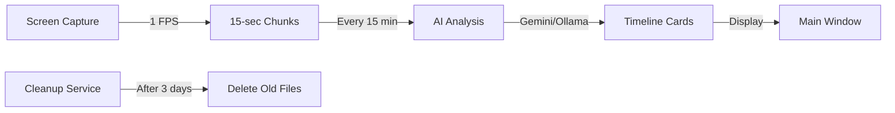

# Dayflow Python - Cross-Platform Edition

<div align="center">
  <h3>📅 Your day, automatically tracked</h3>
  <p>Screen recording + AI timeline generation</p>
  <p><strong>✅ Runs on Windows, macOS, and Linux</strong></p>
</div>

---

## 🚀 Quick Start

### Windows

1. **Install Python** (if not already installed)
   - Download from https://www.python.org/downloads/
   - **Important**: Check "Add Python to PATH" during installation
   - Verify: Open Command Prompt and run `python --version`

2. **Run Dayflow**
   - Double-click `run.bat`
   - First launch will automatically install dependencies
   - Dayflow window will open!

3. **Configure AI Provider** (first time)
   - Click **⚙️ Settings** button
   - Choose **Gemini** (cloud) or **Ollama** (local)
   - For Gemini: Enter your API key from https://ai.google.dev/
   - Click **💾 Save Settings**

4. **Start Recording**
   - Click **🎥 Start Recording**
   - Your timeline will build automatically every 15 minutes!

### macOS / Linux

```bash
# Make launcher executable
chmod +x run.sh

# Run Dayflow
./run.sh
```

Or directly with Python:

```bash
pip install -r requirements.txt
python3 run.py
```

---

## 📋 Features

✅ **1 FPS Screen Recording** - Minimal CPU/storage impact
✅ **AI-Powered Timeline** - Automatic activity categorization
✅ **15-Minute Batches** - Timely analysis without delays
✅ **Auto Cleanup** - Removes recordings after 3 days
✅ **System Tray** - Runs in background
✅ **Gemini + Ollama Support** - Cloud or local AI
✅ **Cross-Platform** - Works on Windows, macOS, Linux

---

## 🛠️ Requirements

- **Python 3.8+** (3.9 or 3.10 recommended)
- **Pip** (package manager)
- **4GB+ RAM**
- **Internet** (for Gemini) or **Ollama** (for local)

---

## 📦 Installation

### Option 1: Automatic (Recommended)

**Windows:** Double-click `run.bat`

**macOS/Linux:** Run `./run.sh`

Dependencies will be installed automatically on first run.

### Option 2: Manual

```bash
# Install dependencies
pip install -r requirements.txt

# Run Dayflow
python run.py
```

### Dependencies

Core packages installed:
- `mss` - Fast screen capture
- `opencv-python` - Video processing
- `customtkinter` - Modern UI
- `pystray` - System tray icon
- `google-generativeai` - Gemini API
- `requests` - HTTP client for Ollama

---

## ⚙️ Configuration

### AI Providers

#### Option 1: Google Gemini (Cloud, Recommended)

**Pros:**
- Fast analysis (2 LLM calls per batch)
- High accuracy
- No local setup required

**Cons:**
- Requires API key
- Sends video to Google servers

**Setup:**
1. Get API key: https://ai.google.dev/gemini-api/docs/api-key
2. In Dayflow: Settings → Gemini → Enter API key

#### Option 2: Ollama (Local, Privacy-Focused)

**Pros:**
- Runs locally (no cloud)
- Free
- Privacy-friendly

**Cons:**
- Requires powerful hardware
- Slower analysis (30+ LLM calls per batch)
- More complex setup

**Setup:**
1. Install Ollama: https://ollama.com/
2. Pull vision model: `ollama pull llava`
3. In Dayflow: Settings → Ollama → Set URL to `http://localhost:11434`

---

## 📂 Data Storage

### Windows
```
C:\Users\{YourName}\AppData\Local\Dayflow\
├── config.json        # Settings
├── dayflow.db         # Timeline database
└── recordings/        # Video chunks (auto-deleted after 3 days)
```

### macOS
```
~/Library/Application Support/Dayflow/
├── config.json
├── dayflow.db
└── recordings/
```

### Linux
```
~/.config/Dayflow/
├── config.json
├── dayflow.db
└── recordings/
```

---

## 🎨 UI Overview

### Main Window

```
┌─────────────────────────────────────────────────┐
│ 📅 Dayflow       ⏸️  Not Recording             │
│            [⚡ Analyze Now] [⚙️  Settings] [🎥 Start] │
├─────────────────────────────────────────────────┤
│                                                 │
│  Today's Timeline - November 17, 2025           │
│                                                 │
│  ┌─────────────────────────────────────────┐   │
│  │ 14:00 - 14:15                           │   │
│  │ 📝 Writing Code                         │   │
│  │ 📁 Development                          │   │
│  │ Working on Python scripts in VS Code... │   │
│  └─────────────────────────────────────────┘   │
│                                                 │
│  ┌─────────────────────────────────────────┐   │
│  │ 14:15 - 14:30                           │   │
│  │ 🌐 Browsing Documentation               │   │
│  │ 📁 Research                             │   │
│  │ Reading Python documentation...         │   │
│  └─────────────────────────────────────────┘   │
│                                                 │
└─────────────────────────────────────────────────┘
```

### Settings

- **AI Provider** - Gemini or Ollama
- **API Key** - For Gemini
- **Retention** - How many days to keep recordings (1-30)

---

## 🔍 How It Works



1. **Recording**: Captures screen at 1 FPS
2. **Chunking**: Saves 15-second video chunks
3. **Analysis**: Every 15 minutes, sends chunks to AI
4. **Timeline**: AI generates cards with title, summary, category
5. **Cleanup**: Auto-deletes recordings after 3 days

---

## 🐛 Troubleshooting

### "Python is not installed or not in PATH"

**Windows:**
1. Reinstall Python from https://www.python.org/
2. Check "Add Python to PATH" during installation
3. Restart Command Prompt

**macOS/Linux:**
```bash
# Check if installed
python3 --version

# If not, install:
# macOS: brew install python3
# Ubuntu: sudo apt install python3 python3-pip
```

### "ModuleNotFoundError: No module named 'mss'"

Dependencies didn't install. Run manually:

```bash
pip install -r requirements.txt
```

### "No timeline cards yet"

1. Make sure recording is started (🔴 Recording indicator)
2. Wait at least 15 minutes for first analysis
3. Check that AI provider is configured in Settings
4. Click **⚡ Analyze Now** to force immediate analysis

### "Gemini API error"

- Check API key is correct
- Verify API key has Gemini API enabled
- Check internet connection

### "Ollama connection failed"

- Make sure Ollama is running: `ollama serve`
- Verify `llava` model is installed: `ollama pull llava`
- Check URL is correct: `http://localhost:11434`

### High CPU usage

- Normal during recording (1-5% CPU)
- High during analysis (temporary, AI processing)
- If always high, check for other background processes

---

## 🔒 Privacy & Security

### What Data is Stored?

- **Locally**: All recordings stored in your user directory
- **Cloud (Gemini only)**: Videos sent to Google for analysis
- **Never collected**: No telemetry, no user tracking

### Data Retention

- Recordings auto-deleted after 3 days (configurable)
- Timeline database kept indefinitely (local)
- Can delete manually: Delete `Dayflow` folder in AppData

### Gemini Privacy

When using Gemini:
- Videos uploaded temporarily for analysis
- Google may store prompts/responses for abuse monitoring
- Enable Cloud Billing for stricter privacy terms
- See: https://ai.google.dev/gemini-api/terms

### Ollama Privacy

When using Ollama:
- Everything runs locally
- No data leaves your computer
- Completely offline once models downloaded

---

## 📝 Configuration Options

Edit `config.json` manually for advanced settings:

```json
{
  "fps": 1,                    // Frames per second (1-5)
  "chunk_duration": 15,        // Seconds per chunk (10-60)
  "target_height": 1080,       // Video height (720, 1080, 1440)
  "retention_days": 3,         // Keep recordings for X days
  "analysis_interval": 900,    // Analyze every X seconds (900 = 15 min)
  "llm_provider": "gemini",    // "gemini" or "ollama"
  "gemini_api_key": "...",     // Your API key
  "ollama_base_url": "http://localhost:11434",
  "ollama_model": "llava"      // Ollama vision model
}
```

---

## 🧪 Development

### Project Structure

```
dayflow-python/
├── run.py                  # Main launcher
├── run.bat                 # Windows launcher
├── run.sh                  # macOS/Linux launcher
├── requirements.txt        # Dependencies
├── README.md              # This file
└── src/
    ├── app_controller.py   # Main app logic
    ├── core/
    │   ├── config.py       # Configuration
    │   ├── storage.py      # SQLite database
    │   ├── recorder.py     # Screen capture
    │   └── cleanup.py      # Auto-cleanup
    ├── ai/
    │   ├── gemini_provider.py
    │   └── ollama_provider.py
    ├── analysis/
    │   └── timeline_generator.py
    └── ui/
        ├── main_window.py  # Main UI
        └── tray_icon.py    # System tray
```

### Running from Source

```bash
# Clone or extract
cd dayflow-python

# Install dependencies
pip install -r requirements.txt

# Run
python run.py
```

---

## 🚧 Known Limitations

- **Windows**: May need to run as Administrator for some screen capture scenarios
- **macOS**: Requires Screen Recording permission (System Settings → Privacy & Security)
- **Linux**: May need `xdotool` for some features: `sudo apt install xdotool`
- **Multi-monitor**: Currently captures primary monitor only
- **Protected content**: DRM content (Netflix, etc.) may appear black

---

## 🔮 Roadmap

Future enhancements:
- [ ] Multi-monitor support
- [ ] Custom categories and colors
- [ ] Export timeline to PDF/CSV
- [ ] Daily/weekly summary emails
- [ ] Integration with calendar apps
- [ ] Mobile companion app
- [ ] Cloud sync (optional)

---

## 📄 License

MIT License - See LICENSE file

---

## 🙏 Credits

- Original Dayflow (macOS): https://github.com/JerryZLiu/Dayflow
- Screen capture: `mss` library
- Video processing: OpenCV
- UI: CustomTkinter
- AI: Google Gemini / Ollama

---

## 📞 Support

- **Issues**: Report bugs or request features
- **Documentation**: See docs in project folder
- **Community**: Discussions welcome

---

**Made with ❤️ for productivity and privacy**

