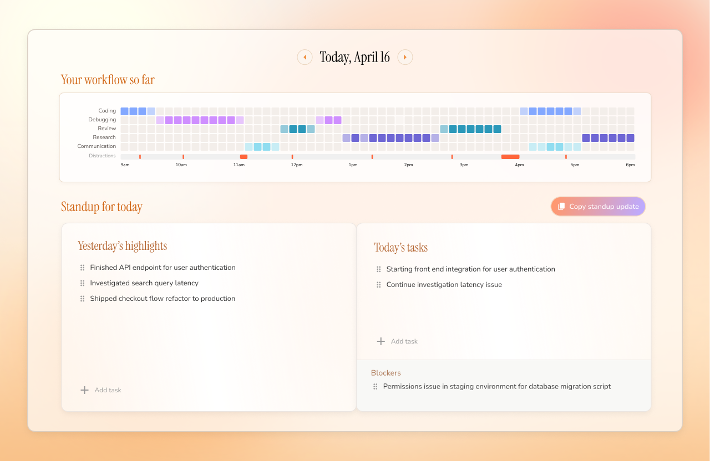
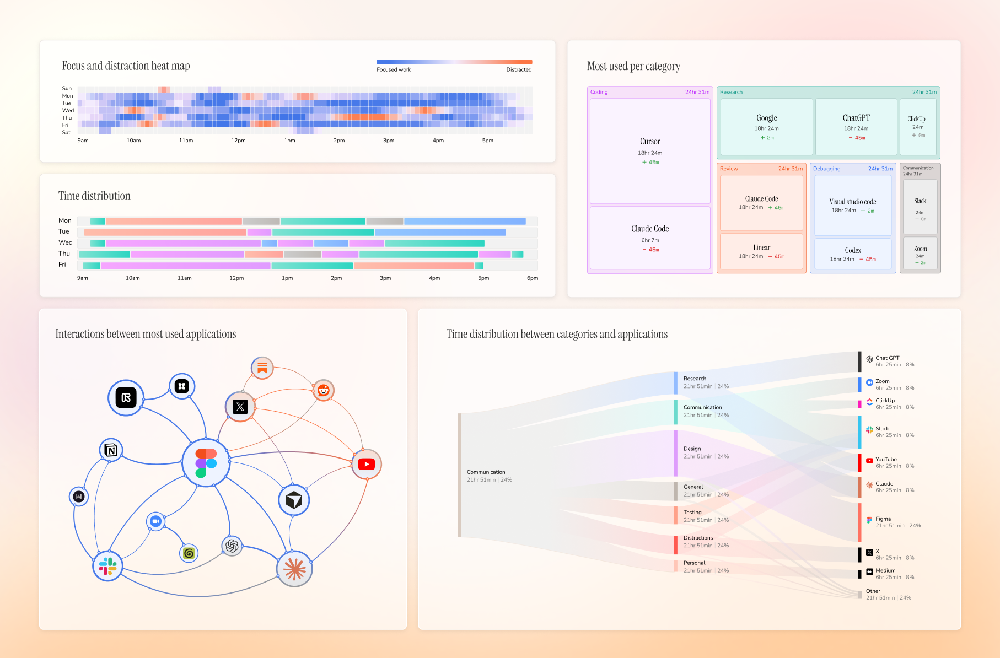

<div align="center">
  

  <p><a href="../README.md">English</a> · <a href="README.zh-CN.md">简体中文</a></p>

  <p><strong>专为 Mac 打造的私密、自动化工作日志。</strong></p>

  <p>
    Dayflow 能理解你在 Mac 上进行的工作，并将其整理成清晰的每日时间线。
    它以隐私为核心从零构建，完全开源、本地优先，并且可以完全通过本地 AI 运行。
  </p>

  <p>
    <a href="https://trendshift.io/repositories/17458" target="_blank" rel="noreferrer">
      
    </a>
  </p>

  <p>
    <a href="https://www.dayflow.so/api/download?source=github_readme_top">
      
    </a>
  </p>
</div>

## 自动时间线

Dayflow 将原始屏幕活动转换为按时间排序的真实工作记录。无需计时器或手动记笔记，也能还原一天的工作过程。

<p align="center">
  
</p>

## 每日站会

通过类似 GitHub 的每日活动网格，结合昨天的重点、今天的优先事项和阻塞问题，让你在参加站会前就自动准备好工作更新。

<p align="center">
  
</p>

## 每周回顾

一览整周情况：专注时段、时间去向、最常使用的应用，以及让你偏离工作重心的因素。

<p align="center">
  
</p>

## 与工作日志对话

直接询问关于某一天、某一周或某一年的问题，Dayflow 会基于你的时间线给出答案，无需翻找笔记、截图或依赖记忆。

<p align="center">
  
</p>

## Dayflow 的功能

Dayflow 在 Mac 上安静运行，根据屏幕活动建立实用的每日工作记录。

| 功能 | 工作方式 | 用途 |
| --- | --- | --- |
| 自动时间线 | Dayflow 以较低开销采集屏幕片段，通过你选择的 AI provider 分析，并将一天整理成活动卡片。 | 无需启动计时器或编写笔记，也能获得准确的工作日志。 |
| 上下文感知摘要 | 它关注你在屏幕上实际进行的工作，而不只记录当前活动的应用。 | Cursor、Chrome、YouTube 或 Slack 的使用会转化成有意义的工作上下文，而非模糊的应用使用记录。 |
| 每日站会 | Dayflow 从时间线中提取昨天的重点、今天的任务和阻塞问题。 | 几分钟内即可完成工作更新，不再依赖回忆。 |
| 与工作日志对话 | 使用自然语言询问时间线及近期活动。 | 找回工作细节、解释时间去向，并将原始活动转化为实用答案。 |
| 每周回顾 | 将时间线聚合为专注模式、类别、应用使用和交互图表。 | 了解一周的真实时间分配，发现有益或有害的工作习惯。 |
| 分心追踪 | Dayflow 识别分心时段，并将其与专注工作一起呈现。 | 无需手动标记每次休息，也能及时发现注意力偏移。 |
| 时间线导出 | 将任意日期范围的时间线导出为 Markdown。 | 可用于工作汇报、客户记录、个人复盘或保存可搜索的工作档案。 |
| 本地优先存储 | 录制内容、时间线数据和应用数据库默认保存在你的 Mac 上。 | 你可以掌控敏感的屏幕历史，并随时将其删除。 |
| 自由选择 AI provider | 根据隐私和质量需求选择本地模型、Gemini、ChatGPT 或 Claude。 | 可以自主权衡隐私、成本、速度和摘要质量，不受单一后端限制。 |
| 自动清理 | 设置存储空间限制，由 Dayflow 自动清除旧录制内容。 | 在持续获得工作日志价值的同时，避免磁盘空间被占满。 |

## 为什么使用 Dayflow

大多数时间追踪工具只能告诉你打开了哪个应用，而 Dayflow 尝试理解你实际在做什么。

使用 Cursor 两小时，可能是在交付新功能、调试身份验证、审查 PR，也可能只是陷入配置问题。Dayflow 提供的是工作上下文，而不只是窗口标题。

## 隐私

Dayflow 本地优先且完全开源。

你的录制内容、时间线和数据库保存在 Mac 的以下位置：

```text
~/Library/Application Support/Dayflow/
```

你可以选择 AI 分析的运行方式：

- 通过 Ollama 或 LM Studio 使用本地模型
- 使用你自己的 API Key 调用 Gemini
- 通过本地 CLI 工具使用 ChatGPT 或 Claude

如果选择云端 provider，分析所需的活动数据会发送给该 provider；如果选择本地模型，分析过程将保留在你的设备上。

## 安装

### 下载

从 GitHub Releases 下载最新的 `Dayflow.dmg`：

<p>
  <a href="https://www.dayflow.so/api/download?source=github_readme_install">
    
  </a>
</p>

打开 DMG，将 Dayflow 拖入“应用程序”文件夹，然后根据提示授予 macOS“屏幕与系统音频录制”权限。

### Homebrew

```bash
brew install --cask dayflow
```

## 系统要求

- macOS 14 或更高版本
- 屏幕与系统音频录制权限
- 可选：Gemini API Key、Ollama、LM Studio、Codex CLI 或 Claude Code，具体取决于你选择的 AI provider

## 从源码构建

```bash
git clone https://github.com/JerryZLiu/Dayflow.git
cd Dayflow
open Dayflow/Dayflow.xcodeproj
```

在 Xcode 中选择 `Dayflow` scheme，然后运行项目。

## 参与贡献

欢迎提交 Issue 和 Pull Request。如果计划进行较大的改动，请先创建 Issue，以便明确改动范围。

## 许可证

Dayflow 使用 MIT License。

<p align="center">
  <a href="https://www.dayflow.so/">dayflow.so</a> ·
  <a href="https://www.dayflow.so/pricing/">价格</a> ·
  <a href="https://www.dayflow.so/privacy/">隐私</a> ·
  <a href="https://www.dayflow.so/blog/">指南</a>
</p>
