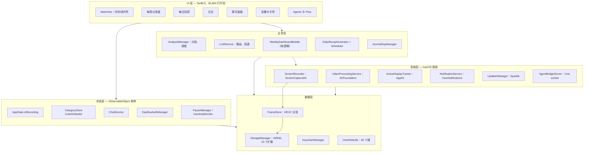

# 2. 当前架构

## 2.1 分层概览



## 2.2 模块清单

每个条目均使用指定格式。迁移难度按 Go + Wails 目标评定：**低** = 机械式移植，**中** = 移植并验证行为，**高** = 需要重新设计，**原生** = 不应移植。

---

### App

```
App  (1,598 LOC)
|
├── 职责
│     进程生命周期、后台 Agent 语义、录制开关标志、深层链接、
│     空闲重置提示、启动顺序。
├── 主要文件
│     DayflowApp.swift        (467) SwiftUI App 场景、窗口配置、命令
│     AppDelegate.swift       (422) NSApplicationDelegate；拒绝终止
│     PauseManager.swift      (220) 有到期时间的临时录制暂停
│     InactivityMonitor.swift (168) NSEvent 监听器 -> 空闲重置提示
│     AppDeepLinkRouter.swift (109) dayflow:// URL scheme
│     AppState.swift           (74) @Published isRecording + 持久化
│     ScreenshotShortcutTracker (70) cmd-shift-3/4/5 分析启发式逻辑
│     RecordingControl.swift    (68) 录制切换外观层
├── 依赖
│     AppKit, SwiftUI, Combine, ScreenCaptureKit, ServiceManagement, Sparkle
└── 迁移难度
      高 — “永不退出、常驻状态栏”的契约
      (AppDelegate.swift:220) 恰恰是 Wails 默认不具备的行为。
```

---

### Core/Recording（采集）

```
Core/Recording — 采集子集  (1,376 LOC)
|
├── 职责
│     定期截图采集、显示器选择、HEVC 编解码、
│     睡眠/唤醒/锁屏/屏保处理、隐私遮蔽。
├── 主要文件
│     ScreenRecorder.swift          (722) 四状态状态机、SCScreenshotManager
│     FrameStore.swift              (427) AVAssetWriter/Reader 分段 I/O
│     ActiveDisplayTracker.swift    (127) 带防抖的光标所在显示器轮询
│     ScreenshotImageLoading.swift   (79) 帧像素的单一关口
│     RecordingPreferences.swift     (63) 时间间隔 + 采集高度
├── 依赖
│     ScreenCaptureKit, AVFoundation, VideoToolbox, CoreGraphics, ImageIO,
│     AppKit, StorageManager, AppState
└── 迁移难度
      原生 — 保留 Swift 实现。重新实现该状态机的
      睡眠/锁屏/屏保/显示器变更处理，以及 Apple Silicon 与
      Intel 编码器回退 (FrameStore.swift:226-235)，会把这里已经修复的
      每个问题重新经历一遍。
```

---

### Core/Recording（存储）

```
Core/Recording — 存储子集  (6,279 LOC)
|
├── 职责
│     全部 SQLite 访问、schema 创建、WAL checkpoint、每日备份、
│     容量上限清理、timelapse 文件、路径迁移。
├── 主要文件
│     StorageManager+TimelineCards.swift (1,023) 卡片 CRUD、范围替换
│     StorageManager.swift                 (731) 连接池设置、schema、追踪
│     StorageManager+Maintenance.swift     (545) 恢复、备份、清理
│     StorageManager+Journal.swift         (282)
│     StorageManager+TimelineReview.swift  (273)
│     StorageManager+Reprocessing.swift    (241)
│     StorageManager+{Chunks,DayGoals,Screenshots,Observations,
│                     DailyStandup,ChatHistory,Migrations}  (~1,000 combined)
│     StorageManaging.swift                (115) 协议 — 接缝
│     StorageModels.swift                  (314) 行结构体
├── 依赖
│     GRDB, Foundation, Sentry, AppKit（仅用于磁盘已满警报）
└── 迁移难度
      中 — 一个协议之后的普通 SQL，因此移植过程机械直接，但
      replaceTimelineCardsInRange (StorageManager+TimelineCards.swift:862) 隐藏了
      必须逐位匹配的“时钟字符串转时间戳”解析逻辑。
```

---

### Core/Analysis

```
Core/Analysis  (1,063 LOC)
|
├── 职责
│     调度器。把未分批截图组成批次，驱动每个批次经过 LLM，
│     管理批次状态，短路空闲批次，并实现按天/按批次重新处理。
├── 主要文件
│     AnalysisManager.swift    (834) 60 秒定时器、分批、重新处理流程
│     IdleBatchClassifier.swift (194) 纯空闲检测，跳过 LLM
│     TimeParsing.swift          (35) "9:30 AM" -> 分钟
├── 依赖
│     StorageManaging, LLMServicing, VideoProcessingService, Sentry
└── 迁移难度
      中 — 逻辑可以干净移植，Go 并发也更适合，但当前重新处理循环通过
      Thread.sleep(2.0) 轮询来阻塞线程
      (AnalysisManager.swift:150, :286)。这些应改为 channel；这是值得明确指出的
      行为变更，而不是直接移植。
```

---

### Core/AI

```
Core/AI  (21,067 LOC)
|
├── 职责
│     Provider 抽象、prompt 构建、响应解析与修复、重试/回退、
│     带工具调用的聊天编排、每日回顾。
├── 主要文件（HTTP provider）
│     GeminiDirectProvider* (10 files, ~3,300) 上传 + 转录 + 卡片
│     OllamaProvider*        (4 files, ~1,650)
│     GemmaBackupProvider*   (4 files, ~1,300) Gemini 自动回退
│     DayflowBackendProvider    (683) 托管 provider、session token
│     OpenAICompatibleProvider  (177)
├── 主要文件（CLI provider）
│     ChatCLIProcessRunner.swift (1,454) login-shell 子进程、JSONL stream
│     ClaudeProvider*        (7 files, ~1,700)
│     CodexProvider*         (6 files, ~1,300)
│     ClaudeStrictJSONParser     (454) + ClaudeOutputValidator (533)
├── 主要文件（编排）
│     LLMService.swift          (1,309) 路由、门控、provider 备份
│     ChatService.swift           (724) + ChatPromptBuilder (601)
│     DailyRecapGenerator.swift   (744) + DailyRecapScheduler (495)
│     TimelineFailureClassifier   (323) 错误 -> 面向用户的类别
├── 依赖
│     Foundation URLSession, Process, AppKit（图像缩放）, Keychain,
│     UserDefaults（路由 + prompt 覆盖）, StorageManager
└── 迁移难度
      HTTP provider 为低-中 — Go 更适合承载此逻辑。
      CLI provider 为中 — os/exec 映射良好，但 login-shell 环境发现和
      session 恢复需要谨慎处理。
      有一项特定内容为高：Gemini 转录会在上传前把截图合成为 mp4
      (GeminiDirectProvider+Transcription.swift:676)，
      因而 AI 层存在隐藏的 AVFoundation 依赖。
```

---

### Core/Weekly

```
Core/Weekly  (2,744 LOC)
|
├── 职责
│     把时间线卡片纯转换为仪表盘 view model：
│     donut、treemap、Sankey、专注热力图、应用交互图。
├── 主要文件
│     WeeklyDashboardBuilder.swift + 3 extensions (~2,000)
│     WeeklyDashboardModels.swift, WeeklyDonutBuilder, WeeklyOverviewBuilder,
│     WeeklyDateRange.swift
├── 依赖
│     仅 Foundation + Calendar。虽有 `import SwiftUI`，但实际用途只有
│     WeeklyDashboardBuilder+Interactions.swift:307 中的两次 Color(hex:) 调用
│     — 实际上是纯逻辑。
└── 迁移难度
      低 — 代码库中最理想的 Go 移植候选。确定性输入产生确定性输出，
      且已有 WeeklyDashboardBuilderTests 可作为起始 oracle。
```

---

### Core/AgentAccess

```
Core/AgentAccess  (1,221 LOC)
|
├── 职责
│     外部 Agent 集成。写入通过权限为 0600 的 Unix socket 进入；
│     读取由捆绑的 dayflow CLI / MCP server 直接访问 SQLite。
├── 主要文件
│     AgentBridgeServer.swift     NDJSON over ~/...​/Dayflow/agent.sock
│     AgentWriteHandlers.swift    6 ops: category_{add,update,remove},
│                                 activity_{update,delete}, goal_set
│     AgentClientRegistration.swift, CodexMCPRegistration.swift
│     AgentUsageTelemetryQueue.swift
├── 依赖
│     POSIX sockets, StorageManager, CategoryStore
└── 迁移难度
      低 — 这是文档 05 中原生桥接协议的参考实现。Go 的 net package
      比当前原始 syscall 代码处理得更简洁。
```

---

### Core/Flow

```
Core/Flow  (1,054 LOC) + Views/UI/Flow (845 LOC)
|
├── 职责
│     带原生桌面 overlay 的托管 Web 体验：一个不激活应用的 NSPanel，
│     显示动画生物，用于专注/分心提示。
├── 主要文件
│     FlowSessionMirror.swift    Web session 状态的原生镜像
│     FlowOverlayController.swift NSPanel 生命周期
│     FlowDistractionAgent.swift, FlowNativeState.swift
│     FlowWebView.swift          WKWebView + JS bridge
├── 依赖
│     AppKit NSPanel, WebKit, DayflowAuthManager
└── 迁移难度
      推迟 — Web 部分本就已经是 Web，但始终置顶、非激活式 overlay panel
      是纯 AppKit，Wails 没有等价能力。这是项目中单位迁移工作量价值最低的部分。
```

---

### System

```
System  (2,557 LOC)
|
├── 职责
│     OS 集成与 telemetry：auth、analytics、status bar、自动更新、
│     login item、权限检查、CPU 监控。
├── 主要文件
│     DayflowAuthManager.swift            (1,007) 托管账户 + entitlement
│     AnalyticsService.swift                (595) PostHog、采样
│     UpdaterManager.swift                  (310) Sparkle + SilentUserDriver
│     ProcessCPUMonitor.swift               (172)
│     TimelineFailureToast.swift            (152)
│     LaunchAtLoginManager.swift             (76) SMAppService
│     StatusBarController.swift              (64) NSStatusItem
│     ScreenRecordingPermissionNotice.swift  (34) CGPreflightScreenCaptureAccess
├── 依赖
│     Sparkle, PostHog, ServiceManagement, AppKit, Security, CoreGraphics
└── 迁移难度
      混合 — auth/analytics 基于 HTTP，容易移植（低）。Sparkle、status item 和
      SMAppService 属于 Apple 生态绑定，应保留 Swift（原生）；特别是为何不得
      替换 Sparkle，参见文档 05。
```

---

### Models

```
Models  (967 LOC)
|
├── 职责
│     共享领域类型与类别 taxonomy。
├── 主要文件
│     TimelineCategory.swift (618) TimelineCategory + CategoryStore
│     DayGoalPlan.swift      (198)
│     ChatMessage.swift       (90)
│     AnalysisModels.swift    (61) Screenshot, RecordingChunk
├── 依赖
│     Foundation, SwiftUI (Color), UserDefaults
└── 迁移难度
      结构体为低。CategoryStore 为中，因为它把整个 taxonomy 持久化到
      UserDefaults 键 `colorCategories`，而非 SQLite — 参见 3.3。
```

---

### Views

```
Views  (65,864 LOC)
|
├── 职责
│     每一个像素。时间线、每周仪表盘、每日回顾、日志、聊天、设置、引导、
│     Agents、Flow。
├── 主要区域
│     Views/UI/*.swift (flat, 63 files) 22,191  聊天、日志、时间线审阅
│     Views/UI/Weekly/                   9,855  自定义图表
│     Views/Components/                  9,113  共享控件
│     Views/Onboarding/                  7,599  provider 设置、权限
│     Views/UI/MainView/                 7,135  时间线外壳
│     Views/UI/Settings/                 6,060
│     Views/UI/Agents/                   3,066
│     Views/UI/Flow/                       845
├── 依赖
│     SwiftUI, AppKit, AVKit, Charts, NetworkImage, MarkdownUI，以及 view 代码中
│     对 StorageManager.shared 的直接调用
└── 迁移难度
      高 — 完全重写，没有机械式路径。这就是工期所在。
```

---

# 3. 依赖分析

## 3.1 耦合度量

基于 360 个 Swift 文件测得：

| 耦合项 | 文件数 | 评估 |
|----------|------:|------------|
| `import GRDB` | 16 | **极佳。**其中 14 个属于 `StorageManager` 本身；`AnalysisManager` 和 `LLMService` 中的 2 个是未使用的遗留 import。 |
| 引用 `StorageManager.shared` | 32 | **尚可但有泄漏。**View 代码直接访问单例，例如 `DayflowApp.swift:97`。Go 必须将其暴露为绑定方法。 |
| `Core/` 内部 `import AppKit` 或 `SwiftUI` | 39 | **大多只是表面依赖。**很多仅用于 `NSImage` 缩小或 `Color(hex:)`。尽管导入 SwiftUI，`Core/Weekly` 实际上是纯逻辑。 |
| `import ScreenCaptureKit` | 4 | **极佳。**仅有 `ScreenRecorder`、`AppDelegate`、`RecordingPrivacyPreferences` 和一个 view。 |
| `import AVFoundation` | ~8 | 集中在 `FrameStore`、`VideoProcessingService` 和播放 view 中。 |

要点是：**此次迁移最重要的两个边界恰好已经很干净。**SQL 位于 `StorageManaging` 之后；帧像素位于 `Screenshot.loadCGImage()` 之后。

## 3.2 第三方依赖

来自 `Package.resolved`：

| 包 | 用途 | Go/Wails 替代方案 |
|---------|----------|----------------------|
| GRDB.swift | SQLite | `modernc.org/sqlite` |
| Sparkle 2.7.1 | 自动更新、EdDSA appcast | **没有合适替代。**保留 Sparkle。参见[风险 C-4](08-risk-analysis.md#c-4自动更新连续性)。 |
| Sentry 8.56.2 | 崩溃报告 | `sentry-go` + helper 中的原生处理器 |
| PostHog 3.31.0 | 分析 | `posthog-go` 或直接 HTTP |
| swift-markdown-ui | 聊天 Markdown | Vue 中的 `markdown-it` |
| NetworkImage | 远程图像 | 浏览器原生能力 |

## 3.3 不在 SQLite 中的状态

这是最容易被低估的部分。已针对实际安装验证：

**`~/Library/Preferences/teleportlabs.com.Dayflow.plist`——46 个键。**其中关键的键：

| 键 | 内容 | 无法读取的后果 |
|-----|-------|-----------------------|
| `colorCategories` | 完整类别体系：名称、颜色、描述、顺序、`isIdle` 标志 | 时间线不显示颜色，LLM 也拿不到类别列表。**阻塞性问题。** |
| `llmProviderRoutingV2` | 主 provider + 备用 provider，schema v2 | 无法运行分析 |
| `{gemini,claude,chatGPT,ollama}PromptOverrides` | 用户提示词定制 | 无声行为变化 |
| `screenshotIntervalSeconds`, `captureHeightPixels` | 捕获频率与分辨率 | 捕获行为在用户不知情时变化 |
| `recordingPrivacyBlockedApplicationIdentifiers` | 从捕获中排除的应用 | **隐私回归。**被屏蔽应用会遭到捕获。 |
| `storageLimitRecordingsBytes` | 清理阈值 | 磁盘使用无限增长 |
| `llmOpenAICompatibleConfigurationV1`, `geminiSelectedModel_v4`, `dailyRecapProvider_v1` | provider 配置 | 请求被错误路由 |
| `didOnboard`, `onboardingStep` | 引导进度 | 用户重新经历引导 |

**Keychain**——通用密码，service 为 `com.teleportlabs.dayflow.apikeys.<provider>`，account 为 `<provider>`，可访问性为 `WhenUnlocked`
([`KeychainManager.swift:14`](../../legacy/dayflow/Dayflow/Core/Security/KeychainManager.swift#L14))。
非 bundle 内或签名不同的二进制读取这些项目时，会提示用户或失败。

**文件系统**——`~/Library/Application Support/Dayflow/`：

```
chunks.sqlite (+ -wal, -shm)   数据库
recordings/                    HEVC 分段，yyyyMMdd_HHmmssSSS.mp4
timelapses/<yyyy-MM-dd>/       每张卡片的 timelapse mp4
backups/                       每日数据库副本
agent.sock                     Agent 写入通道
agents/, chatcli/              CLI provider 工作目录
```

## 3.4 数据库 schema 的实际形态

共 15 张表。已针对实际数据库确认：

| 表 | 行数（样本安装） | 作用 |
|-------|----------------------:|------|
| `screenshots` | 8,746 | 帧索引：`(file_path, frame_index, captured_at, idle_seconds_at_capture)` |
| `observations` | 353 | 每批次的 LLM 转录输出 |
| `analysis_batches` | 121 | 批次状态机 |
| `timeline_cards` | 187 | 产品的主要输出 |
| `batch_screenshots` | — | 批次 ↔ 帧关联表 |
| `chunks`, `batch_chunks` | 0 | **死数据。**旧版视频路径；代码仍保留但未使用 |
| `journal_entries`, `daily_standup_entries` | — | 日志与每日回顾 |
| `day_goals`, `day_goal_categories` | — | 专注/分心目标 |
| `chat_conversations`, `chat_messages` | — | 聊天历史 |
| `timeline_review_ratings` | — | 时间范围评分 |
| `llm_calls` | — | 请求/响应审计，正文截断至 64 KB |

有三项 schema 事实约束 Go 实现：

1. **`PRAGMA user_version` 为 `0`。**不存在迁移账本。Schema 演进依赖 `CREATE TABLE IF NOT EXISTS` 加临时的 `db.columns(in:)` 检查
   ([`StorageManager.swift:679-727`](../../legacy/dayflow/Dayflow/Core/Recording/StorageManager.swift#L679))。
   共存期间 Go 必须采用相同的幂等 ensure 方法，不得设置会改变 Swift 行为的 `user_version`。
2. **WAL + `synchronous=NORMAL` + `busy_timeout=5000`**
   ([`StorageManager.swift:227-233`](../../legacy/dayflow/Dayflow/Core/Recording/StorageManager.swift#L227))。
   正是这些设置让 `dayflow-cli` 的并发访问安全。Go 必须匹配，否则 CLI 和 MCP server 会在写入负载下开始失败。
3. **时间戳以两种格式存储两次。**`timeline_cards` 同时保存本地化时钟字符串形式的 `start`/`end`（`"10:21 AM"`）和 Unix 整数形式的 `start_ts`/`end_ts`。字符串由 LLM 输出，整数由此派生。派生结果的任何偏差都是数据损坏 bug——参见
   [02 §4.5](02-data-flow.md#45-时钟字符串问题)。

## 3.5 原生框架接触点

以下是实际需要 macOS 的完整清单。这就是原生适配器的范围，而且比看起来更小。

| 能力 | API | 位置 |
|------------|-----|------|
| 权限预检 | `CGPreflightScreenCaptureAccess()` | `ScreenRecordingPermissionNotice.swift:6` |
| 枚举显示器/窗口 | `SCShareableContent.excludingDesktopWindows` | `ScreenRecorder.swift:229` |
| 捕获一帧 | `SCScreenshotManager.captureImage` | `ScreenRecorder.swift:408` |
| 从捕获中排除应用 | `SCContentFilter(display:excludingApplications:)` | `ScreenRecorder.swift:393` |
| 编码 HEVC | `AVAssetWriter` + pixel-buffer adaptor | `FrameStore.swift:252` |
| 解码一帧 | `AVAssetReader` + `VTCreateCGImageFromCVPixelBuffer` | `FrameStore.swift:154`, `:397` |
| 合成 mp4 | `AVAssetWriter` | `VideoProcessingService.swift:166` |
| 空闲秒数 | `CGEventSource.secondsSinceLastEventType(.hidSystemState, ...)` | `ScreenRecorder.swift:26` |
| 光标所在显示器 | `NSEvent.mouseLocation` + `NSScreen.screens` | `ActiveDisplayTracker.swift` |
| 睡眠/唤醒 | `NSWorkspace.willSleep/didWake` | `ScreenRecorder.swift:587`, `:613` |
| 锁定/解锁/屏保 | `DistributedNotificationCenter` 的 `com.apple.screenIsLocked` 等 | `ScreenRecorder.swift:628-707` |
| 最前台应用 | `NSWorkspace.frontmostApplication` | `RecordingPrivacyPreferences` |
| 登录项 | `SMAppService.mainApp` | `LaunchAtLoginManager.swift` |
| 状态项 | `NSStatusItem` | `StatusBarController.swift` |
| 本地通知 | `UNUserNotificationCenter` | `NotificationService.swift` |
| 自动更新 | Sparkle `SPUUpdater` | `UpdaterManager.swift` |
| Keychain | `SecItemAdd` / `SecItemCopyMatching` | `KeychainManager.swift` |

共十七项能力。每一项如今都已在 Swift 中实现并正常工作，这正是[文档 05](05-native-bridge.md) 的核心论点。
