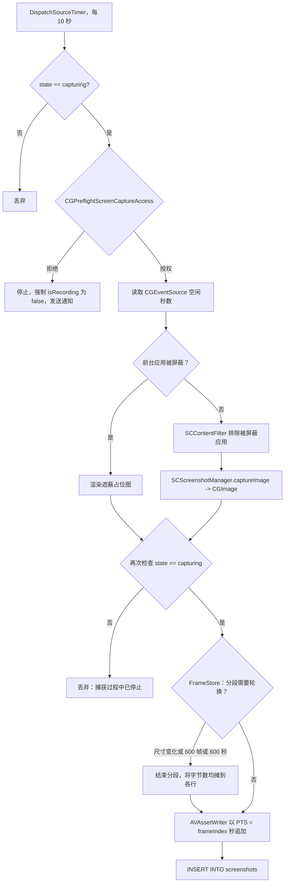
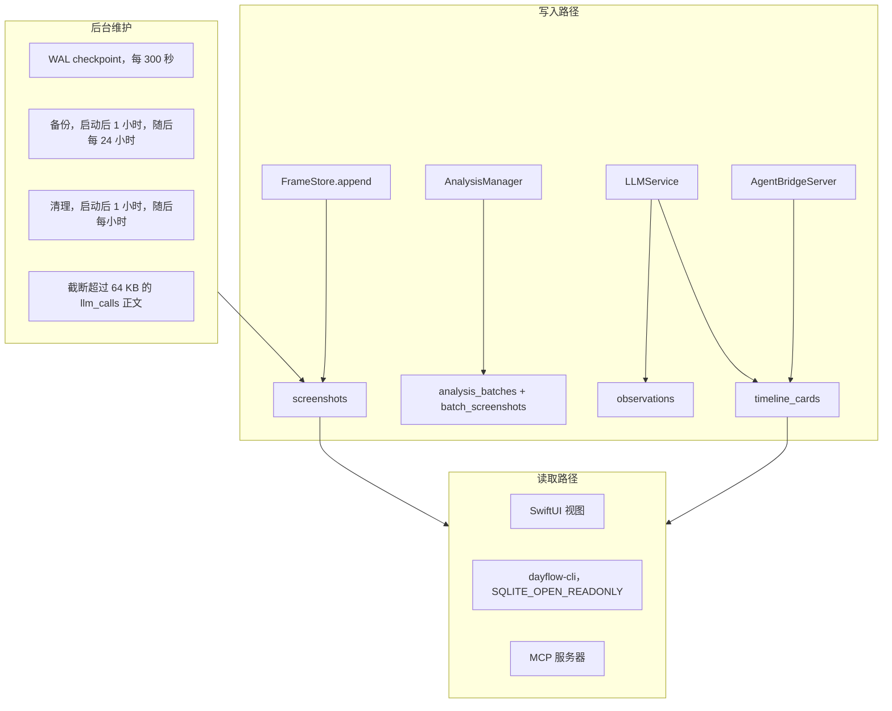
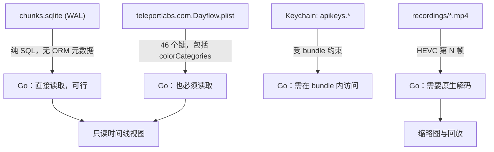
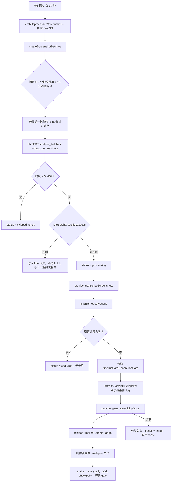

# 4. 数据流

本文档追踪重构必须复现的四条流水线，并指出行为测试需要锁定的具体常量与启发式规则。

---

## 4.1 屏幕捕获流水线



### 截图方式

使用 `SCScreenshotManager.captureImage(contentFilter:configuration:)`，而不是连续的
`SCStream`。文件头说明了原因
（[`ScreenRecorder.swift:5`](../../legacy/dayflow/Dayflow/Core/Recording/ScreenRecorder.swift#L5)）：
离散截图可以避免 macOS 持续显示屏幕录制指示器。这是一个**编码在 API 选择中的产品决策**——任何改用 `SCStream` 的适配器都会让紫色指示器永久出现，从而改变应用的本质。

每次捕获的配置：`scalesToFit = true`、`showsCursor = true`，宽高按
高度等于 `captureHeight` 的比例缩放，宽度向上取整为偶数
（[`:447-455`](../../legacy/dayflow/Dayflow/Core/Recording/ScreenRecorder.swift#L447)）。

### 频率

| 设置 | 默认值 | 可选值 |
|------|--------|--------|
| 间隔 | 10 秒 | 1、5、10、20、30、60 秒 |
| 捕获高度 | 1080 px | 720、1080 |

来自 [`RecordingPreferences.swift`](../../legacy/dayflow/Dayflow/Core/Recording/RecordingPreferences.swift)。
更改会发送 `ScreenshotConfig.didChange`；录制器重启计时器，而
`FrameStore` 会在下一次尺寸变化时轮换分段，而非立即轮换。

### 多显示器处理

**每次只捕获一个显示器**——光标所在的显示器。
`ActiveDisplayTracker` 以 0.1 Hz（每 10 秒一次）轮询 `NSEvent.mouseLocation`（出于电池考虑；注释指出 6 Hz 会产生每小时 21,600 次唤醒），并应用 10 pt 的滞后内缩，避免光标擦过显示器边缘时触发切换；还要求状态稳定 400 ms 后才发布。

随后，录制器在
[`setupCapture`](../../legacy/dayflow/Dayflow/Core/Recording/ScreenRecorder.swift#L221) 中采用明确的三级优先级：
`requestedDisplayID` → 跟踪器的 `activeDisplayID` → 第一个可用显示器。如果首选显示器不在 `SCShareableContent` 快照中，选择会被*推迟*而非强制执行——它会继续捕获当前显示器并重试。这对笔记本合盖和显示器唤醒竞态很重要。

### 权限处理

在三个位置检查：设置之前、每次捕获之前，以及任何失败之后再次检查
（[`:222`](../../legacy/dayflow/Dayflow/Core/Recording/ScreenRecorder.swift#L222)、
[`:355`](../../legacy/dayflow/Dayflow/Core/Recording/ScreenRecorder.swift#L355)、
[`:420`](../../legacy/dayflow/Dayflow/Core/Recording/ScreenRecorder.swift#L420)）。权限丢失不是可忽略的失败：`handleMissingScreenRecordingPermission` 会停止计时器、清除缓存内容、设置 `wantsRecording = false`，并以 `persistPreference: false` 将全局 `AppState.isRecording` 切换为 false——因此用户保存的偏好不会因权限撤销而丢失。

### 空闲检测——两套独立机制

两者很容易混淆，但彼此无关。

1. **逐帧空闲采样。** 在*捕获时*读取 `CGEventSource.secondsSinceLastEventType(.hidSystemState, kCGAnyInputEventType)`，并存入 `screenshots.idle_seconds_at_capture`。特意使用 `.hidSystemState` 表，以确保信号反映硬件输入而非合成事件。该数据稍后提供给 `IdleBatchClassifier`。
2. **UI 空闲重置提示。** `InactivityMonitor` 安装 `NSEvent` 本地监视器；若 15 分钟内未与 *Dayflow 自身窗口*交互，则设置 `pendingReset`，让 UI 可以提示跳转到当前时间。纯属界面行为。

### 睡眠 / 唤醒 / 锁屏

这是一个四状态状态机——`idle`、`starting`、`capturing`、`paused`。其中 `paused` 特指“因系统事件停止，将自动恢复”，区别于表示“用户已将其关闭”的 `idle`。只有 `idle` 和 `paused` 可以转换为 `starting`。

| 事件 | 来源 | 操作 | 恢复延迟 |
|------|------|------|---------:|
| `willSleepNotification` | `NSWorkspace` | → `paused`，停止 | — |
| `didWakeNotification` | `NSWorkspace` | 若为 `paused` 则恢复 | 5 秒 |
| `com.apple.screenIsLocked` | `DistributedNotificationCenter` | → `paused`，停止 | — |
| `com.apple.screenIsUnlocked` | `DistributedNotificationCenter` | 若为 `paused` 则恢复 | 0.5 秒 |
| `com.apple.screensaver.didstart` | `DistributedNotificationCenter` | → `paused`，停止 | — |
| `com.apple.screensaver.didstop` | `DistributedNotificationCenter` | 若为 `paused` 则恢复 | 0.5 秒 |
| `didChangeScreenParameters` | `NSApplication` | 刷新显示器选择 | — |
| `willTerminateNotification` | `NSApplication` | `finishCurrentSegment()` | — |

每次停止都会调用 `FrameStore.finishCurrentSegment()`，因此分段绝不会跨越睡眠而保持打开。唤醒延迟 5 秒，是因为唤醒后 `SCShareableContent` 会立即返回过期或空的显示器列表。

### 文件格式

这是整个捕获路径中影响最深远的细节。

| 属性 | 值 | 来源 |
|------|----|------|
| 容器 | `.mp4` | `FrameStore.swift:258` |
| 编解码器 | HEVC | `:266` |
| 码率控制 | `AVVideoQualityKey = 0.55`，失败时回退到计算出的比特率 | `:226-234` |
| 比特率回退值 | `max(500_000, 2 Mbps × pixels / (1920×1080))` | `:249` |
| 关键帧间隔 | 30 帧 | `:27` |
| 帧重排 | 禁用 | `:262` |
| 预期源速率 | 1 fps | `:263` |
| 呈现时间 | `CMTime(value: frameIndex, timescale: 1)`——**第 N 帧位于第 N 秒** | `:305` |
| 分段轮换 | 尺寸变化，或 600 帧，或 600 秒墙上时钟时间 | `:293-297` |
| 输入像素格式 | `kCVPixelFormatType_32ARGB` | `:277` |
| 输出像素格式 | `kCVPixelFormatType_32BGRA` | `:400` |
| 路径 | `recordings/yyyyMMdd_HHmmssSSS.mp4` | `StorageManager+Screenshots.swift:11` |

双重码率控制路径并非无谓冗余：Apple Silicon 编码器接受质量目标，而 Intel 编码器只接受比特率。代码首先尝试质量目标，失败时回退。**用 Go 重新实现就必须重新摸索这一点。**

读取针对顺序访问进行了优化：`SegmentReader` 保持其 `AVAssetReader` 打开，并可向前跳过最多 8 帧；其他情况则从最近的关键帧重新开始
（[`:360`](../../legacy/dayflow/Dayflow/Core/Recording/FrameStore.swift#L360)、
[`:369-390`](../../legacy/dayflow/Dayflow/Core/Recording/FrameStore.swift#L369)）。以 LRU 方式缓存四个读取器。

### 崩溃恢复

`reconcileAfterLaunch()`（[`:108`](../../legacy/dayflow/Dayflow/Core/Recording/FrameStore.swift#L108)）
在启动时运行一次，处理三种不同的故障模式：

- 行存在、文件缺失 → 软删除这些行。
- 文件存在，但 `SegmentReader` 无法打开（写入中途崩溃）→ 删除文件并软删除这些行。
- 文件可读，但 `file_size` 为 NULL（在 `finishWriting` 与更新尺寸之间崩溃）→ 回填尺寸。

这种来之不易的逻辑恰恰说明应该迁移代码，而不是重写。

---

## 4.2 存储流水线



### 数据库结构管理

没有迁移框架。`migrate()`
（[`StorageManager.swift:458`](../../legacy/dayflow/Dayflow/Core/Recording/StorageManager.swift#L458)）
会在每次启动时为每张表执行 `CREATE TABLE IF NOT EXISTS`，然后执行四项列存在性检查和条件式 `ALTER TABLE ADD COLUMN`：
`timeline_cards.is_deleted`、`screenshots.idle_seconds_at_capture`、
`screenshots.frame_index`、`day_goals.is_skipped`。

已确认实际数据库中的 `PRAGMA user_version` 为 `0`。没有可读取的版本，也没有已执行操作的账本。

这对迁移反而*有利*：幂等的 ensure-schema 步骤很容易用 Go 重新实现；与版本化迁移链不同，它不会在两个实现之间失去同步。要求很简单：**Go 的 ensure-schema 必须对现有数据库执行为超集兼容的空操作**，且在共存期间双方都不得删除或重命名列。

### Repository 形态

`StorageManaging` 在九个关注点上声明了约 60 个方法——chunks（已废弃）、批次、时间线卡片、复盘评分、每日目标、观察结果、重新处理、截图、调试。`StorageManager` 在按关注点拆分的 13 个文件中实现这些方法。

每项操作都包装在 `timedWrite`/`timedRead` 中，它们添加 Sentry breadcrumb、超过阈值的慢查询日志，以及记录活动操作和近期操作标签的竞争跟踪器。`StorageManager.swift` 中约 250 LOC 用于此类插桩。它确实有用，值得在 Go 中复现，但它属于可观测性而非领域逻辑——不要将其放进 repository 接口。

### 可靠性机制

| 机制 | 行为 |
|------|------|
| 打开并恢复 | 正常打开 → 恢复最新备份 → 新建数据库。恢复**仅**针对 `SQLITE_CORRUPT`/`SQLITE_NOTADB`；环境错误（磁盘已满）会显示警告并 `exit(1)`，而不是销毁完好的文件。`StorageManager+Maintenance.swift:49` |
| WAL checkpoint | 每 300 秒执行 `.passive`，每个批次完成后也执行 |
| 备份 | 启动一小时后执行，随后每 24 小时备份到 `backups/` |
| 清理 | 每小时。按从旧到新顺序软删除整个分段，直至 `recordings/` 符合 `storageLimitRecordingsBytes`；**绝不**删除活动分段；不再有活动帧引用文件后，由 `cleanupRecordingStragglers()` 删除文件 |
| 正文截断 | 超过 64 KB 的 `llm_calls` 请求/响应正文会改写为 `<truncated llm body: ...>` 标记，每轮 100 行，最多 50 轮 |

清理设计有一个值得保留的微妙之处：每个 `screenshots` 行上的 `file_size` 是*分段总字节数均摊到所有帧后的值*
（[`StorageManager+Screenshots.swift:34`](../../legacy/dayflow/Dayflow/Core/Recording/StorageManager+Screenshots.swift#L34)），
因此逐行计数之和等于磁盘上的真实尺寸。删除以分段为单位，从不按帧删除，因为无法从 HEVC 流中移除单个帧。

### Go 能否直接读取现有数据库？

**数据库可以，但仅此并不充分。**



| 产物 | Go 能读取吗？ | 说明 |
|------|--------------|------|
| `chunks.sqlite` | **可以，直接读取** | 纯 SQL，无 ORM 特有编码。WAL 允许 Swift 写入时存在并发读取器——`dayflow-cli` 已证明这一点。 |
| 分类体系 | **可以，但需要工作** | `colorCategories` 下的二进制 plist。Go 必须解析 plist；`howett.net/plist` 可以处理。 |
| API 密钥 | **只能从 bundle 内部读取** | Keychain ACL 受代码签名约束。同一签名 `.app` 内的辅助程序可以读取；独立二进制文件会提示授权或失败。 |
| 帧像素 | **不可以** | HEVC 帧提取需要 VideoToolbox。委托给原生适配器，绝不要重新实现。 |

因此兼容目标可以实现，但准确说法不是“Go 读取旧数据库”，而是**“Go 读取旧数据库和旧 plist，并向辅助程序请求像素。”**从一开始就准确界定，可避免第二阶段看似完成、实则未完成。

---

## 4.3 分析流水线



### 调度器

主运行循环上的 60 秒 `Timer`；工作派发到 `.utility` 串行队列。重入由普通的 `isProcessing` 布尔值保护
（[`AnalysisManager.swift:49`](../../legacy/dayflow/Dayflow/Core/Analysis/AnalysisManager.swift#L49)），
它在多个上下文中被读写——这是一个潜在竞态，Go 移植应使用 channel 或 `atomic.Bool` 替代，而不是复现。

### 分批规则

来自 `BatchingConfig.standard`
（[`LLMTypes.swift:159`](../../legacy/dayflow/Dayflow/Core/AI/LLMTypes.swift#L159)）和
`createScreenshotBatches`：

| 规则 | 值 |
|------|---:|
| 目标批次时长 | 15 分钟 |
| 拆分前最大间隔 | 2 分钟 |
| 卡片生成回看范围 | 45 分钟 |
| 未分批帧回看范围 | 24 小时 |
| 最小分析时长 | 5 分钟 |

有两项行为很容易被忽视，但都至关重要：

- **如果最新批次的跨度小于目标时长，则丢弃该批次**
  （[`:672-677`](../../legacy/dayflow/Dayflow/Core/Analysis/AnalysisManager.swift#L672)）。这可以防止应用分析仍在填充的批次。省略此规则会为当前时段生成重复且不完整的卡片。
- **批次跨度按首次到末次捕获时间戳计算，而不是按帧数计算。**以 10 秒间隔捕获的 90 帧跨度是 890 秒，而不是 900 秒——因此即便是一个*完整的* 15 分钟批次，`duration < maxBatchDuration` 仍为 true，丢弃规则也会触发。下一轮在较晚的帧扩展跨度后会再次选中它。任何移植都必须准确保留这一差一个间隔的算术，否则批次会重复处理或停滞。

### 队列与并发

通常意义上不存在工作队列。`processRecordings()` 创建所有待处理批次，并立即为每个批次触发 `queueLLMRequest`
（[`:398`](../../legacy/dayflow/Dayflow/Core/Analysis/AnalysisManager.swift#L398)）；
每个请求都会成为独立的 `Task`。并发仅在下游由 `timelineCardGenerationGate` 限制——这是
[`LLMService.swift:12`](../../legacy/dayflow/Dayflow/Core/AI/LLMService.swift#L12) 中手写的异步信号量——它会串行化读取—生成—替换序列，以免两个批次交错改写同一时间范围。转录则以无界并行方式运行。

这是合理的设计，而 Go 能更清晰地表达：使用为转录设置显式并发上限的 worker pool，并以 mutex 保护改写临界区。

### 重试与失败

重试策略是**每个 provider 各自定义**的，并非集中管理——没有共享策略：

| Provider | 尝试次数 | 退避 |
|----------|---------:|------|
| Gemini 活动卡片 | 4 | 按策略分类 |
| Gemini 转录 | 3 | 按策略分类 |
| Gemini 文本 | 4 | 按策略分类 |
| Ollama 聊天 | 3 | — |
| Ollama 帧描述 | 1 | — |
| OpenAI-compatible | 1 | — |

`TimelineFailureClassifier` 将错误映射到面向用户的类别，`llm_calls` 则记录每次尝试。在此之上还有两级回退：

1. **Gemini → Gemma**，位于 Gemini provider 内部。`GemmaFallbackState` 具有粘性：Gemini 一旦失败，该批次余下部分都使用 Gemma
   （[`LLMService.swift:316`](../../legacy/dayflow/Dayflow/Core/AI/LLMService.swift#L316)）。
2. **主 provider → 已配置的备用 provider**，通过 `executeWithProviderBackup`
   （[`:362`](../../legacy/dayflow/Dayflow/Core/AI/LLMService.swift#L362)）。只有主 provider 可以回退；一旦切换到备用 provider，该批次就一直使用它。如果主 provider *初始化*失败，备用 provider 将成为基准，且它自身的 fallback 被设为 nil。

终态批次状态：`analyzed`、`completed`、`failed`、`failed_empty`、
`skipped_short`。实际数据库显示 `completed: 87, skipped_short: 24, failed: 9, analyzed: 1`——注意，`AnalysisManager` 和 `LLMService` 分别为同一个成功结果写入了 `completed` 与 `analyzed`。**这是现有的不一致**；Go 移植应选择一个状态并迁移，而不是保留歧义。

### 空闲短路

`IdleBatchClassifier.assess` 是纯函数，也是代码库中最干净的移植目标。来自
[`IdleBatchRules`](../../legacy/dayflow/Dayflow/Core/Analysis/IdleBatchClassifier.swift#L11) 的阈值：

| 规则 | 值 |
|------|---:|
| 符合条件的最小批次时长 | 12 分钟 |
| 要求的空闲时间覆盖率 | 0.95 |
| 要求的合格空闲帧占比 | 0.90 |
| 要求的空闲样本可用率 | 0.90 |
| 帧符合条件所需的空闲秒数 | 60 |
| 允许的最大未覆盖间隔 | 30 秒 |
| 与前一空闲卡片合并的最大间隔 | 5 分钟 |

算法将每帧的 `idle_seconds_at_capture` 转换为覆盖区间
`[capturedAt - idleSeconds, capturedAt]`，裁剪到批次范围内，合并重叠区间，取反得到间隙，再应用上述比例。触发时会直接写入 `Idle` 卡片并完全跳过 LLM——这能显著节省成本，绝不能退化。

### 提示词

提示词按 provider 分开，并允许用户覆盖，存储在 UserDefaults 的
`{gemini,claude,chatGPT,ollama}PromptOverrides` 下，默认值来自
`ClaudePromptDefaults`、`ActivityCardPromptOverrides` 以及各 provider 的 `+Prompts` extension。不存在统一的提示词 registry。相应地，provider 输出解析非常防御性：`ClaudeStrictJSONParser`（454 LOC）和 `ClaudeOutputValidator`（533 LOC）存在，是因为模型会输出格式错误的 JSON、正文前言和围栏代码块。

**移植这两个文件时要保持异乎寻常的高保真。**它们编码了关于特定模型实际异常行为的经验知识，其测试 fixture（`ClaudeActivityCardBoundaryTests`、`ClaudeTranscriptionInputBuilderTests`）是现有的最佳规范。

---

## 4.4 AI 架构

### 当前的 Provider

| ID（`LLMProviderID`） | 传输方式 | 转录输入 | 说明 |
|-----------------------|----------|----------|------|
| `gemini` | HTTPS，Gemini API | **合成后的 mp4** | 自动回退到 Gemma |
| `dayflow` | HTTPS，托管后端 | **合成后的 mp4** | Bearer session token |
| `local` | HTTP，Ollama | JPEG 帧 | 默认 `localhost:11434` |
| `openai_compatible` | HTTPS，任意 OpenAI 形态的 endpoint | JPEG 帧 | 用户配置 |
| `claude` | **子进程**，`claude -p` | JPEG 帧路径 | session resume、配置目录清理 |
| `chatgpt` | **子进程**，Codex CLI | JPEG 帧路径 | 可执行文件解析 |
| *Gemma* | HTTPS | 帧 | 用户不可选择；仅为 Gemini 的回退 |

路由位于 `llmProviderRoutingV2`（schema v2，主 provider + 可选备用 provider），写入经过验证，失败时回滚
（[`LLMProviderRouting.swift`](../../legacy/dayflow/Dayflow/Core/AI/LLMProviderRouting.swift)）。

### 代码实际使用的抽象

不是 protocol，而是包含两个 closure 的 struct
（[`LLMService.swift:106`](../../legacy/dayflow/Dayflow/Core/AI/LLMService.swift#L106)）：

```swift
private struct BatchProviderActions {
  let transcribeScreenshots:
    ([Screenshot], Date, Int64?) async throws -> (observations: [Observation], log: LLMCall)
  let generateActivityCards:
    ([Observation], ActivityGenerationContext, Int64?) async throws -> (cards: [ActivityCardData], log: LLMCall)
}
```

之所以选择 closure，是因为各 provider 没有共同的父类型，且 Gemini 需要在每次调用时介入回退逻辑。它可以工作，但让代码库付出三项代价：无法枚举 provider、无法查询能力，以及 Gemini 需要视频而 Ollama 需要帧这一事实在边界处不可见——它被埋在
[`GeminiDirectProvider+Transcription.swift:676`](../../legacy/dayflow/Dayflow/Core/AI/GeminiDirectProvider+Transcription.swift#L676) 往下 40 行处。

### Go 接口设计

Go 版本应明确声明输入要求，因为一旦编码器位于 platform port 之后，媒体编码就应由流水线而不是 provider 负责。

```go
package ai

type ProviderID string

const (
    ProviderGemini           ProviderID = "gemini"
    ProviderDayflow          ProviderID = "dayflow"
    ProviderOllama           ProviderID = "local"
    ProviderOpenAICompatible ProviderID = "openai_compatible"
    ProviderClaude           ProviderID = "claude"
    ProviderCodex            ProviderID = "chatgpt"
)

// InputKind declares what a provider needs for transcription, so the pipeline
// can prepare the payload once instead of each provider doing its own encoding.
type InputKind int

const (
    InputJPEGFrames InputKind = iota // Ollama, OpenAI-compatible, Claude, Codex
    InputVideo                       // Gemini, Dayflow backend
)

// Provider is the minimum every timeline provider implements.
type Provider interface {
    ID() ProviderID
    InputKind() InputKind
}

// Transcriber turns captured frames into timestamped observations.
type Transcriber interface {
    Provider
    Transcribe(ctx context.Context, req TranscribeRequest) (TranscribeResult, error)
}

// CardGenerator turns observations into timeline cards.
type CardGenerator interface {
    Provider
    GenerateCards(ctx context.Context, req CardsRequest) (CardsResult, error)
}

// Optional capabilities, asserted at runtime rather than required of everyone.
type TextGenerator interface {
    GenerateText(ctx context.Context, prompt string) (TextResult, error)
}

type TextStreamer interface {
    StreamText(ctx context.Context, prompt string) (<-chan TextDelta, error)
}

type ChatStreamer interface {
    StreamChat(ctx context.Context, req ChatRequest) (<-chan ChatEvent, error)
}
```

请求和结果类型显式携带审计记录，替代当前的 `LLMCall` tuple 返回值：

```go
type TranscribeRequest struct {
    BatchID    int64
    BatchStart time.Time
    Payload    Payload // frames or video, prepared by the pipeline
    Categories []CategoryDescriptor
    Language   string  // llmOutputLanguageOverride
}

// Payload is prepared by the pipeline via platform.Media, honouring InputKind.
type Payload struct {
    Kind   InputKind
    Frames []Frame // JPEG bytes + capture timestamps
    Video  *Video  // mp4 bytes + compression factor for timestamp expansion
}

type TranscribeResult struct {
    Observations []storage.Observation
    Call         CallRecord // provider, model, latency, bodies -> llm_calls
}
```

路由与回退成为显式 decorator，而不是内联 closure 逻辑：

```go
// Registry resolves configured providers and applies the routing policy.
type Registry interface {
    Resolve(ctx context.Context, id ProviderID) (Transcriber, CardGenerator, error)
    Routing(ctx context.Context) (Routing, error)
}

type Routing struct {
    Primary   ProviderID
    Secondary *ProviderID
}

// WithFallback wraps a primary so a failure retries once on the backup and then
// pins to it, reproducing executeWithProviderBackup's sticky semantics.
func WithFallback(primary, backup Transcriber, obs FallbackObserver) Transcriber
```

相较当前设计，有三项刻意的改进；每一项都应明确写成变更，而不是暗中引入：

1. `InputKind` 将 mp4 合成从 Gemini provider 移到流水线，使 AVFoundation 依赖不再泄漏到 AI 层。
2. 小型可选接口取代一个宽泛 struct，因此 `Ollama` 不再需要假装支持流式聊天。
3. `CallRecord` 是具名类型，使 `llm_calls` 审计轨迹成为契约的一等组成部分，而不是旁路 tuple。

---

## 4.5 时钟字符串问题

它值得单列一节，因为这是移植中最可能造成无声数据错误的单一来源。

LLM 以本地化时钟字符串输出时间——`"10:21 AM"`。`timeline_cards` 同时存储这些字符串和派生的 Unix 时间戳。派生逻辑位于
[`replaceTimelineCardsInRange`](../../legacy/dayflow/Dayflow/Core/Recording/StorageManager+TimelineCards.swift#L862)，
采用启发式算法：

```
anchor      = from + (to - from) / 2          // 替换窗口的中点
resolveClock(h, m):
    candidates = [anchor 所在日 - 1、anchor 所在日、anchor 所在日 + 1] 的 h:m
    return 使 |candidate - anchor| 最小的 candidate

startTs = resolveClock(startHour, startMinute)
endTs   = resolveClock(endHour,   endMinute)
if endTs < startTs: endTs += 1 天            // 跨越午夜
day     = startDate.getDayInfoFor4AMBoundary().dayString
```

用于软删除的重叠谓词：

```sql
WHERE ((start_ts < :to AND end_ts > :from) OR (start_ts >= :from AND start_ts < :to))
  AND is_deleted = 0
  AND (category != 'System' OR batch_id = :batchId)
```

十二行中包含四个彼此独立的微妙之处：

1. **在前后共三天中选择最近日期。**临近午夜时，简单地将 `"11:50 PM"` 解析到 anchor 所在日是错误的；搜索 ±1 天候选项可修正此问题。
2. **跨越午夜。**`end < start` 表示卡片跨越午夜。
3. **凌晨 4 点日期边界。**`day` 不是日历日期。02:00 的卡片属于时间线的*前一天*
   （[`StorageDateHelpers.swift:22`](../../legacy/dayflow/Dayflow/Core/Recording/StorageDateHelpers.swift#L22)）。
4. **保留系统卡片。**来自*其他*批次的错误卡片不会被删除，因此当相邻批次改写自身范围时，失败仍然可见。

这一切都依赖 `Calendar.current` 和主机时区。使用 `time.Local` 的 Go 移植必须在 DST 转换和非整数时差时区中验证。这是基于属性测试的首要候选——参见
[07 §12.3](07-testing-strategy.md#123-行为测试)。
