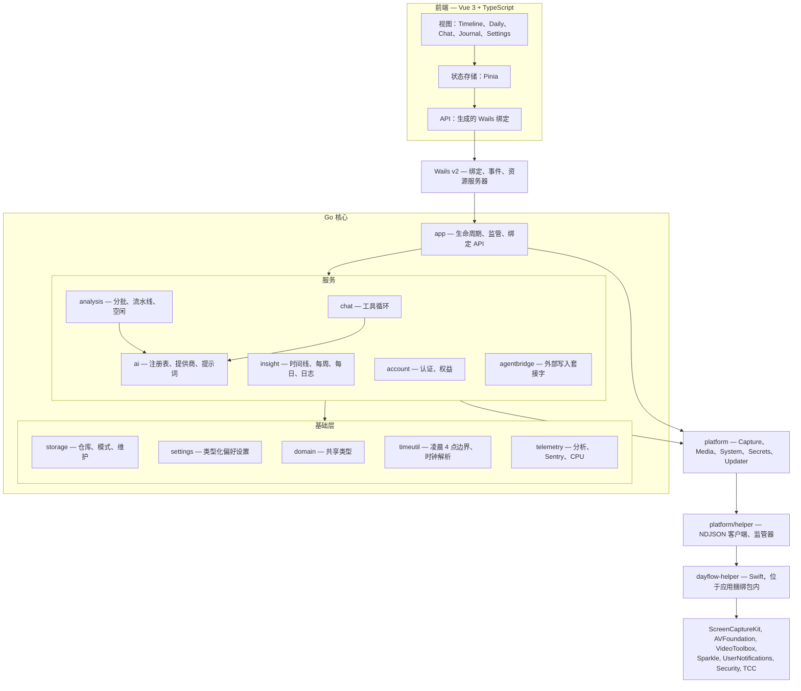
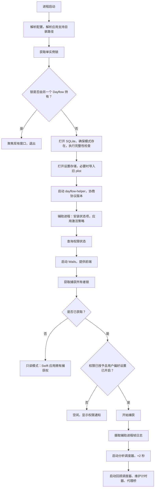

# 6. 目标架构

## 6.1 模块图



## 6.2 依赖规则

四条规则，通过导入检查器在 CI 中强制执行：

1. **`foundation` 不依赖其上层的任何模块。** `storage`、`settings`、`domain`、
   `timeutil` 和 `telemetry` 只能相互导入以及导入标准库。
2. **`services` 依赖 `foundation` 和 `platform`，绝不依赖彼此的内部实现。**
   跨服务需求通过消费者声明的接口实现。
3. **`app` 以下的任何模块都不导入 Wails。** 服务返回普通 Go 值；只有
   `internal/app` 知道 `wails/runtime`。这使整个核心无需 GUI 和 WebView 即可测试。
4. **只有 `platform` 与辅助进程通信。** 任何服务都不构造 IPC 消息。服务需要像素时调用
   `platform.Media`，传输层对其不可见。

规则 3 的收益最大。它意味着 `go test ./internal/...` 可在 CI 中无头运行，
从而使[文档 07](07-testing-strategy.md) 中的黄金夹具策略切实可行。

## 6.3 与当前架构相比的变化及原因

| 当前 | 目标 | 理由 |
|------|------|------|
| `LLMService` 既负责路由，*又*运行批处理流水线 | `ai.Registry` 解析提供商；`analysis.Pipeline` 运行处理序列 | 批处理状态机不属于提供商职责 |
| Gemini 在提供商内部合成 mp4 | 流水线按 `InputKind` 准备负载 | 从 AI 层移除 AVFoundation |
| `TimelineActivityLoader` 和 `DailyWorkflowComputation` 位于 `Views/` | `internal/insight/` | 它们是纯转换逻辑，而非 UI |
| `CategoryStore` 写入 `UserDefaults` 并发布到 SwiftUI | `settings.Categories` 读写；UI 通过 Wails 事件订阅 | 从数据类型中移除 UI 框架 |
| 视图直接调用 `StorageManager.shared`（32 个文件） | 视图只调用绑定的 `app` 方法 | 单一、可模拟的 API 表面 |
| 每个提供商重复实现重试策略（1–4 次且不一致） | `ai.WithRetry(policy)` 装饰器 | 一套可配置、可测试的策略 |
| 两种成功状态 `completed` 和 `analyzed` | 一种终态成功状态 | 修复现有不一致，而不是照搬 |
| `isProcessing` 布尔值跨线程防止重入 | 并发有界的工作池 | 消除潜在竞态 |
| 重处理循环中使用 `Thread.sleep(2.0)` 轮询 | 通道完成信号 | 消除阻塞线程 |

这些都是有意的修正，而非偶然偏移。应在第 4 阶段开始前将其作为整体评审，
因为其中状态统一和重试统一是用户可观察的行为变化，需要产品决策，而不仅是工程决策。

---

# 7. 新目录结构

```
dayflow/
├── cmd/
│   ├── dayflow/                     Wails entry point
│   │   └── main.go
│   └── dayflow-cli/                 read-only CLI + MCP server (Go port)
│       └── main.go
│
├── internal/
│   ├── app/                         lifecycle, supervision, Wails-bound API
│   │   ├── app.go                   construction and wiring
│   │   ├── lifecycle.go             startup order, graceful shutdown
│   │   ├── api_timeline.go          bound methods: timeline
│   │   ├── api_settings.go          bound methods: settings
│   │   ├── api_chat.go              bound methods: chat
│   │   ├── events.go                Go -> Vue event names and payloads
│   │   └── state.go                 recording flag, pause state
│   │
│   ├── domain/                      shared types, no behaviour
│   │   ├── screenshot.go
│   │   ├── card.go
│   │   ├── observation.go
│   │   ├── batch.go
│   │   ├── category.go
│   │   └── goal.go
│   │
│   ├── storage/                     the only SQLite writer
│   │   ├── db.go                    pool, PRAGMAs, open-with-recovery
│   │   ├── schema.go                idempotent ensure-schema
│   │   ├── repository.go            interface definitions
│   │   ├── timeline.go              cards, incl. ReplaceCardsInRange
│   │   ├── screenshots.go
│   │   ├── observations.go
│   │   ├── batches.go
│   │   ├── journal.go
│   │   ├── goals.go
│   │   ├── standup.go
│   │   ├── chat.go
│   │   ├── review.go
│   │   ├── llmcalls.go
│   │   ├── reprocess.go
│   │   ├── maintenance.go           checkpoint, backup, purge
│   │   ├── legacy.go                path rewriting for moved installs
│   │   └── observe.go               slow-query and contention instrumentation
│   │
│   ├── settings/                    typed access over the preference store
│   │   ├── store.go                 Store interface
│   │   ├── plist_darwin.go          legacy plist reader (coexistence)
│   │   ├── sqlite.go                Go-owned store (post-cutover)
│   │   ├── categories.go            colorCategories
│   │   ├── capture.go               interval, height
│   │   ├── providers.go             routing, models, endpoints
│   │   ├── privacy.go               blocked application identifiers
│   │   ├── storage.go               size limits
│   │   └── notifications.go
│   │
│   ├── analysis/
│   │   ├── scheduler.go             60 s tick, worker pool
│   │   ├── batcher.go               gap and duration splitting
│   │   ├── pipeline.go              transcribe -> generate -> replace
│   │   ├── idle.go                  IdleBatchClassifier port
│   │   ├── cards.go                 card post-processing
│   │   ├── failure.go               error classification
│   │   └── reprocess.go
│   │
│   ├── ai/
│   │   ├── provider.go              Provider, Transcriber, CardGenerator
│   │   ├── registry.go              resolution and routing
│   │   ├── routing.go               llmProviderRoutingV2
│   │   ├── fallback.go              WithFallback decorator
│   │   ├── retry.go                 WithRetry decorator
│   │   ├── types.go
│   │   ├── prompts/                 defaults + per-provider overrides
│   │   ├── jsonrepair/              malformed-JSON recovery (shared)
│   │   ├── gemini/                  incl. gemma.go fallback
│   │   ├── dayflow/
│   │   ├── ollama/
│   │   ├── openaicompat/
│   │   ├── claude/
│   │   ├── codex/
│   │   └── cli/                     shared subprocess runner
│   │
│   ├── chat/
│   │   ├── service.go
│   │   ├── prompt.go
│   │   ├── tools.go
│   │   ├── memory.go
│   │   └── types.go
│   │
│   ├── insight/                     derived read models
│   │   ├── timeline.go              cards -> display segments
│   │   ├── daily.go
│   │   ├── journal.go
│   │   ├── recap.go
│   │   ├── recap_scheduler.go
│   │   ├── clipboard.go
│   │   └── weekly/
│   │
│   ├── media/
│   │   └── cache.go                 decoded-frame LRU, bytes not images
│   │
│   ├── platform/                    the port. Interfaces only.
│   │   ├── capture.go
│   │   ├── media.go
│   │   ├── system.go
│   │   ├── secrets.go
│   │   ├── updater.go
│   │   ├── events.go
│   │   ├── helper/                  the darwin adapter
│   │   │   ├── client.go            NDJSON client
│   │   │   ├── supervisor.go        spawn, health, restart with backoff
│   │   │   ├── protocol.go          wire types, version negotiation
│   │   │   └── journal.go           ingest helper's offline frame journal
│   │   └── fake/                    in-memory adapter for tests and CI
│   │
│   ├── agentbridge/
│   ├── account/
│   ├── telemetry/
│   └── timeutil/
│       ├── dayboundary.go           4 AM logical day
│       ├── clock.go                 "h:mm a" parse and format
│       └── week.go
│
├── native/darwin/                   the Swift helper
│   ├── Package.swift
│   └── Sources/DayflowHelper/
│       ├── main.swift               socket server, request dispatch
│       ├── Protocol/                mirrored wire types
│       ├── Capture/                 ScreenRecorder, FrameStore, DisplayTracker
│       ├── Media/                   VideoEncoder, FrameDecoder, JPEGEncoder
│       ├── System/                  Permissions, Keychain, LoginItem,
│       │                            Notifications, SystemEvents
│       ├── UI/                      StatusItem, activation policy
│       └── Update/                  Sparkle host
│
├── frontend/
│   ├── src/
│   │   ├── views/                   Timeline, Daily, Chat, Journal, Settings,
│   │   │                            Onboarding, Review
│   │   ├── components/
│   │   ├── stores/                  Pinia
│   │   ├── api/                     generated Wails bindings + thin wrappers
│   │   ├── styles/                  theme as CSS custom properties
│   │   └── assets/                  fonts, icons
│   ├── package.json
│   └── vite.config.ts
│
├── testdata/                        the compatibility harness
│   ├── fixtures/                    captured Swift inputs and outputs
│   │   ├── idle/
│   │   ├── batching/
│   │   ├── cardreplace/
│   │   ├── dayboundary/
│   │   └── weekly/
│   └── databases/                   anonymised reference databases
│       ├── v2.4.0-typical.sqlite
│       ├── v2.4.0-legacy-jpeg.sqlite
│       └── v2.4.0-empty.sqlite
│
├── wails.json
├── go.mod
└── docs/plan/                      these documents
```

有两个目录值得说明。

`internal/platform/fake/` 不是事后补充。正是它使分析流水线、AI 层和每个 insight 构建器
能在 Linux CI 上测试，无需 Mac、TCC 提示或真实帧。它的存在应是第 1 阶段的交付物，
而不是第 4 阶段的。

`testdata/` 保存参考数据库，使“Go 能否读取旧数据？”成为回归测试而非人工检查。
三个变体很重要：典型安装、包含旧式 JPEG 行的安装（`frame_index IS NULL`——
样本安装中没有，但长期用户会有），以及用于首次运行路径的空数据库。

---

# 8. 接口设计

## 8.1 平台端口

这些是唯一会跨入原生领域的接口。核心中的其他所有内容都是纯 Go。

### 捕获

```go
package platform

// Capture owns the screenshot loop. The implementation runs out of process, so
// Frames and Status are the only ways state reaches Go.
type Capture interface {
    Start(ctx context.Context, cfg CaptureConfig) error
    Stop(ctx context.Context) error

    // Frames yields one message per encoded frame. Closed only on shutdown.
    Frames() <-chan CapturedFrame

    // Status yields recorder state-machine transitions and permission changes.
    Status() <-chan CaptureStatus
}

type CaptureConfig struct {
    Interval          time.Duration // screenshotIntervalSeconds
    CaptureHeight     int           // captureHeightPixels
    BlockedBundleIDs  []string      // recordingPrivacyBlockedApplicationIdentifiers
    SegmentDirectory  string        // <appsupport>/Dayflow/recordings
}

// CapturedFrame is everything Go needs to write the screenshots row. Go, not the
// helper, performs the INSERT, so there is exactly one database writer.
type CapturedFrame struct {
    SegmentPath string
    FrameIndex  int
    CapturedAt  time.Time
    IdleSeconds *int   // nil when CGEventSource returned an unusable value
    Width       int
    Height      int
    Redacted    bool   // a privacy placeholder was captured instead of the screen
}

type CaptureState string

const (
    CaptureIdle      CaptureState = "idle"
    CaptureStarting  CaptureState = "starting"
    CaptureCapturing CaptureState = "capturing"
    CapturePaused    CaptureState = "paused" // system event; will auto-resume
)

type CaptureStatus struct {
    State             CaptureState
    Reason            string // "system sleep", "screen locked", ...
    PermissionGranted bool
    ActiveDisplayID   uint32
}

// SegmentClosed is emitted when a segment is finalised, so Go can spread the
// byte count across the segment's rows for purge accounting.
type SegmentClosed struct {
    SegmentPath string
    TotalBytes  int64
    FrameCount  int
    Succeeded   bool // false means drop the file and soft-delete its rows
}
```

关键设计选择是：**辅助进程绝不接触 SQLite。** 它报告 `CapturedFrame` 和
`SegmentClosed`；Go 决定持久化哪些内容。这保留了单写入者语义，也意味着可以重启辅助进程
而无需进行任何数据库协调。

代价是存在一个故障窗口——如果捕获帧时 Go 正在重启，该元组会丢失。辅助进程通过将
未确认元组追加到分段旁的小型磁盘日志，并在重新连接时重放它们来处理此问题
（`platform/helper/journal.go`）。这与 `FrameStore.reconcileAfterLaunch()` 当前已解决的问题
属于同一类，因此机制是熟悉的，而非全新的。

### 媒体

```go
// Media covers every codec operation. No Go code decodes HEVC.
type Media interface {
    // DecodeFrame returns JPEG bytes for one frame of a segment, optionally
    // downscaled. Replaces Screenshot.loadCGImage().
    DecodeFrame(ctx context.Context, req DecodeRequest) ([]byte, error)

    // DecodeFrames batches requests to amortise IPC on thumbnail strips.
    DecodeFrames(ctx context.Context, reqs []DecodeRequest) ([][]byte, error)

    // EncodeVideo composites frames into an mp4: timelapses and the Gemini upload.
    EncodeVideo(ctx context.Context, req EncodeRequest) (EncodeResult, error)

    // ProbeSegment reports frame count and dimensions, and whether a segment left
    // over from a crash is readable at all.
    ProbeSegment(ctx context.Context, path string) (SegmentInfo, error)
}

type DecodeRequest struct {
    SegmentPath  string
    FrameIndex   *int // nil selects the legacy standalone-JPEG path
    MaxPixelSize *int
    JPEGQuality  float32
}

type EncodeRequest struct {
    Frames             []DecodeRequest
    OutputPath         string
    FPS                int
    CompressedTimeline bool // true: frame N at N/FPS seconds; false: real timestamps
    MaxOutputHeight    *int
    FrameStride        int
    AverageBitRate     int
    Codec              string // "h264" | "hevc"
    KeyframeSeconds    int
}

type EncodeResult struct {
    OutputPath string
    Bytes      int64
    FrameCount int
    Duration   time.Duration
    // CompressionFactor = realDuration / (frameCount - 1). Gemini needs this to
    // expand compressed-timeline timestamps back to wall clock.
    CompressionFactor float64
}
```

`CompressionFactor` 被显式公开，因为它目前在
[`GeminiDirectProvider+Transcription.swift:658`](../../legacy/dayflow/Dayflow/Core/AI/GeminiDirectProvider+Transcription.swift#L658)
内部计算，在边界处不可见。计算错误会悄无声息地偏移批次中每条观测的时间戳——
这是代码评审中极难发现、但黄金测试中极易发现的错误。

### 系统

```go
type System interface {
    ScreenRecordingPermission(ctx context.Context) (PermissionState, error)
    RequestScreenRecordingPermission(ctx context.Context) error
    OpenSystemSettings(ctx context.Context, pane SettingsPane) error

    Displays(ctx context.Context) ([]Display, error)
    FrontmostApplication(ctx context.Context) (AppInfo, error)
    InstalledApplications(ctx context.Context) ([]AppInfo, error) // privacy picker

    LaunchAtLogin(ctx context.Context) (bool, error)
    SetLaunchAtLogin(ctx context.Context, enabled bool) error

    SetActivationPolicy(ctx context.Context, p ActivationPolicy) error
    SetStatusItem(ctx context.Context, s StatusItemState) error

    ScheduleNotification(ctx context.Context, n Notification) error
    CancelNotifications(ctx context.Context, ids []string) error

    // Events multiplexes sleep, wake, lock, unlock, screensaver, display change,
    // deep-link URLs, status-item clicks and notification taps.
    Events() <-chan SystemEvent
}

type PermissionState string

const (
    PermissionGranted      PermissionState = "granted"
    PermissionDenied       PermissionState = "denied"
    PermissionNotDetermined PermissionState = "not_determined"
)
```

### 密钥与更新器

```go
// Secrets is Keychain. It must be served by the in-bundle helper: Keychain ACLs
// are code-signature scoped, and existing users' keys were written by the signed
// Dayflow.app. A separately-signed binary would prompt or fail.
type Secrets interface {
    Get(ctx context.Context, provider string) (string, error)
    Set(ctx context.Context, provider, secret string) error
    Delete(ctx context.Context, provider string) error
}

// Updater fronts Sparkle. Kept native so the published appcast and EdDSA key
// keep working for the existing install base.
type Updater interface {
    CheckForUpdates(ctx context.Context, interactive bool) error
    State(ctx context.Context) (UpdaterState, error)
    SetAutomaticChecks(ctx context.Context, enabled bool) error
    Events() <-chan UpdaterEvent
}
```

## 8.2 存储仓库

当前的 `StorageManaging` 是一个约有 60 个方法的协议。按关注点拆分，使消费者只依赖其使用的部分——
`insight/weekly` 不应能够删除批次。

```go
package storage

type TimelineRepository interface {
    CardsForDay(ctx context.Context, day string) ([]domain.TimelineCard, error)
    CardsInRange(ctx context.Context, from, to time.Time) ([]domain.TimelineCard, error)
    CardByID(ctx context.Context, id int64) (domain.TimelineCardWithTimestamps, error)
    CardsForBatch(ctx context.Context, batchID int64) ([]domain.TimelineCard, error)
    LastCardEndingBefore(ctx context.Context, t time.Time) (domain.TimelineCardWithTimestamps, error)
    HasCardConnectedTo(ctx context.Context, batchStart time.Time, maxGap time.Duration) (bool, error)

    // ReplaceCardsInRange is the pipeline's atomic commit point. It soft-deletes
    // overlapping cards, preserves System cards from other batches, resolves clock
    // strings to timestamps, and returns orphaned timelapse paths for cleanup.
    // See docs/plan/02 section 4.5 -- this is the highest-risk method in the port.
    ReplaceCardsInRange(ctx context.Context, from, to time.Time,
        cards []domain.CardShell, batchID int64) (ReplaceResult, error)

    UpdateCardCategory(ctx context.Context, id int64, category string) error
    UpdateCardTitle(ctx context.Context, id int64, title string) error
    UpdateCardVideoURL(ctx context.Context, id int64, path string) error
    SoftDeleteCard(ctx context.Context, id int64) (videoPath string, err error)

    TotalMinutesTracked(ctx context.Context, from, to time.Time) (float64, error)
}

type ReplaceResult struct {
    InsertedIDs        []int64
    DeletedVideoPaths  []string
    SkippedCards       []domain.CardShell // unparseable clock strings, currently silent
}

type ScreenshotRepository interface {
    Save(ctx context.Context, f platform.CapturedFrame) (int64, error)
    Unprocessed(ctx context.Context, since time.Time) ([]domain.Screenshot, error)
    ForBatch(ctx context.Context, batchID int64) ([]domain.Screenshot, error)
    InRange(ctx context.Context, from, to time.Time) ([]domain.Screenshot, error)
    ApplySegmentClosed(ctx context.Context, c platform.SegmentClosed) error
    MostRecentSegmentPath(ctx context.Context) (string, error)
    ObservedBytesPerHour(ctx context.Context, since time.Time) (int64, bool, error)
}

type BatchRepository interface {
    CreateWithScreenshots(ctx context.Context, from, to time.Time, ids []int64) (int64, error)
    SetStatus(ctx context.Context, id int64, s domain.BatchStatus) error
    MarkFailed(ctx context.Context, id int64, reason string) error
    All(ctx context.Context) ([]domain.Batch, error)
    ForDay(ctx context.Context, day string) ([]domain.Batch, error)
}

type ObservationRepository interface {
    Save(ctx context.Context, batchID int64, obs []domain.Observation) error
    ForBatch(ctx context.Context, batchID int64) ([]domain.Observation, error)
    InRange(ctx context.Context, from, to time.Time) ([]domain.Observation, error)
    DeleteForBatches(ctx context.Context, batchIDs []int64) error
}
```

同样模式还包括 `JournalRepository`、`GoalRepository`、`ChatRepository`、
`ReviewRepository` 和 `LLMCallRepository`。

`ReplaceResult.SkippedCards` 是有意新增的字段。当前，如果卡片的时钟字符串解析失败，
就会通过一个裸 `continue` 被丢弃
（[`StorageManager+TimelineCards.swift:970`](../../legacy/dayflow/Dayflow/Core/Recording/StorageManager+TimelineCards.swift#L970)）——
用户可见数据悄无声息地丢失，没有日志、指标，也无法检测。公开它只需一个字段，
却能将不可见故障变为可观测故障。

## 8.3 设置端口

```go
package settings

// Store abstracts where preferences live. Two implementations exist because the
// coexistence window and the end state have different requirements.
type Store interface {
    Get(ctx context.Context, key string) (Value, bool, error)
    Set(ctx context.Context, key string, v Value) error
    Delete(ctx context.Context, key string) error
    Watch(ctx context.Context, keys ...string) (<-chan Change, error)
}
```

此处的实现选择确实棘手，值得直白说明而不是轻描淡写：

| 时段 | 存储 | 原因 |
|------|------|------|
| 第 2–4 阶段（两个应用均已安装） | **读取：直接解析 plist。写入：通过辅助进程的 `UserDefaults` 路由。** | `cfprefsd` 会缓存偏好设置域。Swift 应用运行时，非捆绑进程写入 plist 文件，其写入会被悄无声息地覆盖。辅助进程位于应用捆绑包内，因此其 `UserDefaults` 写入是正确的，两个应用也都能看到。 |
| 第 5 阶段及以后（Go 接管应用） | **Go 在 SQLite 中拥有的 `app_settings` 表**，从 plist 一次性导入 | 完全移除对 `cfprefsd` 的依赖，使设置能与受其影响的数据以事务方式处理，并使其对 `dayflow-cli` 可见。 |

另一种方案——始终让 Go 直接写 plist——看似更简单，实际是错误的。它会导致间歇性设置丢失，
而且几乎无法复现，因为写入能否保留取决于 `cfprefsd` 的刷新时机。此问题记录为
[风险 H-3](08-risk-analysis.md#h-3通过-cfprefsd-写入偏好设置时发生竞争)。

## 8.4 Wails 绑定 API

Vue 应用看到的接口表面。刻意保持粗粒度：每次屏幕加载一次调用，而非每个字段一次，
因为每次跨界都是一次 JSON 往返。

```go
package app

// Timeline
func (a *App) GetTimelineDay(day string) (TimelineDayDTO, error)
func (a *App) GetTimelineWeek(weekStart string) (TimelineWeekDTO, error)
func (a *App) UpdateCardCategory(cardID int64, category string) error
func (a *App) UpdateCardTitle(cardID int64, title string) error
func (a *App) DeleteCard(cardID int64) error
func (a *App) RetryBatches(batchIDs []int64) error

// Frames. Returns a URL served by the Wails asset handler rather than base64,
// so the WebView streams and caches bytes instead of parsing them out of JSON.
func (a *App) GetFrameURL(screenshotID int64, maxPixelSize int) (string, error)
func (a *App) GetFrameStripURLs(from, to string, count int) ([]string, error)

// Recording
func (a *App) GetRecordingState() (RecordingStateDTO, error)
func (a *App) SetRecording(enabled bool) error
func (a *App) PauseRecording(minutes int) error

// Settings
func (a *App) GetSettings() (SettingsDTO, error)
func (a *App) UpdateSettings(patch SettingsPatchDTO) error
func (a *App) GetCategories() ([]CategoryDTO, error)
func (a *App) SaveCategories(cats []CategoryDTO) error

// Providers
func (a *App) GetProviderRouting() (RoutingDTO, error)
func (a *App) SetProviderRouting(r RoutingDTO) error
func (a *App) TestProvider(id string) (ProviderTestDTO, error)
func (a *App) SetProviderSecret(id, secret string) error

// Chat
func (a *App) SendChatMessage(conversationID, content string) error // streams via events
func (a *App) ListConversations() ([]ConversationDTO, error)
func (a *App) LoadConversation(id string) (ConversationDTO, error)

// Insight
func (a *App) GetDailyRecap(day string) (DailyRecapDTO, error)
func (a *App) GetWeeklyDashboard(weekStart string) (WeeklyDashboardDTO, error)
func (a *App) GetJournalDay(day string) (JournalDayDTO, error)
func (a *App) SaveJournalDay(entry JournalDayDTO) error

// Permissions
func (a *App) GetPermissionState() (PermissionDTO, error)
func (a *App) RequestScreenRecordingPermission() error
func (a *App) OpenSystemSettings(pane string) error
```

Go → Vue 推送的事件：

| 事件 | 负载 | 替代项 |
|------|------|--------|
| `timeline:updated` | `{day}` | `.timelineDataUpdated` 通知 |
| `recording:state` | `RecordingStateDTO` | `AppState.$isRecording` |
| `batch:progress` | `{batchId, step}` | `LLMProcessingStep` 处理器 |
| `batch:failed` | `{batchId, kind, message}` | `TimelineFailureToast` |
| `chat:delta` | `{conversationId, delta}` | `ChatService.$streamingText` |
| `chat:tool` | `{conversationId, tool, status}` | `ChatService.$workStatus` |
| `permission:changed` | `PermissionDTO` | `.showScreenRecordingPermissionNotice` |
| `settings:changed` | `{keys}` | `ScreenshotConfig.didChange` |
| `update:available` | `UpdaterEvent` | Sparkle 委托回调 |

`GetFrameURL` 返回 URL 而不是字节，是此接口表面上最重要的单项决策。一天的时间线可能显示数百张缩略图；
使用 JSON 中的 base64 意味着每次导航时，主 WebView 线程都要解析数 MB 字符串。通过 Wails
资源处理器提供帧，浏览器便可直接流式传输、缓存并懒加载它们。

---

# 9. 生命周期管理

## 9.1 启动



步骤 L 的**捕获所有者锁**使共存变得安全。它是
`~/Library/Application Support/Dayflow/capture.lock` 上的独占 `flock`，在进程生命周期内持续持有。
两个进程同时追加分段并插入 `screenshots` 行，会产生重叠覆盖、重复计算的清理统计和重复批次。
该锁从结构上杜绝了这种情况；无法获取锁的进程会干净地降级为只读查看器，而非损坏数据。参见
[风险 C-1](08-risk-analysis.md#c-1采集写入方并发运行)。

## 9.2 关闭

需按顺序执行，因为最后两步可防止数据丢失：

```
1. stop accepting new work: analysis scheduler, recap scheduler, agent bridge
2. cancel in-flight LLM requests (context cancellation; batches stay 'processing'
   and are re-picked up next launch)
3. capture.Stop  -> helper finalises the open segment, flushes its journal
4. ingest any remaining journal entries
5. WAL checkpoint (.truncate)
6. close SQLite
7. terminate helper, release locks
```

步骤 3 对应当前的 `willTerminateNotification` → `finishCurrentSegment()`
（[`ScreenRecorder.swift:538`](../../legacy/dayflow/Dayflow/Core/Recording/ScreenRecorder.swift#L538)）。
跳过它会丢失最多十分钟的录制，因为未完成的 mp4 没有 moov atom，无法读取。

## 9.3 后台代理语义

这是最困难的生命周期要求，也是 Wails 不提供的能力。

| 当前行为 | 位置 | Wails 等效实现 |
|----------|------|----------------|
| Cmd+Q 隐藏而非退出 | `AppDelegate.swift:220` | `OnBeforeClose` 返回 `true` 拒绝关闭，然后隐藏 |
| 隐藏时激活策略 → `.accessory` | `AppDelegate.swift:226` | 辅助进程调用 `NSApp.setActivationPolicy` |
| 状态项始终存在 | `StatusBarController.swift` | 辅助进程拥有 `NSStatusItem`；点击作为 `SystemEvent` 到达 |
| 无窗口时继续捕获 | — | 捕获位于辅助进程中，因此天然与窗口无关 |
| 只有关机可终止 | `AppDelegate.swift:188` | `willPowerOff` 的 `SystemEvent` 解除拒绝关闭 |
| Dock 图标切换 | `showDockIcon` 偏好设置 | 辅助进程应用激活策略 |

请注意，辅助进程架构在此自然带来一个结构性优势：**因为捕获在单独的进程中运行，
“无窗口时继续录制”不再是生命周期技巧，而成为自然状态。** 在当前设计中，关闭窗口不得拆除录制器，
因为两者共享一个进程。在目标设计中则不共享。

尚未真正验证的是：能否让 Wails 在 `.accessory` 激活策略下无窗口运行，且其运行时不会决定退出。
这是[第 1 阶段探针](09-first-task.md#146-并行探索wails-外壳可行性)的主题；坦率地说，
本计划依赖其成功。

## 9.4 辅助进程监管

```go
// Supervisor keeps exactly one helper alive for the lifetime of the app.
type Supervisor struct {
    binaryPath string // <bundle>/Contents/Helpers/dayflow-helper
    socketPath string // <appsupport>/Dayflow/helper.sock
}
```

| 关注点 | 策略 |
|--------|------|
| 启动 | 启动时、Wails 之前，以便首次绘制前已知权限状态 |
| 握手 | 交换版本；不匹配即致命并报告，绝不悄然容忍 |
| 健康检查 | 30 秒 ping；连续三次未响应即视为死亡 |
| 重启 | 指数退避 1 秒 → 60 秒，不限尝试次数 |
| 重启后 | 重新应用 `CaptureConfig`、重放帧日志、重新确立状态项 |
| 崩溃报告 | 辅助进程崩溃连同最近 50 条协议消息捕获到 Sentry |
| 降级模式 | 3 次重启失败后，显示持久横幅并保持 UI 只读，而不是假装正在录制 |

降级模式比看上去更重要。此产品最糟糕的故障，是 UI 显示“正在录制”而实际未捕获任何内容——
用户数小时后才发现缺口，且无数据可恢复。UI 中显示的录制状态必须源自辅助进程实际收到的
`CaptureStatus` 消息，绝不能源自 Go 自己的意图。
