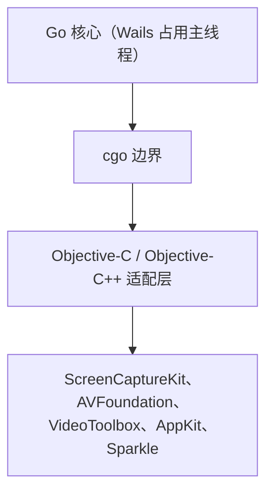
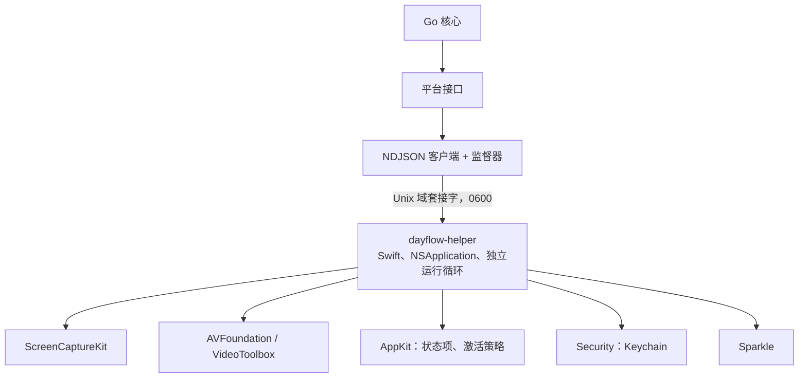

# 10. 原生桥接策略

## 10.1 必须跨越边界的内容

根据 [01 §3.5](01-current-architecture.md#35-原生框架接触点)，有 17 项能力需要 macOS 框架。按其对桥接层的要求分组如下：

| 分组 | 能力 | 桥接要求 |
|------|------|----------|
| **A. 纯 C、同步、无状态** | `CGPreflightScreenCaptureAccess`、`CGEventSourceSecondsSinceLastEventType` | 无论采用哪种方式都很简单 |
| **B. 异步、Swift 优先的 API** | `SCShareableContent`、`SCScreenshotManager.captureImage`、`SCContentFilter` | 需要 Swift 并发，或使用不便的 ObjC 完成回调 |
| **C. 长生命周期的 ARC 对象图** | `AVAssetWriter` + 像素缓冲区适配器 + `CVPixelBufferPool`；`AVAssetReader` + `VTCreateCGImageFromCVPixelBuffer` | 对象生命周期必须跨越单次调用；存在 ARC/GC 互操作风险 |
| **D. 依赖运行循环的观察者** | `NSWorkspace` 睡眠/唤醒、`DistributedNotificationCenter` 锁屏/屏保、`NSEvent.mouseLocation`、`NSScreen` | 需要真实主线程上持续运行的 `NSRunLoop` |
| **E. 框架拥有的 UI 与生命周期** | `NSStatusItem`、`NSApp.setActivationPolicy`、`UNUserNotificationCenter`、Sparkle `SPUUpdater` | 需要由主线程拥有的 `NSApplication` |
| **F. 与签名绑定** | Keychain `SecItem*`、TCC 屏幕录制授权 | 必须在宿主 bundle 的代码签名下运行 |

真正决定方案的是 C、D、E、F 组；A 组并不构成决策因素。

---

## 10.2 方案 A — 进程内 CGO



### 必须如何实现

Go 调用编译进同一二进制的 ObjC 适配层。`SCScreenshotManager.captureImage` 在 ObjC 中以完成回调方法暴露，因此每次捕获流程变为：Go 调用 → ObjC 分派 → 某队列上的回调 → 将 `CGImage` 封送回 Go → 交给生命周期必须由 Go 跨调用管理的 `AVAssetWriter`。

### 问题所在

**主线程争用（D、E 组）。** `NSStatusItem`、激活策略变更和 `NSWorkspace` 观察者要求线程 1 上运行 `NSRunLoop`。Wails 已在该线程为 WebView 运行自己的 `NSApplication`。虽然可以把更多 AppKit 使用者加入同一运行循环，但所有原生调用都会排在 WebView 工作之后，反之亦然。唤醒后已知较慢的 `SCShareableContent` 调用（因此现有代码会延迟 5 秒）会造成 UI 卡顿。

**内存安全面（C 组）。** `CVPixelBuffer`、`CGImage` 和 `CMSampleBuffer` 是引用计数的 Core Foundation 对象。现有 `FrameStore` 谨慎维护这些约束：`SegmentReader` 使用 `alwaysCopiesSampleData = false`，返回生命周期绑定到来源 sample 的缓冲区（[`FrameStore.swift:378-384`](../../legacy/dayflow/Dayflow/Core/Recording/FrameStore.swift#L378)）；同时用显式 `NSLock` 保护显示对象，因为“reader 绝不能保留另一个线程正在释放的引用”（[`:144-147`](../../legacy/dayflow/Dayflow/Core/Recording/FrameStore.swift#L144)）。在 cgo 边界重建这些不变量，并叠加 Go 移动式垃圾收集器规则，会引入只在发布构建中间歇崩溃的问题。

**影响范围。** ObjC 适配层中的一次 `EXC_BAD_ACCESS` 就会终止整个进程：UI 消失、SQLite 写入器在事务中途退出，而且打开的 HEVC 分段因没有 moov atom 而无法完成，最多丢失十分钟录制。当前的 `reconcileAfterLaunch()` 正是为这种情况存在；cgo 只会提高其发生概率。

**签名范围（F 组）并未形成差异。** 两种方案都要求代码在宿主 bundle 的签名下运行。CGO 自然满足，但 §10.4 表明 bundle 内 helper 同样满足。

**工具链成本。** 整个模块都需启用 `CGO_ENABLED=1`：构建更慢、无法纯 Go 交叉编译、`go vet`/竞态检测器受限，而且 `delve` 与 `lldb` 都难以呈现混合 Go/ObjC 调用栈。

**重写成本。** 这是决定性因素。选择 CGO 意味着用 Objective-C **重写** `ScreenRecorder`（722 行）、`FrameStore`（427 行）和 `VideoProcessingService`（421 行），而不是移植。其逻辑包含多年积累的修复：处理六种系统事件的四状态状态机、延迟显示器选择、Apple Silicon 与 Intel 编码器回退、三路崩溃恢复、带 8 帧跳过窗口的顺序读取优化。每一项都是已发现并修复过的缺陷；重写会同时重新引入所有风险。

---

## 10.3 方案 B — 通过 IPC 连接 Swift helper



### 工作方式

`dayflow-helper` 是 app bundle 内 `Contents/Helpers/dayflow-helper` 路径下的 Swift 可执行文件，使用相同身份签名，由 Go 进程启动并监督。它运行自己的 `NSApplication` 和主运行循环，因此 D、E 组能力可与当前方式完全相同地工作。它监听权限为 `0600` 的 Unix 域套接字，并使用换行符分隔的 JSON 通信。

捕获、编码和解码代码几乎可以**原样迁移**。`ScreenRecorder` 仅需两处变更：`FrameStore.shared.append` 不再调用 `StorageManager`；不再读取 `AppState.shared.isRecording`，而是读取由传入的 `capture.start`/`capture.stop` 消息设置的标志。

### 协议

控制平面——在一个套接字上使用 NDJSON，支持请求/响应和服务器推送：

```jsonc
// Go -> helper
{"v":1,"id":42,"op":"capture.start",
 "args":{"intervalSeconds":10,"captureHeight":1080,
         "blockedBundleIDs":["com.1password.1password"],
         "segmentDirectory":"/Users/x/Library/Application Support/Dayflow/recordings"}}

// helper -> Go，响应
{"v":1,"id":42,"ok":true}

// helper -> Go，主动推送
{"v":1,"event":"capture.frame",
 "data":{"segmentPath":".../20260909_102145123.mp4","frameIndex":7,
         "capturedAt":1788920505,"idleSeconds":0,"width":1920,"height":1080,
         "redacted":false,"seq":10241}}

{"v":1,"event":"capture.status",
 "data":{"state":"paused","reason":"system sleep","permissionGranted":true}}

{"v":1,"event":"capture.segmentClosed",
 "data":{"segmentPath":"...","totalBytes":4194304,"frameCount":600,"succeeded":true}}

// Go -> helper，确认已持久化
{"v":1,"op":"capture.ack","args":{"seq":10241}}
```

数据平面——像素不经过 JSON。`media.decodeFrame` 在第二条连接上写入带长度前缀的二进制帧：

```
[4-byte big-endian length][4-byte request id][payload bytes]
```

这在实际规模下很重要：时间线日视图会请求数百张缩略图。在 JSON 中使用 Base64 会使体积增加 33%，并迫使 WebView 主线程在每次导航时解析数 MB 字符串。使用二进制通道后，Go 接收原始 JPEG，在 `internal/media` 中缓存，并通过 Wails 资源处理器把它作为普通 HTTP 资源提供给 WebView，由浏览器免费完成流式传输和缓存。

### `seq`/`ack` 对

每个 `capture.frame` 都携带单调递增的 `seq`。Go 在 `screenshots` 行提交后确认。helper 会把未确认帧追加到分段旁的小型日志中，并在重新连接后重放。这样既能关闭“捕获帧时 Go 正在重启”的窗口，又保持 Go 是唯一数据库写入者。

---

## 10.4 对比

| 标准 | A：进程内 CGO | B：IPC 连接 Swift helper |
|------|---------------|--------------------------|
| **开发复杂度** | **高。** 用 Objective-C 重写约 1,570 行捕获/编解码逻辑；跨 cgo 边界手动管理 CF 对象生命周期。 | **低至中。** 几乎原样移动现有 Swift；两端各编写约 400 行协议代码。 |
| **维护成本** | **高。** 单个二进制内混合两种语言，没有清晰所有权边界。每次 ScreenCaptureKit 弃用都需编辑团队无人愿维护的 ObjC。 | **低。** Swift 保持为 Swift，可直接采用 Apple 文档和示例。边界是具有明确契约的版本化协议。 |
| **性能** | 略好：无需序列化。 | **充足且留有余量。** 捕获间隔为 10 秒时控制平面约每分钟 6 条消息。数据平面是 GB/s 级本地套接字；1080p JPEG 约 200 KB，传输远低于 1 ms。批量 `decodeFrames` 可为缩略图条带分摊系统调用。 |
| **可调试性** | **差。** 混合 Go/ObjC 调用栈；`delve` 与 `lldb` 无法协作；存在仅发布版触发的内存错误。 | **好。** Xcode 附加 helper，`delve` 附加 Go。协议是人类可读的 NDJSON——`socat` 就是可用的调试器，团队也已用同样方式调试 `agent.sock`。 |
| **崩溃隔离** | **无。** 一次 `EXC_BAD_ACCESS` 会同时损失 UI、进行中的事务和打开的分段。 | **强。** helper 崩溃被隔离；监督器按退避策略重启、重放日志并恢复状态项。UI 与数据库存活。 |
| **主线程模型** | **争用。** Wails 为 WebView 占用线程 1；AppKit 观察者和缓慢的 `SCShareableContent` 调用排在 UI 工作之后。 | **清晰。** helper 拥有自己的 `NSApplication` 和运行循环。这是最大的单项技术优势。 |
| **TCC / Keychain 身份** | 天然满足。 | 通过放入 `Contents/Helpers/` 并使用相同签名身份与 team ID 满足。**必须在阶段 1 验证**——见[风险 C-3](08-risk-analysis.md#c-3tcc-和-keychain-身份丢失)。 |
| **Sparkle** | 可以实现，但很别扭：Sparkle 需要 `NSApplication` 并重新启动宿主 bundle。 | **自然契合。** helper 托管 `SPUUpdater`；现有 appcast、EdDSA 密钥和 installer-launcher entitlement 可原样工作。 |
| **构建与 CI** | 模块全局 `CGO_ENABLED=1`。构建更慢、仅限 Mac、工具支持退化。 | Go 核心无 cgo，可在任意平台针对 `platform/fake` 进行无界面测试。helper 使用 SwiftPM 构建。 |
| **仓库内先例** | 无。 | **三个。** `dayflow-cli`（独立进程、同一数据库）、`AgentBridgeServer`（通过 `0600` Unix 套接字传输 NDJSON）、`FlowWebView`（Web UI + 原生桥接）。 |

---

## 10.5 建议

**选择方案 B：通过 IPC 连接 bundle 内的 Swift helper。** 不是略优，而是压倒性地更好。

最应重视的理由不是对比表，而是：

> 此决策涉及的代码最可能已吸收多年细微缺陷修复：`ScreenRecorder` 处理六种不同系统事件的四状态状态机、可避开合盖竞态的延迟显示器选择、Apple Silicon 与 Intel 编码器回退、`reconcileAfterLaunch` 的三种崩溃模式、8 帧顺序读取窗口。这些都不是纯粹“设计”出来的，而是实践中“学到”的。方案 B 移动这些代码；方案 A 用第三种语言重写，并同时重新引入每一项风险。

其他理由按重要性排序：

1. **主线程问题没有好的 CGO 解法。** Wails 占用线程 1，AppKit 观察者和 `NSStatusItem` 也需要线程 1。独立进程才是干净的解决方案，其他方式都只是在管理争用。
2. **此处崩溃隔离比多数应用更有价值。** 失败并非简单的“应用重启”，而可能因未完成的 mp4 没有 moov atom 而让用户悄然丢失十分钟记录。
3. **延续 Sparkle。** 现有用户通过使用特定 EdDSA 密钥签名的公开 appcast 更新。方案 B 无需取巧即可保留此路径；方案 A 会把它变成一个独立项目。
4. **团队已采用此模式。** `AgentBridgeServer` 使用相同传输、相同帧格式和相同权限模型，不会增加新的运维负担。

### 完全不使用 CGO

人们可能想为 A 组的两个调用——`CGPreflightScreenCaptureAccess` 和 `CGEventSourceSecondsSinceLastEventType`——保留 cgo，因为它们是纯 C，不涉及 ARC 对象和运行循环。

**不要这样做。** Go 中两者都不在热路径上：

- 空闲秒数在捕获时由 helper 采样，并随帧发送；Go 无需轮询。
- 权限状态通过 `capture.status` 到达，且很少变化。

为 Go 不需要的两个调用启用 cgo，会让整个模块失去无 cgo 属性；正是这一属性使 `go test ./internal/...` 能在 CI 中针对 `platform/fake` 进行无界面测试。它是整个测试策略的关键基础。

### 因此

| 关注点 | 决策 |
|--------|------|
| `CGO_ENABLED` | 所有 Go 代码均为 `0` |
| SQLite 驱动 | `modernc.org/sqlite`（纯 Go），理由相同 |
| helper 位置 | `Dayflow.app/Contents/Helpers/dayflow-helper` |
| helper 签名 | 与宿主相同的身份、team ID 和 hardened-runtime 设置 |
| helper 分发 | 放在 `.app` 内，作为其一部分完成公证。**绝不能**是独立 `.app` 或 `LaunchAgent`；任一做法都会创建新的 TCC 身份，迫使现有用户重新授予屏幕录制权限。 |

---

## 10.6 Helper 职责

```
dayflow-helper
├── Capture
│   ├── ScreenRecorder      从 Core/Recording/ScreenRecorder.swift 迁移
│   ├── FrameStore          从 Core/Recording/FrameStore.swift 迁移
│   ├── DisplayTracker      从 Core/Recording/ActiveDisplayTracker.swift 迁移
│   └── Placeholder         从 Core/Recording/RecordingPrivacyPlaceholder.swift 迁移
├── Media
│   ├── FrameDecoder        从 FrameStore.image(for:) 提取
│   ├── VideoEncoder        从 Core/Recording/VideoProcessingService.swift 迁移
│   └── JPEGEncoder         从 ScreenshotImageLoading + AgentCLISupport 提取
├── System
│   ├── Permissions         CGPreflight + 设置深层链接
│   ├── SystemEvents        NSWorkspace + DistributedNotificationCenter
│   ├── Keychain            从 Core/Security/KeychainManager.swift 迁移
│   ├── LoginItem           从 System/LaunchAtLoginManager.swift 迁移
│   └── Notifications       从 Core/Notifications/NotificationService.swift 迁移
├── UI
│   ├── StatusItem          从 System/StatusBarController.swift 迁移
│   └── ActivationPolicy    从 AppDelegate 提取
└── Update
    ├── Updater             从 System/UpdaterManager.swift 迁移
    └── SilentDriver        从 System/SilentUserDriver.swift 迁移
```

共约 2,400 行，其中约 2,000 行只是迁移而非新写。

### 明确不承担的职责

helper **不得**：

- 打开或写入 SQLite。Go 是唯一写入者。
- 为自身决策读写 `UserDefaults`。所有配置均通过消息传入，使 helper 在重启后无状态且可在测试中复现。*（唯一例外是在共存窗口中代理 `settings.write`——见 [04 §8.3](04-target-architecture.md#83-设置端口)。它代表 Go 执行写入，而不会读取该值进行决策。）*
- 发起网络请求。所有 HTTP 均由 Go 处理。
- 包含产品逻辑。不得进行批处理、空闲分类或卡片生成。

最后一条约束确保它是*平台适配器*而非第二个应用。只要决策能在 Go 中做，就必须在 Go 中做。

## 10.7 协议版本控制

helper 与 Go 二进制一同发布在一个 bundle 中，理论上不应出现版本偏差；但 Sparkle 更新和安装不完整意味着“理论上”还不够。

| 规则 | 细节 |
|------|------|
| 首先握手 | `{"v":1,"op":"hello","args":{"coreVersion":"3.0.0","protocol":1}}`；helper 返回自己的版本信息。 |
| 不匹配即致命错误 | 拒绝开始捕获，显示明确的“重新安装 Dayflow”消息。**绝不**静默降级——只能工作一半的 helper 比完全无法启动更糟。 |
| 加法式演进 | 协议版本内新增可选字段；仅在破坏性变更时提升版本。 |
| 忽略未知字段 | 双方均容忍向前兼容的新增内容。 |
| 拒绝未知操作 | 显式返回 `{"ok":false,"error":{"code":"unknown_op"}}` 而不是保持沉默，使缺陷表现为错误而非挂起。 |
