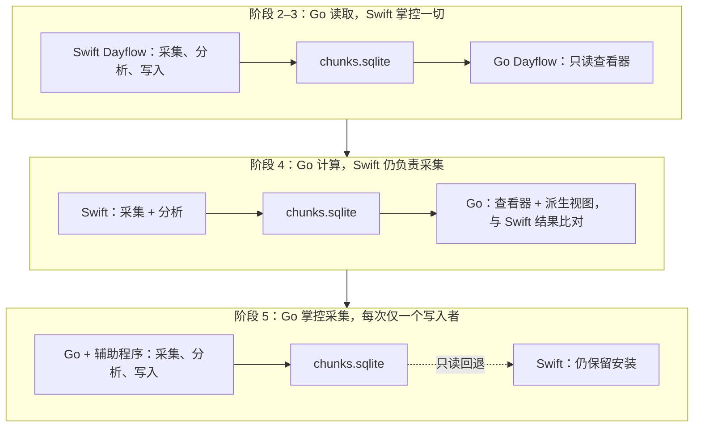
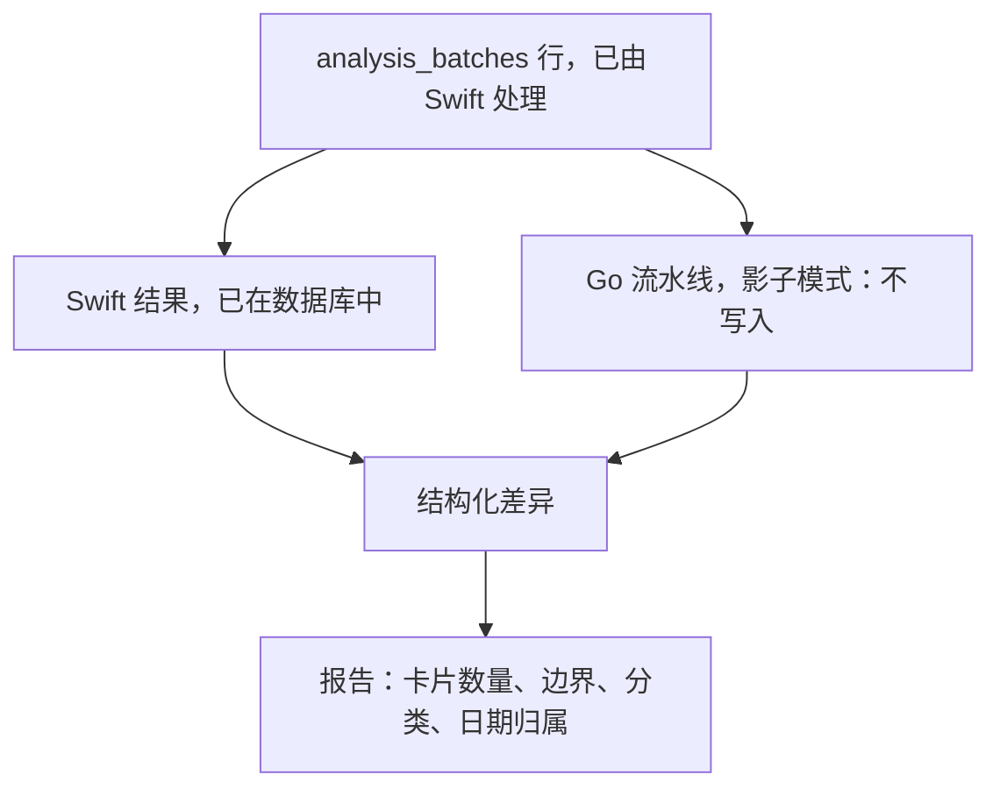

# 11. 迁移路线图

## 11.1 一句话概括策略

数据库是在固定路径下以 WAL 模式运行的 SQLite，而 `dayflow-cli` 已经证明应用写入时，第二个进程可以同时读取。仅凭这一事实，本项目就能从重写转变为**共存式迁移**：

项目的大部分时间里，Go 应用只是被动读取用户真实、在线、持续增长的数据。这是建立信心成本最低的方式，也意味着高风险时刻——采集所有权移交——只会在后期发生一次，并由锁文件保护，而不是寄希望于运气。

**贯穿始终且不可妥协的不变量：恰好一个进程持有采集所有者锁。**参见[风险 C-1](08-risk-analysis.md#c-1采集写入方并发运行)。

## 11.2 阶段概览

| 阶段 | 目标 | 写入用户数据？ | 退出门槛 |
|------|------|----------------|----------|
| 0 | 基线与夹具 | 否 | 夹具可重现 Swift 行为 |
| 1 | Go + Wails + Vue 骨架 | 否 | Wails 可承载后台代理 |
| 2 | Go 读取现有数据库 | 否 | 时间线与 `dayflow-cli` 逐字节一致 |
| 3 | v1 范围的 Vue UI | 否 | 可作为查看器日常使用 |
| 4 | Go 负责分析与派生视图 | 是，由功能标志控制 | 连续 7 天输出与 Swift 相同 |
| 5 | Go 负责采集 | 是 | 连续 14 天无数据缺口 |
| 6 | 退役 Swift 业务代码 | 是 | 仅剩 `native/darwin` 下的 Swift |

---

## 阶段 0——基线与夹具

**目标。**以可执行工件而非文字说明的形式，确定“行为不变”的含义。此时尚不构建产品，而是构建判定基准。

**变更范围。**新增 `testdata/` 目录。添加临时 Swift 测试目标 `DayflowFixtureExport`，序列化重要行为的输入和输出。不改动生产代码。

**输入。**当前 `main` 分支；三份已匿名化的真实数据库副本。

**输出。**

| 工件 | 内容 |
|------|------|
| `testdata/databases/v2.4.0-typical.sqlite` | 匿名化的真实安装数据——清理标题、摘要和路径，保留结构与时间戳 |
| `testdata/databases/v2.4.0-legacy-jpeg.sqlite` | 包含 `frame_index IS NULL` 的行。**必须合成**——样本安装中没有，但长期用户的数据中存在 |
| `testdata/databases/v2.4.0-empty.sqlite` | 首次运行时的模式，用于空状态路径 |
| `testdata/fixtures/idle/*.json` | `IdleBatchClassifier.assess` 的输入/输出，包括各阈值边界情况 |
| `testdata/fixtures/batching/*.json` | `createScreenshotBatches` 的输入/输出，包括丢弃最后一批规则 |
| `testdata/fixtures/cardreplace/*.json` | `replaceTimelineCardsInRange` 的输入/输出，包括午夜、夏令时及 System 卡片保留行为 |
| `testdata/fixtures/dayboundary/*.json` | `getDayInfoFor4AMBoundary` 在夏令时和半小时时差时区的结果 |
| `testdata/fixtures/weekly/*.json` | `WeeklyDashboardBuilder.build` 的输入/输出 |
| `docs/baseline-metrics.md` | 实测 CPU、内存、采集延迟、批处理时长、磁盘速率 |

**验证。**每个夹具都通过运行 Swift 实现生成，再用同一代码回放复验。无法往返一致的夹具说明导出器有缺陷，而现在发现这些问题正是本阶段的目的。

**风险。**

- *夹具把当前缺陷编码成“正确”行为。*这确实存在且部分无法避免。缓解措施：每个夹具目录附带 `NOTES.md`；对于看似错误的行为——同时存在 `completed`/`analyzed` 状态、无法解析的卡片被静默丢弃——记录为*已知差异、有意为之*，而非照搬。
- *匿名化破坏引用完整性。*原位清理文本；绝不重新编号 ID 或平移时间戳。

---

## 阶段 1——Go + Wails + Vue 骨架

**目标。**证明外壳可以承载后台代理，并搭建模块结构和 CI。不实现 Dayflow 功能。

**变更范围。**按照 [04 §7](04-target-architecture.md#7-新目录结构) 新建仓库目录树。不触碰 `legacy/dayflow/`。

**输入。**阶段 0 夹具；`go.mod`；一个 Wails v2 项目。

**输出。**

1. 一个可启动并显示空白 Vue 窗口的 Wails 应用；关键是，它在窗口关闭后**继续运行，留在状态栏中，并保持后台 goroutine 运转**。
2. `internal/platform` 接口及 `internal/platform/fake`。
3. `dayflow-helper` 骨架：启动、握手、响应 `system.permissionState`，安装 `NSStatusItem`，设置激活策略。暂不采集。
4. `internal/storage` 以只读方式打开夹具数据库，并使用匹配的 PRAGMA。
5. `internal/analysis/idle.go`——首个真实逻辑；选择它是因为其为纯逻辑且已有夹具。
6. CI：在 Linux 上无头运行 `go test ./internal/...`；在 macOS 上运行 `swift build` 和辅助程序测试。

**验证。**

| 检查项 | 方法 |
|--------|------|
| 后台代理在窗口关闭后存活 | 关闭窗口；确认 10 分钟后进程仍存活且 goroutine 仍在运转 |
| 无窗口时状态项可用 | 在未打开窗口时操作整个菜单 |
| 辅助程序握手和重启 | 对辅助程序执行 `kill -9`；确认按退避策略重启并重新建立状态项 |
| 权限状态正确 | 在“系统设置”中切换“屏幕录制”权限；确认报告状态随之变化 |
| `idle.go` 与 Swift 一致 | 所有阶段 0 空闲夹具通过 |
| 核心不依赖 cgo | `CGO_ENABLED=0 go build ./...` 成功 |

**风险。**

- **Wails 无法承载后台代理。**这是本阶段的门槛，也是计划的核心依赖。若第一项检查失败，应在投入任何 UI 工作前停止并重新评估——参见[风险 C-2](08-risk-analysis.md#c-2wails-无法承载后台代理)。失败后的选项：Wails v3、一个承载 WebView 的轻量 ObjC `NSApplication` 外壳，或放弃 Wails 改用其他外壳。
- *`modernc.org/sqlite` 的 WAL 并发访问。*验证 Swift 应用写入时 Go 可读取，且 `dayflow-cli` 同时可读取。回退方案：`mattn/go-sqlite3`，只允许 `storage` 使用 cgo。
- *TCC 身份。*确认包内辅助程序继承宿主的屏幕录制授权，不触发新提示。将辅助程序复制到*当前*应用的签名构建中测试。

---

## 阶段 2——Go 读取现有数据库

**目标。**达到既定里程碑：**新应用可以查看旧数据。**只读，但使用真实数据。

**变更范围。**`internal/storage`（所有读取路径）、`internal/settings`（plist 读取器）、`internal/insight/timeline.go`、`internal/timeutil`、辅助程序中的 `platform.Media.DecodeFrame`，以及 Go 版 `cmd/dayflow-cli`。

**输入。**阶段 0 数据库与夹具；一个在线安装实例，用于人工比对。

**输出。**

1. 用 Go 实现 `StorageManaging` 中的所有读取方法。
2. 46 个键的旧版 plist 读取器，首先处理 `colorCategories`。
3. `internal/insight/timeline.go`——移植 `TimelineActivityLoader`，包括带 60 秒容差的失败分组。
4. 辅助程序提供 `media.decodeFrame`，使真实缩略图可以渲染——包括 `frame_index IS NULL` 的旧版 JPEG 路径。
5. `internal/insight/weekly/`——提前移植，因为成本低、属于纯逻辑且便于差异比对。
6. Go 版 `dayflow-cli`，输出与 Swift CLI 逐字节一致。

**验证——本阶段开始体现差异判定基准的价值。**

| 检查项 | 方法 |
|--------|------|
| CLI 输出一致性 | 对参考数据库中的每一天运行 `diff <(swift-cli timeline --json) <(go-cli timeline --json)`。结果必须为空。 |
| 分类保真度 | 名称、颜色、顺序和 `isIdle` 标志与正在运行的 Swift 应用完全一致 |
| 帧解码保真度 | 分别随机解码 1,000 帧；比较尺寸和感知哈希 |
| 旧版 JPEG 路径 | 针对 `v2.4.0-legacy-jpeg.sqlite` 执行相同检查 |
| 凌晨 4 点边界 | 所有 `dayboundary` 夹具通过，包括夏令时和半小时时差时区 |
| 周报一致性 | 所有 `weekly` 夹具通过 |
| 并发安全 | Swift 采集和分析时 Go 连续读取 1 小时；无 `SQLITE_BUSY`，`dayflow-cli` 持续可用 |

**风险。**

- *二进制 plist 中的分类体系。*这是阶段 2 最可能的阻塞项。`colorCategories` 中 `Date` 和 `UUID` 的编码必须能往返一致。应将其作为首个实现项，而不是最后处理。
- *时区差异。*`Calendar.current` 与 `time.Local` 在常见场景中一致；分歧出现在夏令时边界和非整数小时偏移。
- *帧解码延迟。*如果逐个缩略图 IPC 太慢，应使用批量 `decodeFrames` 加 `internal/media` 缓存。先测量，再优化。

---

## 阶段 3——v1 范围的 Vue UI

**目标。**Go 应用成为可日常使用的*查看器*。仍然完全不写入用户数据。

**变更范围。**`frontend/` 和 `internal/app/api_*.go` 的读取部分。

**输入。**阶段 2 读取层；以现有 SwiftUI 作为设计参考。

**输出。**

| 界面 | 替代对象 |
|------|----------|
| 日/周时间线 | `Views/UI/MainView/`（7,135 LOC） |
| 活动详情 + 帧条 | `ActivityCard`、`ScreenshotSlideshow` |
| 每日回顾 | `Views/UI/Daily*`（约 3,500 LOC） |
| 日记 | `Views/UI/Journal*`（约 3,000 LOC） |
| 设置（只读展示） | `Views/UI/Settings/`（6,060 LOC） |
| 使用 CSS 自定义属性的主题 | `Utilities/DayflowTheme.swift` |
| 通过 `vue-i18n` 实现国际化 | `Utilities/Localization.swift` |

本阶段明确**不包括**：Weekly、Agents、Flow、Chat、Onboarding。

**验证。**

| 检查项 | 方法 |
|--------|------|
| 视觉一致性 | 在三个窗口尺寸下并排截图比较两个应用中的同一天 |
| 缩略图性能 | 包含 200 多张卡片的一天以 60 fps 滚动；拖动帧条无卡顿 |
| 内存上限 | 加载一周数据时低于 400 MB（基线来自阶段 0） |
| Playwright 冒烟测试 | 基于夹具数据库遍历每个 v1 路由 |
| 内部试用 | 团队连续两周将其作为主要*查看器*，同时由 Swift 继续采集 |

**风险。**

- *范围膨胀到追求像素级完美。*这是项目最大的进度风险。应明确约定 v1 是*功能*等价而非像素完全一致，定制 SwiftUI 动画不属于需求。
- *WebView 在数百个缩略图下的滚动性能。*从一开始就使用虚拟滚动和 `loading="lazy"`，而不是事后补救。

---

## 阶段 4——Go 负责分析与派生视图

**目标。**Go 写入 `observations` 和 `timeline_cards`。这是首个修改用户数据的阶段。

**变更范围。**`internal/analysis`、`internal/ai`、`internal/chat`、`internal/insight/recap*`、`internal/storage` 中的写入路径。

**输入。**阶段 2–3；阶段 0 的批处理和卡片替换夹具。

**输出。**

1. 完成 `internal/analysis`：调度器、批处理器、流水线、重新处理、失败分类。
2. `internal/ai`：全部六个提供商及 Gemma 回退、路由、重试和回退装饰器、提示词覆盖、`jsonrepair`。
3. 流水线通过 `InputKind` 准备负载，使 mp4 合成移出 Gemini 提供商并置于 `platform.Media` 之后。
4. 带双工具循环的 `internal/chat`。
5. 每日回顾生成及其调度器。
6. 存储写入路径，首要是 `ReplaceCardsInRange`。
7. **影子模式**：Go 对 Swift 已处理的批次运行完整流水线，不写入任何数据，并记录结构化差异。

**验证——影子模式是阶段门槛。**

| 检查项 | 方法 | 阈值 |
|--------|------|------|
| 批处理一致性 | 相同帧 → 相同批次边界 | 100% |
| 空闲分类 | 每个历史批次的判定相同 | 100% |
| 卡片替换 | 相同的 `start_ts`、`end_ts`、`day` 和软删除集合 | 100% |
| LLM 解析稳健性 | 在两个解析器中回放记录的 `llm_calls` 响应正文 | 100% |
| 端到端卡片 | 影子运行 7 天；比较数量、边界、分类 | 边界精确；标题/摘要可不同（LLM 非确定性） |
| 重新处理 | 在两者中重新处理某一天并比较 | 边界精确 |

必须正视这种不对称：LLM 文本输出是非确定性的，所以无法比较*内容*。**但结构可以且必须比较**——边界、数量、日期归属、分类有效性。`llm_calls` 中记录的响应正文让解析部分完全确定，而真正的缺陷最可能出现在这里。

**切换。**只有影子模式连续 7 天无误后：通过 `DAYFLOW_ANALYSIS_OWNER=go` 标志禁用 Swift 分析计时器（对 `AppDelegate` 的单行、可还原改动）并启用 Go 的计时器。Swift 继续采集。

**风险。**

- **两个应用同时分析** → 卡片重复、范围重写相互交错。`timelineCardGenerationGate` 仅在进程内有效，无法提供跨进程保护。需要按采集锁的相同模式建立*分析所有者锁*。
- *CLI 提供商的环境差异。*Go 的 `os/exec` 不会自动复现 `LoginShellRunner` 的 `$SHELL -lc` 环境。应有意移植，并使用 `nvm`、`asdf`、`mise` 和 Homebrew 管理的工具链测试。
- *静默丢失卡片。*目前无法解析的时间字符串会被无痕丢弃。在 Go 写入任何内容前，必须将 `ReplaceResult.SkippedCards` 接入指标。

---

## 阶段 5——Go 负责采集

**目标。**辅助程序负责采集，Go 负责持久化。Swift 不再录制。

**变更范围。**`native/darwin/` 采集模块、`internal/platform/helper`、`internal/app` 启动流程，以及采集所有者锁。

**输入。**阶段 4 已完成；阶段 1 的辅助程序骨架。

**输出。**

1. 将 `ScreenRecorder`、`FrameStore`、`DisplayTracker` 和 `Placeholder` 移入辅助程序，并让 `FrameStore` 上报帧而非写入行。
2. 实现 `capture.frame` / `capture.segmentClosed` / `capture.ack` 及离线日志。
3. Go 摄取帧并负责插入 `screenshots`。
4. Go 中的维护任务：清理、备份、WAL 检查点、尾项清理。
5. 采集所有者锁，以及显示哪个进程正在录制的 UI。
6. 辅助程序承载 Sparkle、通知、Keychain 和登录项控制。

**验证。**

| 检查项 | 方法 | 阈值 |
|--------|------|------|
| 分段格式一致性 | 通过 Swift 应用和辅助程序路径编码固定图像序列；比较编解码器、尺寸、关键帧间隔、帧数、PTS | 除编码器非确定性外可逐字节比较 |
| 交叉读取兼容性 | **旧 Swift 应用**必须能解码辅助程序产生的分段，反之亦然 | 100% |
| 无采集缺口 | 内部试用 14 天；断言除睡眠/锁屏外，帧间间隔不超过 `interval × 3` | 无无法解释的缺口 |
| 睡眠/唤醒/锁屏一致性 | 脚本化执行睡眠、锁屏、屏保、切换显示器、合盖 | 暂停/恢复行为与基线相同 |
| 崩溃恢复 | 在分段处理中对辅助程序执行 `kill -9`；确认协调流程丢弃或修复分段 | 无孤立行或文件 |
| Go 崩溃恢复 | 在采集过程中对 Go 执行 `kill -9`；确认日志回放不丢帧 | 零丢失 |
| 清理计量 | 填充至超出限制；确认 `recordings/` 收敛且活动分段保留 | 限制值的 ±5% 内 |
| 资源基线 | CPU 和内存与 `docs/baseline-metrics.md` 比较 | 恶化不超过 20% |
| 权限撤销 | 采集中撤销屏幕录制权限 | 干净停止、显示通知、保留偏好 |

**切换。**Go 获取采集锁；Swift 应用检测到锁后以只读模式启动。回滚只需删除锁并重新启动 Swift——因此锁必须是文件而非偏好设置。

**风险。**

- **静默丢失采集数据**是本产品最严重的失败。缓解措施：当状态为 `capturing` 且超过 `interval × 5` 未收到帧时，由看门狗告警；UI 录制状态严格依据收到的 `capture.status` 消息，不得依据 Go 的意图推断。
- *辅助程序首次采集时出现 TCC 提示。*必须在阶段 1 解决，不能到此时才发现。
- *编码器非确定性。*对同一组帧运行两次可能无法逐字节一致。应比较结构和可解码性，而不是字节。

---

## 阶段 6——退役 Swift 业务代码

**目标。**仅保留 `native/darwin/` 中的 Swift。删除 Xcode 项目。

**变更范围。**删除 `legacy/dayflow/Dayflow/{App,Core,Models,System,Utilities,Views,Menu}`、`legacy/dayflow/DayflowTests`、`legacy/dayflow/DayflowUITests`、`legacy/dayflow/Dayflow.xcodeproj` 和 `legacy/dayflow-cli`（由 Go CLI 替代）。将设置迁移到 SQLite。重做发布脚本。

**前置条件——必须全部满足。**

1. Go 连续负责采集 30 天且无数据缺口。
2. 延后处理的界面要么已在 Vue 中交付，要么正式裁撤，并记录决策。
3. 设置已从 plist 迁移到 SQLite，且一次性导入经过验证。
4. 发布包可读取 Keychain 项目。
5. 已从*上一已发布版本*（而非开发构建）验证 Sparkle 能通过已发布的 appcast 更新到 Go 构建。
6. 外部用户可使用 Go 实现的 `dayflow-cli` 和 MCP 服务器。

**输出。**

1. 删除约 105,000 LOC 的 Swift。
2. `app_settings` 表；plist 只在导入时读取一次。
3. 重做 `scripts/release*.sh`，用于 `wails build` + 嵌入辅助程序 + 公证。
4. 更新 `docs/`：架构、贡献指南、构建说明。

**验证。**

| 检查项 | 方法 |
|--------|------|
| 干净机器安装 | 全新 macOS 虚拟机：安装、授权、采集、分析、查看 |
| 从 2.4.0 升级 | 安装已发布的 2.4.0，生成一周数据，通过 Sparkle 升级，确认每张卡片和每一帧都保留 |
| 设置导入 | 46 个键全部正确写入；使用非常规配置抽查 |
| `native/` 外无 Swift | `find . -name '*.swift' -not -path './native/*'` 不返回任何内容 |
| 公证 | 构建的 `.app` 通过 `spctl -a -vvv` |

**风险。**

- *过早删除。*Swift 应用是回滚路径和差异判定基准。阶段 6 后至少两个版本内，应在 `legacy/swift` 分支保留可构建版本。
- *Sparkle 升级路径。*这是项目风险最高的单一步骤：升级损坏会困住整个安装用户群，且无法远程修复。发布前必须使用实际已发布构建在干净机器上测试。

---

## 11.3 顺序说明

**可并行的工作。**阶段 2 完成后，阶段 3（Vue）和阶段 4（Go 分析）相互独立——一个是前端，一个是后端，只在绑定 API 处交汇。鉴于 UI 占工作量的 60%，并行推进两者是缩短总工期的主要手段。

**不可并行的工作。**阶段 5 依赖阶段 4：若分析无法消费采集数据，采集就毫无意义。阶段 4 的影子模式依赖阶段 2。阶段 1 的 Wails 门槛阻塞所有后续工作。

**需要严格执行之处。**阶段 4 的 7 天影子期和阶段 5 的 14 天内部试用期不是冗余缓冲。它们是发现时间相关缺陷的唯一机制——夏令时切换、凌晨 4 点翻日、整夜睡眠周期、周边界。日期归属缺陷在单元测试中不可见，但经过一个周末的真实使用便会一目了然。

**计划最薄弱之处。**阶段 3 的范围由主观品味而非可检查条件定义。“功能等价”是目标，但没有任何测试能在有人花三天制作弹簧动画时失败。这里需要一位有权裁剪范围的明确负责人，并在阶段开始前商定书面的 v1 界面清单。
