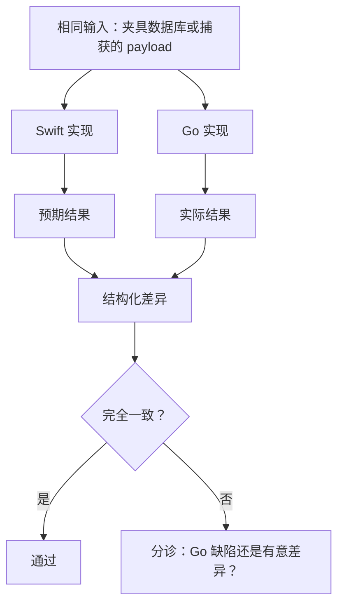
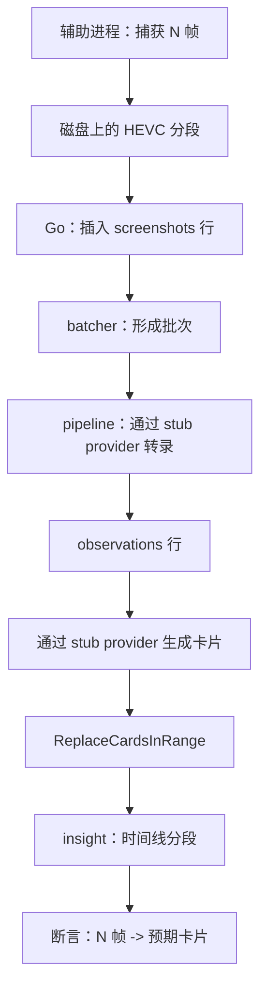

# 12. 测试策略

## 12.1 原则：以 Swift 应用为基准实现

本项目拥有一项巨大的测试优势，应充分利用：**存在一个可用的参考实现，并且它可以同时针对相同数据运行。**

这意味着正确性问题无需从基本原理推导，而可通过比较回答：



关键纪律是：**绝不能忽略差异。** 每项差异要么是 Go 缺陷，要么是记录在 `testdata/fixtures/*/NOTES.md` 中的有意差异，不存在第三种情况。

三层测试，按单位投入的价值排序：

| 层级 | 回答的问题 | 运行位置 |
|-------|-------------------|---------------|
| 数据库兼容性 | Go 能否读取 Swift 写入的数据？ | 无头 CI，任意平台 |
| 行为 | Go 的计算结果是否与 Swift 相同？ | 无头 CI，任意平台 |
| 集成 | 整个循环能否在真实 Mac 上运行？ | macOS runner + 手动测试 |

第 1、2 层在设计上不依赖 cgo——这正是 [05 §10.5](05-native-bridge.md#完全不使用-cgo) 中“不使用 cgo”决策的具体收益。

---

## 12.2 数据库兼容性测试

**目标。** `旧 Dayflow 数据库 → Go 应用 → 兼容。` 必须证明，而非假定。

### 参考数据库

| 夹具 | 用途 | 说明 |
|---------|---------|-------|
| `v2.4.0-typical.sqlite` | 常见情形 | 匿名化的真实安装：约 8,700 帧、190 张卡片、350 条观察、120 个批次 |
| `v2.4.0-legacy-jpeg.sqlite` | 分段机制之前的数据行 | `frame_index IS NULL`。**必须合成**——检查过的实时安装均不存在，但长期用户可能有，否则 Go 路径将未经测试 |
| `v2.4.0-empty.sqlite` | 首次运行 | 仅 Schema |
| `v2.4.0-corrupt.sqlite` | 恢复 | 在页面中间截断，用于验证损坏与环境故障的区分 |
| `v2.4.0-moved-paths.sqlite` | 旧路径重写 | `file_url` 值指向旧沙盒容器 |

匿名化规则对保持测试意义至关重要：

- 用长度相近的生成文本替换文本内容（`title`、`summary`、`detailed_summary`、`observation`、日志字段和聊天消息）。
- **绝不**重新编号 ID、偏移时间戳或修改 `day` 字符串——这些正是测试对象。
- 将 `file_path` 和 `video_summary_url` 重写为夹具相对路径，同时保留 `yyyyMMdd_HHmmssSSS.mp4` 文件名格式。
- 将 `llm_calls` body 截断到 4 KB，但保留足够内容以重放解析器。

### 测试矩阵

| ID | 测试 | 断言 |
|----|------|-----------|
| DC-1 | Schema 接受性 | 对每个夹具运行 Go 的 ensure-schema 时产生**零**项 DDL 变更。通过比较前后的 `sqlite_master` 哈希验证。 |
| DC-2 | 读取每张表 | 每个读取型 repository 方法在所有夹具上均返回非错误结果 |
| DC-3 | 往返完整性 | 打开、全部读取、关闭。`sqlite3 fixture 'PRAGMA integrity_check'` 仍返回 `ok` |
| DC-4 | 元数据 JSON 解码 | 每个 `timeline_cards.metadata` blob 都能解码为 `TimelineMetadata`，并保留 `distractions`、`appSites`、`isBackupGenerated` 和 `idle` |
| DC-5 | Distraction `id` 容错 | 有无 `UUID` 的 distraction 均可解码。缺失时 Swift 会生成新 UUID（`StorageModels.swift:73`）；Go 必须保持一致 |
| DC-6 | 旧版 JPEG 行 | `frame_index IS NULL` 通过独立文件路径解码 |
| DC-7 | 废弃表容错 | `chunks` 和 `batch_chunks` 存在但为空时不报错，且 Go 从不写入它们 |
| DC-8 | 损坏分类 | `v2.4.0-corrupt` 触发备份恢复；只读或磁盘已满故障则显示警报并退出，且**不**删除文件 |
| DC-9 | 旧路径重写 | `v2.4.0-moved-paths` 按 `StorageManager+Migrations.swift` 的行为重写为当前路径 |
| DC-10 | 并发访问 | Go 读取方 + Swift 写入方 + `dayflow-cli` 读取方持续 1 小时：零 `SQLITE_BUSY`、零损坏 |
| DC-11 | PRAGMA 一致性 | Go 设置 `journal_mode=WAL`、`synchronous=NORMAL`、`busy_timeout=5000`，并通过查询回读断言 |
| DC-12 | 回写兼容性 | Go 写入卡片后，**Swift 应用**能正确读取。双向兼容——这是回滚安全的基础 |

DC-1 和 DC-12 才是最重要的两项。DC-1 保证 Go 不会静默修改 Swift 应用仍需使用的数据库 Schema；DC-12 保证回滚路径有效，从而使之后每个阶段都可逆。

### 非 SQLite 兼容性

这很容易被遗忘，而 [01 §3.3](01-current-architecture.md#33-不在-sqlite-中的状态) 解释了为何它不是可选项：

| ID | 测试 | 断言 |
|----|------|-----------|
| PC-1 | Plist 读取 | 从真实 `teleportlabs.com.Dayflow.plist` 解析全部 46 个键 |
| PC-2 | 分类保真度 | `colorCategories` 往返后保持名称、`colorHex`、详情、顺序、`isSystem`、`isIdle` 和时间戳 |
| PC-3 | 路由解码 | `llmProviderRoutingV2` 可解码；Schema 版本不匹配以及 `primary == secondary` 均像 Swift 一样被拒绝 |
| PC-4 | Prompt 覆盖 | 全部四个 `*PromptOverrides` blob 均可解码 |
| PC-5 | OpenAI 配置 | `llmOpenAICompatibleConfigurationV1` 可解码，`isComplete` 保持一致 |
| PC-6 | 隐私列表 | `recordingPrivacyBlockedApplicationIdentifiers` 的规范化结果相同 |
| PC-7 | Keychain 读取 | 辅助进程无需用户提示即可读取签名 Swift 应用写入的密钥 |
| PC-8 | 写入可见性 | 通过辅助进程写入的设置对*正在运行的* Swift 应用可见——即[风险 H-3](08-risk-analysis.md#h-3通过-cfprefsd-写入偏好设置时发生竞争) 中的 `cfprefsd` 隐患 |

---

## 12.3 行为测试

**目标。** 计算结果完全相同，而非仅仅看似合理。

### 夹具生成

在阶段 0 由临时 Swift target 一次性生成，随后冻结：

```jsonc
// testdata/fixtures/idle/fully_idle_15min.json
{
  "description": "15-minute batch, all frames idle > 60 s, coverage 0.98",
  "generatedBy": "DayflowFixtureExport @ 1627b9e",
  "input": {
    "screenshots": [
      {"id": 1, "capturedAt": 1788920400, "idleSecondsAtCapture": 120,
       "filePath": "seg.mp4", "frameIndex": 0, "isDeleted": false}
    ]
  },
  "expected": {
    "assessment": {
      "classifierVersion": "idle_v1",
      "coverageRatio": 0.98,
      "coveredSeconds": 882,
      "batchDurationSeconds": 900,
      "qualifiedIdleRatio": 1.0
    }
  }
}
```

Go 测试加载夹具、运行 Go 函数并与 `expected` 比较。Swift 测试加载*同一个*夹具并断言相同结果——因此该夹具是双方都必须遵守的契约，而不是一方对另一方的转写。

### 按风险划分的覆盖范围

按差异在生产环境中未被发现的可能性排序。

| 优先级 | 行为 | 来源 | 危险原因 |
|---------:|-----------|--------|---------------------|
| **1** | `replaceTimelineCardsInRange` 时钟解析 | `StorageManager+TimelineCards.swift:862` | 四项相互作用的启发式规则；差异会静默地将卡片错放一天。参见 [02 §4.5](02-data-flow.md#45-时钟字符串问题) |
| **2** | `getDayInfoFor4AMBoundary` | `StorageDateHelpers.swift:22` | 每个按日查询都依赖它。某一天的边界错误会让整天看起来为空 |
| **3** | `createScreenshotBatches` | `AnalysisManager.swift:623` | 丢弃末批规则中的差一错误会造成批次重复或永久停滞 |
| **4** | `IdleBatchClassifier.assess` | `IdleBatchClassifier.swift:40` | 错误判定会导致为空闲时间支付 LLM 费用，或把真实活动标为 Idle |
| **5** | `ClaudeStrictJSONParser` + `ClaudeOutputValidator` | 合计 987 行代码 | 编码了模型异常行为的经验知识；回归看起来会像 provider 不稳定 |
| **6** | Gemini 压缩因子 | `GeminiDirectProvider+Transcription.swift:658` | 统一偏移批次内每条观察的时间戳——看似合理但实际错误 |
| **7** | `WeeklyDashboardBuilder.build` | `Core/Weekly/` | 可见但不具破坏性 |
| **8** | `TimelineActivityLoader` 故障分组 | `TimelineActivityLoader.swift:40` | 60 秒容差；影响重试入口 |
| **9** | Provider fallback 粘滞性 | `LLMService.swift:362` | 首次故障后保持 fallback 的语义容易出现细微偏差 |
| **10** | 各 provider 重试次数 | 多处 | 当前并不一致（1–4 次）；统一是有意变更——记录为差异 |

### 夹具不足时采用基于属性的测试

夹具只能覆盖已想到的情况。三个领域需要生成输入：

```go
// Any clock string resolved within a window must land inside that window,
// widened by one day on each side. Catches the nearest-of-three-days logic.
func TestResolveClockWithinWindow(t *testing.T) {
    rapid.Check(t, func(t *rapid.T) {
        anchor := rapid.Int64Range(0, 2_000_000_000).Draw(t, "anchor")
        hour   := rapid.IntRange(0, 23).Draw(t, "hour")
        minute := rapid.IntRange(0, 59).Draw(t, "minute")
        // ... assert |resolved - anchor| <= 12h + 1min
    })
}

// Day assignment must be stable and total: every instant maps to exactly one
// logical day, and consecutive instants never skip a day.
func TestDayBoundaryTotality(t *testing.T)

// Batching must partition: every input frame appears in exactly one batch or
// the dropped tail, never both, never neither.
func TestBatchingPartitions(t *testing.T)
```

三项测试都必须在多个 `TZ` 值下运行——至少包括 `UTC`、`America/Los_Angeles`（DST）、`Asia/Kolkata`（半小时时差）、`Australia/Lord_Howe`（半小时 DST）和 `Pacific/Chatham`。`Calendar.current` 与 `time.Local` 在常见情况下相同，但恰好会在这些情况下出现分歧。

### 确定性 LLM 测试

LLM *输出*不具确定性，因此无法比较端到端文本。LLM *解析*完全确定，且缺陷真正存在于此。

`llm_calls` 已存储真实请求和响应 body。提取它们：

```
testdata/fixtures/llmresponses/
├── gemini/transcribe/{ok,malformed_json,fenced_block,truncated}.json
├── claude/cards/{ok,prose_preamble,trailing_comma,wrong_types}.json
├── ollama/transcribe/{ok,empty,partial}.json
└── codex/cards/{ok,session_error}.json
```

通过两个解析器重放每个文件，并要求结果完全一致。这样可将系统最难测试的部分变成最易测试的部分；收集成本为零，因为数据已在记录。

---

## 12.4 集成测试

**目标。** 在真实 Mac 上验证 `捕获 → 存储 → 分析 → 时间线`。



### 层级

| 层级 | 平台 | 原生适配器 | AI provider | 运行时机 |
|-------|----------|----------------|-------------|------|
| **L1：核心循环** | 任意 | `platform/fake` | Stub | 每次 commit |
| **L2：辅助进程循环** | macOS | 真实辅助进程 | Stub | 每个 PR |
| **L3：完整循环** | macOS | 真实辅助进程 | 真实 Ollama | 每夜 |
| **L4：内部试用** | macOS | 真实 | 用户自己的 | 持续运行，阶段 3–5 |

L1 最具价值：由 `platform/fake` 提供合成帧，stub provider 返回预设观察，整个 pipeline——批处理、空闲分类、卡片替换、日期归属、时间线构建——都能在 Linux 上以无头方式于一秒内完成，无需 TCC 提示，也无 LLM 成本。

L3 专门使用 Ollama，因为它本地、免费且具有足够的可复现性，可每夜运行；每夜针对 Gemini 测试会缓慢、昂贵且受速率限制。

### L2 测试用例

| ID | 测试 | 断言 |
|----|------|-----------|
| IT-1 | 捕获到数据行 | 启动捕获，等待 5 个间隔后停止。行数匹配；每个 `frame_index` 连续 |
| IT-2 | 分段最终化 | 停止后分段可读，且每行 `file_size` 均非 NULL |
| IT-3 | 分段轮换 | 捕获中途强制改变分辨率；启动新分段，二者均可读 |
| IT-4 | 帧解码 | 解码每个捕获帧；尺寸与 `CaptureConfig` 一致 |
| IT-5 | 隐私遮蔽 | 将被屏蔽的应用置于前台；帧为占位图且 `redacted` 为 true |
| IT-6 | 睡眠和唤醒 | `pmset sleepnow`；唤醒后 10 秒内状态恢复为 `capturing`，且睡眠前分段已最终化 |
| IT-7 | 锁屏 | 锁定、等待、解锁；观察到暂停与恢复 |
| IT-8 | 显示器切换 | 将光标移到第二台显示器；经过 debounce 后捕获随之切换 |
| IT-9 | 权限撤销 | 捕获中撤销权限；捕获停止、发布通知，且不覆盖用户偏好 |
| IT-10 | 辅助进程崩溃 | 对辅助进程执行 `kill -9`；supervisor 重启它、重新应用配置并重放日志，且不丢帧 |
| IT-11 | Go 崩溃 | 在捕获中对 Go 执行 `kill -9`；重启后日志重放恰好生成缺失数据行 |
| IT-12 | 清理 | 设置较小上限并超量填充；`recordings/` 收敛，且**活跃分段绝不被删除** |
| IT-13 | 跨版本解码 | 已发布的 **Swift 2.4.0** 应用能解码辅助进程生成的分段 |
| IT-14 | 并发锁 | 启动两个应用；恰好一个执行捕获，另一个只读 |

IT-13 和 IT-14 是回滚保证。没有 IT-13，阶段 5 出现问题时无法无损回滚；没有 IT-14，同时安装两个应用的用户会静默破坏自己的录制覆盖范围。

### 长时间验证

有些缺陷只会随时间出现。以下检查在阶段 4–5 内部试用期间作为持续断言运行，而非普通测试：

| 检查 | 窗口 | 断言 |
|-------|-------:|-----------|
| 捕获连续性 | 14 天 | 除记录的睡眠/锁屏窗口外，帧间间隔不超过 `interval × 3` |
| 日期翻转 | 14 天 | 每张卡片的 `day` 等于 `getDayInfoFor4AMBoundary(start_ts)`；特别验证 03:30–04:30 创建的卡片 |
| DST 转换 | 跨越一次转换 | 没有重复或缺失小时；没有 `end_ts <= start_ts` 的卡片 |
| 周边界 | 跨越一个周一 | 周范围无重叠、无间隙地分区 |
| 批次活性 | 14 天 | 没有批次保持 `processing` 超过 30 分钟 |
| 磁盘收敛 | 14 天 | `recordings/` 保持在配置上限的 5% 范围内 |
| 内存稳定性 | 14 天 | 第一小时后 RSS 增长低于 10%——可捕捉该设计最可能出现的帧缓存泄漏 |

---

## 12.5 有意不测试的内容

明确说明可避免虚假信心：

| 不测试 | 原因 | 补偿性控制 |
|------------|-----|----------------------|
| LLM 输出文本 | 本质上不确定 | 断言结构；通过夹具测试解析 |
| 像素级 UI 一致性 | v1 追求功能一致，而非视觉一致 | 在阶段门禁进行并排审查 |
| 编码器字节级一致性 | VideoToolbox 输出因芯片和 OS build 而异 | 改为断言结构与可解码性 |
| CI 中的 Sparkle 端到端流程 | 需要签名、公证和托管 appcast | 每次发布前使用已发布 build 手动验收 |
| 推迟的界面 | v1 不构建 | Swift 应用保持可用 |
| 真实 provider 速率限制 | 成本高且不稳定 | 使用 stub HTTP 状态码测试错误路径 |

第一行是整个策略坦诚承认的限制：本计划可以证明 Go 的批处理、分类、解析、存储和显示结果一致，却无法证明 LLM 给出相同文本。这可以接受，因为即使当前应用连续运行两次，LLM 也已不具确定性——产品从未依赖这一属性。