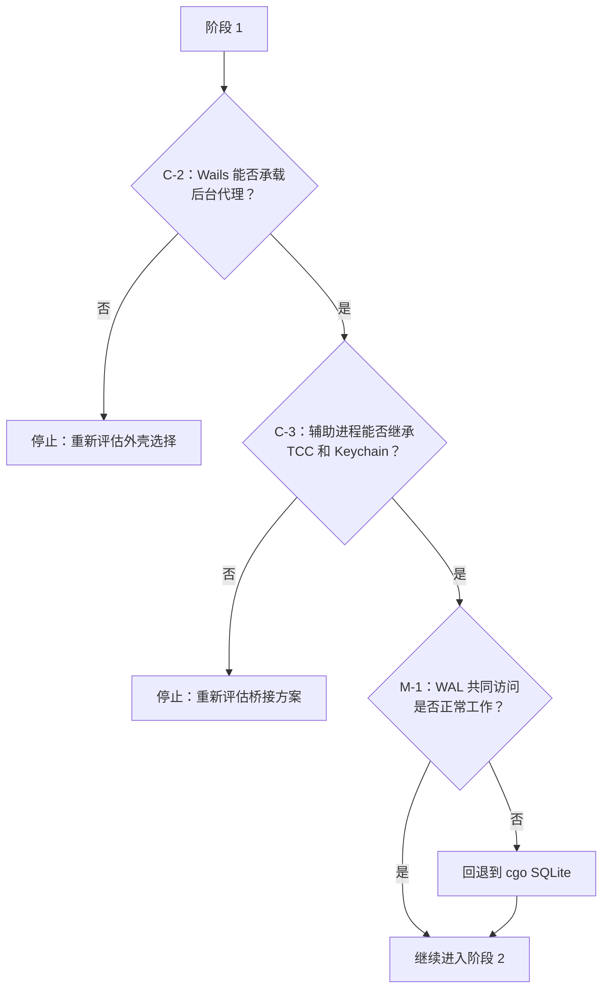

# 13. 风险分析

## 13.1 风险登记表

严重程度综合反映影响、发生可能性以及风险被发现的滞后程度。

| ID | 风险 | 严重程度 | 暴露阶段 |
|----|------|----------|----------|
| C-1 | 并发采集写入方破坏覆盖数据 | **严重** | 5 |
| C-2 | Wails 无法承载后台代理 | **严重** | 1 |
| C-3 | TCC / Keychain 身份丢失 | **严重** | 1 |
| C-4 | 自动更新连续性 | **严重** | 6 |
| C-5 | 静默采集丢失 | **严重** | 5 |
| H-1 | UI 重写范围失控 | 高 | 3 |
| H-2 | 在 Swift 之外解码 HEVC 帧 | 高 | 2 |
| H-3 | 通过 `cfprefsd` 写入偏好设置时发生竞争 | 高 | 4 |
| H-4 | 时钟字符串解析出现偏差 | 高 | 4 |
| H-5 | 分析任务并发写入 | 高 | 4 |
| H-6 | CLI 提供方的环境出现偏差 | 高 | 4 |
| M-1 | `modernc.org/sqlite` 的 WAL 行为 | 中 | 1 |
| M-2 | WebView 渲染帧条带时的性能 | 中 | 3 |
| M-3 | 辅助进程崩溃循环 | 中 | 5 |
| M-4 | 时区和夏令时偏差 | 中 | 2 |
| M-5 | 辅助进程的打包与公证 | 中 | 6 |
| M-6 | 延后界面的功能对等缺口 | 中 | 6 |
| M-7 | Agent/MCP 契约破坏 | 中 | 2 |
| L-1 | 字体和资源保真度 | 低 | 3 |
| L-2 | 分析事件连续性 | 低 | 4 |
| L-3 | 跨两个进程的 Sentry 符号化 | 低 | 5 |

---

## 严重

### C-1：采集写入方并发运行

**会发生什么。** Swift 和 Go 应用同时安装且都在采集。两个进程会针对重叠的时间范围追加 HEVC 片段并插入 `screenshots` 行。后果包括：帧覆盖数据重复；`file_size` 被重复计入，导致清理时过度删除；以及 `fetchUnprocessedScreenshots` 生成的批次交错包含来自两个片段的帧，而这些片段使用了不一致的 `frame_index` 基准。

**为什么容易发生。** 当前设计中没有任何机制可以阻止这种情况。在阶段 4–5 期间，两个应用本来就会同时安装，而 macOS 会正常启动二者。

**缓解措施。**

- 启动时获取 `~/Library/Application Support/Dayflow/capture.lock` 上的独占 `flock`，并在进程的整个生命周期内持有。无法获取该锁的进程以只读模式启动。
- Swift 应用需要进行一项小型的增量修改，以遵循同一把锁。这是该计划要求对已发布应用进行的**唯一一项修改**，并且应在阶段 5 开始*之前*发布，以确保用户届时已经运行支持锁机制的版本。
- UI 必须显示由哪个进程负责采集，避免将只读实例误认为正在录制的实例。
- 检测：使用 [07 §12.4](07-testing-strategy.md#l2-测试用例) 中的 IT-14，并定期查询来自不同 `file_path` 前缀且 `captured_at` 值重叠的记录。

**残余风险。** 用户强制退出锁持有方后会留下过期锁文件。进程终止时，内核会释放 `flock`，因此这种情况已得到处理——但如果主目录位于网络挂载卷上，锁文件并不可靠。如果 `~` 不在本地存储上，应检测并发出警告。

---

### C-2：Wails 无法承载后台代理

**会发生什么。** Dayflow 本质上是一个常驻菜单栏的后台代理：`applicationShouldTerminate` 返回 `.terminateCancel`（[`AppDelegate.swift:220`](../../legacy/dayflow/Dayflow/App/AppDelegate.swift#L220)），应用隐藏并切换到 `.accessory` 策略，且在没有窗口的情况下继续采集。Wails v2 围绕窗口构建，窗口关闭后进程随之终止，而且它对状态栏项目的支持并非一等能力。

**为什么这是首要风险。** 这是一个*前提*失效问题，而不是实现缺陷。如果在 Vue 重写完成后才发现失败，项目中最大的一笔单项投入将被搁置。

**缓解措施。**

- **在阶段 1 限时用一周完成探索性验证，并且要早于任何 UI 工作。** 具体验证内容：Wails 应用窗口关闭；由辅助进程安装 `NSStatusItem`；应用 `.accessory` 策略；10 分钟后 goroutine 仍在运行；可以从状态菜单重新打开窗口。
- 架构本身已经提供了部分保障：采集位于辅助进程中，因此“在没有窗口时继续录制”完全不依赖 Wails。剩余问题的范围更窄——*Wails 进程*能否在无窗口状态下继续存活？
- 按优先顺序记录的后备方案：(1) Wails v2 `HideWindowOnClose` + 由辅助进程拥有状态栏项目；(2) Wails v3，并接受 alpha 阶段风险；(3) 使用精简的 ObjC `NSApplication` 外壳负责生命周期并承载 WebView，Wails 仅用于绑定；(4) 完全改用其他外壳。

**残余风险。** 后备方案 (3) 会重新引入 ObjC，并削弱“无 cgo”方案的部分依据。如果探索性验证最终采用该方案，应重新审视 [05](05-native-bridge.md)，而不是依靠惯性继续推进。

---

### C-3：TCC 和 Keychain 身份丢失

**会发生什么。** macOS 会将屏幕录制授权和 Keychain ACL 绑定到代码身份。如果执行采集的二进制文件所呈现的身份与用户原先授权的身份不同，所有现有用户都会在没有预警的情况下重新遇到权限提示——而且如果不弹出提示，Keychain 中的 API Key 也将无法读取。

对于一个用户已经信任过一次的隐私敏感型应用，在自动更新后意外出现“Dayflow 想要录制您的屏幕”对话框，是一次严重的信任事件，而不是无关紧要的小问题。

**缓解措施。**

- 辅助进程应发布在现有 bundle **内部**的 `Contents/Helpers/dayflow-helper`，使用相同的身份、团队 ID 和 hardened runtime 设置签名，并作为宿主 `.app` 的一部分进行公证。
- **绝不能**将它作为独立 `.app`、`LaunchAgent` 或 `LaunchDaemon` 发布。每种方式都会创建不同的 TCC 身份。
- bundle identifier `teleportlabs.com.Dayflow` 不得更改。
- 在阶段 1 进行实机验证：将辅助进程复制到*当前*应用的已签名构建中，在一台已具备现有授权的机器上确认不会出现提示。需要同时在 Intel 和 Apple Silicon 上测试。
- 使用 [07 §12.2](07-testing-strategy.md#非-sqlite-兼容性) 中的 PC-7 和 PC-8。

**残余风险。** 无论如何，macOS 偶尔都会在操作系统大版本升级后使 TCC 授权失效。应用目前已经能够妥善处理权限缺失（[`ScreenRecorder.swift:496`](../../legacy/dayflow/Dayflow/Core/Recording/ScreenRecorder.swift#L496)）；必须完整保留这条处理路径。

---

### C-4：自动更新连续性

**会发生什么。** 现有 2.4.0 用户通过 Sparkle 从 `https://dayflow.so/appcast.xml` 更新，并使用嵌入 `Info.plist` 的 EdDSA 公钥进行验证。使用不同更新器的 Go/Wails 构建无法通过该渠道交付。这些用户将被困在 2.4.0，且**无法远程补救**——唯一的解决办法是要求每位用户手动下载新应用。

**缓解措施。**

- 保留 Sparkle。正因如此，`UpdaterManager` 和 `SilentUserDriver` 在 [03 §5.9](03-migration-classification.md#59-系统集成) 中被标记为 **KEEP**。
- 在辅助进程中承载 `SPUUpdater`：Sparkle 需要 `NSApplication` 并会重新启动宿主 bundle，而辅助进程天然能够提供这两项能力。这也是采用辅助进程架构的重要次要理由。
- 原样保留 `SUFeedURL`、`SUPublicEDKey`、`SUEnableInstallerLauncherService` 以及两项 `temporary-exception.mach-lookup.global-name` entitlement。
- **以真实升级测试作为门禁条件**：在干净的机器上安装已发布的 2.4.0，生成一周的数据，通过线上 appcast 更新到 Go 构建，并验证每张卡片和每一帧均完整保留。必须从已发布构建升级，而不是从开发构建升级。

**残余风险。** 对所有进行首次 Go 版本升级的用户来说，这是一个单向门。正式发布前，应先通过分阶段 appcast 向一小批用户发布。

---

### C-5：静默采集丢失

**会发生什么。** UI 显示“正在录制”，但实际没有采集任何内容。用户直到第二天才发现时间线中缺失了数小时的数据，而且完全无法恢复——那些时刻已经过去。

这是该产品可能发生的最严重故障。它比崩溃更糟，因为崩溃是可见的，而这种故障不可见。

**该架构引入的新风险敞口。** 目前，录制状态和录制器位于同一进程中。在目标设计里，辅助进程可能终止、卡死、失去 socket 连接或陷入崩溃循环，而 Go 的 UI 仍继续显示它最后认知到的状态。

**缓解措施。**

- **UI 的录制状态必须仅根据实际从辅助进程收到的 `capture.status` 消息推导。** 绝不能根据 Go 的意图推导。这是一条架构规则，而不是代码审查偏好。
- 看门狗：如果状态为 `capturing`，且在 `interval × 5` 内未收到 `capture.frame`，则将 UI 切换到明显的降级状态并记录日志。
- 辅助进程重启失败三次后，显示一个不可关闭的持久横幅。
- 在内部试用期间执行连续性断言：除已记录的睡眠或锁屏时段外，相邻帧之间的间隔不得超过 `interval × 3`。
- 在所有停止路径（包括关机）中保留 `finishCurrentSegment()`。未完成最终处理的 mp4 没有 moov atom，无法恢复。

**残余风险。** 如果 VideoToolbox 编码器静默卡死，仍接受帧但不写入任何内容，帧到达监控将无法发现该问题。必须保留现有的 `writer.status == .failed` 检查（[`FrameStore.swift:67`](../../legacy/dayflow/Dayflow/Core/Recording/FrameStore.swift#L67)），并将其失败情况上报给 Go，而不是仅仅打印。

---

## 高

### H-1：UI 重写范围失控

**会发生什么。** 现有代码包含 65,864 LOC 的 SwiftUI，其中包括 9,855 LOC 的手工构建图表和大量定制弹簧动画。在 Vue 中忠实重建这些内容没有明确边界，其失败模式不是错过截止日期，而是阶段 3 *无限期*延长。

**缓解措施。**

- 在阶段 3 开始前书面确定并达成一致的 v1 界面清单：时间线、每日、日志、设置、聊天、新手引导。每周、Agents 和 Flow 延后。
- 将“功能等价，而非像素级一致”明确规定为执行标准。
- 指定一名有权削减范围的负责人。
- 阶段 3 与阶段 4 并行推进，避免 UI 成为唯一的关键路径。
- 需要延后界面的用户继续使用 Swift 应用；两个应用读取同一数据库。

**残余风险。** 延后的界面可能永远不会重建。如果这是经过审慎决策得出的结果，那么它可以成为可接受的产品结果——应记录这一决定，而不是任由它因资源逐渐流失而发生。

### H-2：在 Swift 之外解码 HEVC 帧

**会发生什么。** 如果在 Go 中重新实现帧解码，则每个缩略图、幻灯片和 Gemini 上传都将依赖第三方 HEVC 解码器：引入大型 cgo 依赖（`libavcodec`）、带来许可证问题，而且几乎必然与 VideoToolbox 的输出产生偏差。

**缓解措施。** 不要这样做。`platform.Media.DecodeFrame` 委托给辅助进程；编解码器始终留在 Swift 中。`Screenshot.loadCGImage()` 已经是唯一的关键入口（[`ScreenshotImageLoading.swift:26`](../../legacy/dayflow/Dayflow/Core/Recording/ScreenshotImageLoading.swift#L26)），因此从概念上讲，只需替换一行，而不需要进行重构。

**残余风险。** 每帧均会产生 IPC 延迟。可通过批量调用 `DecodeFrames` 和 `internal/media` 缓存缓解；应先测量，再优化。

### H-3：通过 `cfprefsd` 写入偏好设置时发生竞争

**会发生什么。** macOS 偏好设置域由 `cfprefsd` 代理，并按进程缓存。如果非 bundle 进程在 Swift 应用运行期间直接写入 plist 文件，那么下次 `cfprefsd` 刷新时，该写入会被静默丢弃。其症状是设置偶尔恢复原值，且复现取决于时序——这是诊断成本最高的缺陷类型之一。

**缓解措施。**

- 共存期间：**读取**操作直接解析 plist（安全）；**写入**操作通过辅助进程的 `UserDefaults` 代理，该辅助进程位于 bundle 内，因此行为正确。
- 切换完成后：将设置迁移到 SQLite 中的 `app_settings` 表，从而彻底移除 `cfprefsd` 的影响。
- PC-8 断言由辅助进程写入的设置对一个*正在运行的* Swift 应用可见。

**残余风险。** 代理会给设置写入增加一次 IPC 跳转。可以接受——这类操作很少发生，且由用户主动触发。

### H-4：时钟字符串解析出现偏差

**会发生什么。** `replaceTimelineCardsInRange` 通过三个候选日期中距离最近的日期、跨午夜修正和凌晨 4 点边界，将 LLM 时钟字符串解析为时间戳（[02 §4.5](02-data-flow.md#45-时钟字符串问题)）。一旦实现产生偏差，卡片就会被放到错误的日期——数据看似存在，却无法找到。

**缓解措施。** 将行为固件测试列为最高优先级（[07 §12.3](07-testing-strategy.md#按风险划分的覆盖范围) 中的优先级 1），再加上覆盖五个时区的基于属性的测试，以及内部试用断言：每张卡片的 `day` 必须等于 `getDayInfoFor4AMBoundary(start_ts)`，并特别关注在 03:30 至 04:30 之间创建的卡片。

**残余风险。** 固件无法覆盖每个时区。基于属性的测试可以缩小缺口，但无法完全消除缺口。

### H-5：分析任务并发写入

**会发生什么。** 两个应用都运行各自的分析计时器。二者从同一组未处理帧创建批次，并针对重叠范围调用 `replaceTimelineCardsInRange`。`timelineCardGenerationGate` 是进程内信号量（[`LLMService.swift:12`](../../legacy/dayflow/Dayflow/Core/AI/LLMService.swift#L12)），无法提供跨进程保护。结果包括：卡片重复、LLM 成本翻倍，以及卡片在写入过程中被另一个进程软删除。

**缓解措施。** 按照与 C-1 相同的模式设置分析所有者锁。阶段 4 的切换通过 `DAYFLOW_ANALYSIS_OWNER=go` 转移所有权，并通过一项可单行还原的更改禁用 Swift 计时器。

**残余风险。** 切换时正在执行的批次可能被处理两次。可以接受：对于相同输入，范围替换逻辑是幂等的，因此结果只是费用浪费，而不是数据损坏。

### H-6：CLI 提供方的环境出现偏差

**会发生什么。** Claude Code 和 Codex 通过 login shell 调用，因此能够继承用户的 PATH 和工具链管理器（[`LoginShellRunner.swift`](../../legacy/dayflow/Dayflow/Core/AI/LoginShellRunner.swift)，以及 1,454 LOC 的 `ChatCLIProcessRunner`）。Go 的 `os/exec` 继承*父进程*环境，而以 GUI 方式启动的应用所拥有的环境非常精简。使用 `nvm`、`asdf`、`mise` 或 Homebrew 工具链的用户，即使终端中的 CLI 工作正常，也会看到“CLI not found”。

**缓解措施。** 有意识地移植 `LoginShellRunner`：解析 `$SHELL`、使用 `-lc` 运行、捕获环境并缓存。针对 `nvm`、`asdf`、`mise`、Homebrew 和裸安装进行测试。保留 `CodexExecutableResolver` 的发现顺序。

**残余风险。** 捕获 login shell 环境本身就很脆弱。保留现有的新手引导“测试连接”流程，使故障在设置阶段暴露，而不是在首次分析时才暴露。

---

## 中

### M-1：`modernc.org/sqlite` 的 WAL 行为

Pure-Go SQLite 是对 C 源代码的翻译，通常具有很高的保真度，但它与*其他*进程连接之间的 WAL 交互是验证最少的路径。如果 Go 写入方和 Swift `dayflow-cli` 读取方发生死锁或引发 `SQLITE_BUSY` 风暴，外部代理集成就会中断。

**缓解措施。** 在阶段 1 验证：让 Go 写入方、Swift CLI 读取方和 Swift 应用读取方并发运行一小时。完全匹配 PRAGMA（DC-11）。后备方案：仅在 `internal/storage` 中使用 `mattn/go-sqlite3`，接受单个 package 使用 cgo，同时保持其余部分不使用 cgo。

### M-2：WebView 渲染帧条带时的性能

一天的时间线可能会请求数百张缩略图；回顾拖动条会以交互速率请求缩略图。在 JSON 中使用 Base64 将造成灾难性的性能问题。

**缓解措施。** `GetFrameURL` 返回由 Wails 资源处理程序提供的 URL，以便浏览器进行流式传输和缓存。从一开始就使用虚拟滚动和 `loading="lazy"`。帧条带使用批量 `DecodeFrames`。在 `internal/media` 中使用有界 LRU。以包含 200 张卡片的一天为基准，在 60 fps 下进行验证。

### M-3：辅助进程崩溃循环

某个持续存在的条件——损坏的片段、缺失的目录或卡死的编码器——可能导致辅助进程在重启后立即崩溃，形成无限循环，在看似正常工作的同时持续消耗 CPU 和电量。

**缓解措施。** 使用最长 60 s 的指数退避。连续失败三次后，停止自动重启并显示持久横幅。在崩溃报告中包含最后 50 条协议消息。IT-10。

### M-4：时区和夏令时偏差

`Calendar.current` 和 Go 的 `time.Local` 在常见情况下保持一致，但在夏令时边界、半小时时区偏移和历史时区变更的情况下可能产生偏差。所有按日期限定范围的查询都依赖二者保持一致。

**缓解措施。** 在五个时区下生成固件；在每个时区下运行基于属性的测试；安排一个跨越真实夏令时变更的内部试用时段。

### M-5：辅助进程的打包与公证

在已公证的 `.app` 中捆绑辅助可执行文件，需要正确执行嵌套代码签名、匹配 hardened runtime 设置，并且在 entitlement 不同时谨慎处理继承。Sparkle 的 installer-launcher XPC 服务还会增加另一种嵌套签名场景。配置错误会导致 Gatekeeper 拒绝运行，而且只能在最终用户的机器上复现。

**缓解措施。** 在**阶段 1** 使用桩辅助进程建立完整的签名和公证流水线，而不是等到阶段 6 才使用真实辅助进程建立。在 CI 中运行 `spctl -a -vvv` 和 `codesign --verify --deep --strict`。在一台从未运行过开发构建的机器上进行测试。

### M-6：延后界面的功能对等缺口

每周、Agents 和 Flow 包含约 12,000 LOC 的用户可见功能，而 v1 将不包含这些功能。依赖这些功能的用户会注意到这一点。

**缓解措施。** 保持 Swift 应用可安装且可作为只读配套应用正常使用。在发行说明中明确传达延期安排。即使其 UI 仍要等待，也应在阶段 2 将每周*构建器*移植到 Go——它成本低、逻辑纯粹，并且这样一来之后只剩渲染工作。

### M-7：Agent/MCP 契约破坏

`dayflow-cli` 的 13 条命令和 JSON 输出是公共契约，用户已经通过 MCP 将其接入 Claude Code 和 Codex。任何结构变化都会在没有明显提示的情况下破坏他们的配置。

**缓解措施。** 将字节级一致的输出作为阶段 2 的门禁条件（通过 `diff` 进行 DC 测试）。保留 `DAYFLOW_DB`。保持 `agent.sock` 协议及其六项操作不变。像 Swift CLI 一样，在连接层强制执行只读限制（`SQLITE_OPEN_READONLY` + `PRAGMA query_only`）。

---

## 低

### L-1：字体和资源保真度

SwiftUI 渲染了六种捆绑的可变字体（Figtree、Instrument Serif、Nunito）。WebKit 无法以完全相同的方式渲染它们——字体微调、子像素定位和可变轴处理均不相同。根据 SwiftUI 度量调校的布局会发生偏移。

**缓解措施。** 通过 `@font-face` 加载相同的 TTF。接受细微差异。重新调校间距，而不是与渲染器对抗。

### L-2：分析事件连续性

`AnalyticsEventDictionary.md` 记录了一个既有的事件分类体系，用于为现有 PostHog 仪表板提供数据。如果重命名或遗漏事件，就会在最需要历史对比的时刻——迁移期间——破坏这种对比。

**缓解措施。** 原样移植事件名称和属性键，包括采样概率（`withSampling(probability: 0.01)`）。添加 `client=go` 属性，在不破坏现有查询的前提下区分不同实现。

### L-3：跨两个进程的 Sentry 符号化

崩溃可能源自 Go 进程或 Swift 辅助进程，两者需要不同的符号化方式。缺乏上下文的辅助进程崩溃报告很难用于采取行动。

**缓解措施。** 核心使用 `sentry-go`，辅助进程使用 `sentry-cocoa`，二者共享相同的发布版本和会话 ID，以便关联成对报告。将最后 50 条协议消息附加到辅助进程崩溃报告中。

---

## 13.2 风险驱动的阶段排序

风险登记表决定了一个路线图已经体现出的执行顺序。其中三项是*前提*风险——它们会使计划失效，而不只是增加计划的复杂度——因此必须在进行实质性投入之前，于阶段 1 全部明确：

需要始终牢记的区别是：C-1、C-4 和 C-5 *虽然严重，但可以解决*——它们需要谨慎的工程实现，而且上述缓解措施已知有效。C-2 和 C-3 在性质上有所不同。它们是本计划赖以成立的假设；如果事实证明这些假设不成立，那么无论工程实现多么谨慎都无法解决。这就是为什么它们是阶段 1 的门禁条件，而不是阶段 5 才需关注的问题；也是为什么[首项任务](09-first-task.md)从第一天起就并行开展 C-2 探索性验证。
