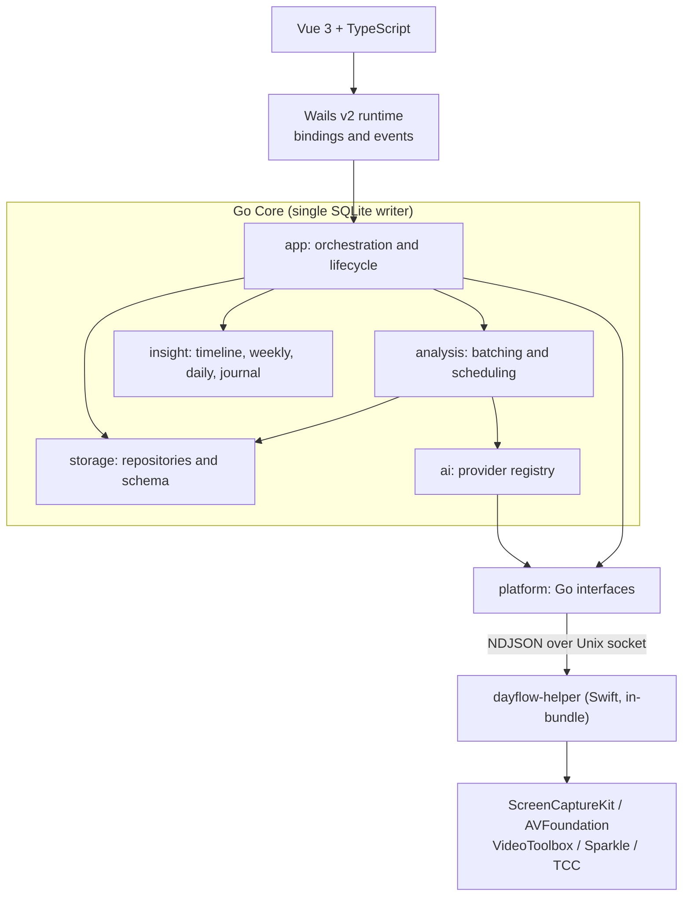

# Dayflow → Go + Wails 重构设计

> **状态：仅设计。** 本计划不会修改任何生产代码。这里的每份文档都描述了目标状态及其实现路径；目前尚未实施任何内容。

## 文档

| # | 文档 | 涵盖内容 |
|---|----------|--------|
| — | 本文件 | 执行摘要 |
| 01 | [当前架构](01-current-architecture.md) | 模块图、职责和依赖分析 |
| 02 | [数据流](02-data-flow.md) | 端到端的捕获、存储、分析与 AI 流水线 |
| 03 | [迁移分类](03-migration-classification.md) | 按文件划分 KEEP / REWRITE / BRIDGE / REPLACE / DELETE / DEFER |
| 04 | [目标架构](04-target-architecture.md) | 模块拆分、目录布局和 Go 接口设计 |
| 05 | [原生桥接策略](05-native-bridge.md) | CGO 与 IPC 的比较及建议 |
| 06 | [迁移路线图](06-migration-roadmap.md) | 带门禁的阶段 0–6 里程碑 |
| 07 | [测试策略](07-testing-strategy.md) | 兼容性、行为和集成测试 |
| 08 | [风险分析](08-risk-analysis.md) | 从严重到低级别的风险及缓解措施 |
| 09 | [首个实施任务](09-first-task.md) | 应优先启动的任务 |

---

# 1. 执行摘要

## 1.1 Dayflow 当前形态

Dayflow 是一个带 SwiftUI 前端的 macOS 后台代理。它每 10 秒截取一次当前显示器，将帧编码为 HEVC 分段文件，按 15 分钟分批，把每批发送给 LLM 进行转录并生成活动卡片，最后将结果呈现为时间线、每日回顾、每周仪表板、日志和聊天界面。

实测规模（`*.swift`，不含资源）：

| 区域 | 代码行数 | 占比 |
|------|----:|------:|
| `Views/`（SwiftUI） | 65,864 | 60% |
| `Core/AI/` | 21,067 | 19% |
| `Core/Recording/`（捕获 + 存储） | 7,655 | 7% |
| `Core/Weekly/` | 2,744 | 2.5% |
| `System/` | 2,557 | 2.3% |
| `Utilities/` | 2,069 | 1.9% |
| `App/` | 1,598 | 1.5% |
| `Core/AgentAccess/` | 1,221 | 1.1% |
| `Core/Analysis/` | 1,063 | 1.0% |
| `Core/Flow/` | 1,054 | 1.0% |
| `Models/`、`Menu/`、`Core/{Net,Notifications,Thumbnails,Security,Access}` | 2,930 | 2.7% |
| **总计** | **109,822** | |

此外还有独立的只读 Swift 可执行文件 `legacy/dayflow-cli`（2,308 行代码）。

## 1.2 决定本计划形态的四项发现

**发现 1 — UI 才是项目主体，而非逻辑。** 60% 的代码是 SwiftUI。仅 `Views/UI/Weekly/` 就有 9,855 行手工构建的树状图、桑基图、热力图和交互图渲染代码。从 SwiftUI 到 Vue 没有机械式迁移路径；这是对代码库最大部分的从零重写，主导整个工期。Go 工作反而是较为*容易*的一半。

**发现 2 — 数据层已有清晰边界。** 所有 SQL 都位于单一协议 [`StorageManaging`](../../legacy/dayflow/Dayflow/Core/Recording/StorageManaging.swift) 之后，且仅 16 个文件导入 GRDB，其中 14 个就是 `StorageManager`。其余两个导入位于 [`AnalysisManager.swift:11`](../../legacy/dayflow/Dayflow/Core/Analysis/AnalysisManager.swift#L11) 和 [`LLMService.swift:9`](../../legacy/dayflow/Dayflow/Core/AI/LLMService.swift#L9)，均为遗留且未使用。因此，使用 Go 重新实现数据层只需满足一项明确的契约，无需处理散布在整个应用中的 SQL。

**发现 3 — 数据兼容性远不止 SQLite 文件。** 数据库反而是简单部分：15 张表、普通 SQL、WAL 模式，且 `PRAGMA user_version` 为 `0`。困难在于数据库*周边*的一切：

- **`~/Library/Preferences/teleportlabs.com.Dayflow.plist` 中的 46 个键**，包括完整的分类体系 `colorCategories`。`timeline_cards.category` 存储分类*名称字符串*；这些名称对应的颜色和描述仅存在于 plist 中。只读取数据库无法复现 UI。
- **Keychain 项目**，位于 `com.teleportlabs.dayflow.apikeys.<provider>` 下。
- **HEVC 分段文件**，位于 `recordings/`，通过 `(file_path, frame_index)` 寻址。样本数据库包含 217 个分段中的 8,746 帧。还原像素需要 `AVAssetReader` + `VTCreateCGImageFromCVPixelBuffer`。

**发现 4 — 此代码库已在生产环境运行进程外模式。** 有三个独立先例：[`legacy/dayflow-cli`](../../legacy/dayflow-cli/Sources/dayflow/Database.swift) 在应用写入时只读访问实时数据库；[`AgentBridgeServer`](../../legacy/dayflow/Dayflow/Core/AgentAccess/AgentBridgeServer.swift) 通过权限为 `0600` 的 Unix 域套接字提供换行分隔 JSON；`Core/Flow/` 已通过 JS 桥接在 `WKWebView` 中托管 Web UI。基于 IPC 的原生适配器对这个团队而言并非新想法——而是已经交付的模式。

## 1.3 推荐架构

Go 负责业务逻辑、数据和调度。一个小型 Swift 辅助进程（约 2,000 行代码，基本原样迁移自当前的 `ScreenRecorder`、`FrameStore` 和 `VideoProcessingService`）负责所有 Apple 框架。双方通过 Unix 域套接字上的版本化 NDJSON 协议通信。

## 1.4 核心建议

| 决策 | 建议 | 原因 |
|----------|----------------|-----|
| 原生桥接 | **通过 IPC 连接 Swift 辅助进程**，而非 CGO | 原样复用可用的捕获/编解码代码；将框架崩溃隔离；符合仓库内三个现有先例。参见 [05](05-native-bridge.md)。 |
| CGO 使用 | **不使用** | 辅助进程随帧报告空闲秒数和权限状态，因此没有热路径需要 C 调用。 |
| SQLite 驱动 | `modernc.org/sqlite`（纯 Go） | 让整个核心无需 Xcode 即可构建和测试，这是黄金测试框架的基础。阶段 1 验证 WAL 并发访问。 |
| Schema 所有权 | **Go Core 是唯一写入方** | 单一 Schema 所有者、单一事务边界。辅助进程报告帧元数据，并在 Go 重启时缓冲到有界的磁盘日志。 |
| 自动更新 | **保留 Sparkle，由辅助进程托管** | 已交付的 2.4.0 appcast 和 EdDSA 密钥必须继续服务现有用户。替换更新器会让他们失去后续更新。 |
| 迁移方式 | **共存，而非直接切换** | 两个应用可以并发打开同一 WAL 数据库，因此 Go 应用可在写入前读取实时用户数据数周。 |
| v1 范围 | 时间线 + 每日 + 设置。**推迟**每周、代理、Flow | 以一小部分 UI 预算交付可用的 Go 应用；推迟的界面承载最少、成本最高。 |

## 1.5 必须尽早验证的一件事

Dayflow 是一个*永不退出的后台代理*：[`applicationShouldTerminate`](../../legacy/dayflow/Dayflow/App/AppDelegate.swift#L220) 返回 `.terminateCancel`、隐藏窗口并切换到 `.accessory` 激活策略，使捕获在无窗口时继续运行。Wails 围绕窗口构建，关闭窗口会结束进程，且其状态栏项目支持并非一等能力。

如果 Wails 无法承载常驻状态栏、无窗口且由 Sparkle 更新的后台代理，那么架构前提就不成立——而且会在已经付出 Vue 重写成本后才失败。该探索严格限时一周，并与首个任务并行执行。参见 [09](09-first-task.md#146-并行探索wails-外壳可行性) 和[风险 C-2](08-risk-analysis.md#c-2wails-无法承载后台代理)。

## 1.6 如实估算的工作量形态

| 工作流 | 输入 Swift 代码行数 | 预计输出 Go/TS 代码行数 | 特征 |
|------------|-------------:|------------------------:|-----------|
| Go 核心（存储、分析、AI、洞察） | ~30,000 | 15,000–20,000 | 规格明确、高度可测试 |
| Vue UI（v1 范围：时间线、每日、设置） | ~35,000 | 15,000–25,000 | 完整重新设计与重建 |
| Vue UI（推迟：每周、代理、Flow） | ~25,000 | 10,000–18,000 | 自定义图表工作；推迟 |
| Swift 辅助进程 | ~2,000 | ~2,000（迁移） | 主要是位置调整 |
| 测试 + 黄金测试框架 | — | 3,000–5,000 | 高杠杆，优先构建 |

Go 核心是一个契约清晰的已解问题。UI 才决定工期。任何把两者视作等量工作的计划都是错误的。
